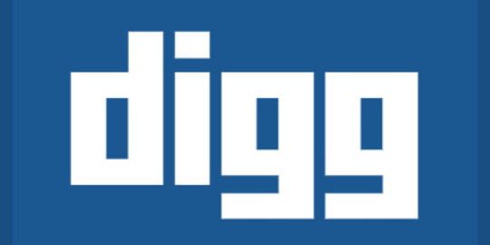

عادة ما تشتري شركاتٌ شركات أخرى، إما للاستفادة من التقنية التي تطورها، أو لتقضي عليها كمنافس مباشر لها، وأحيانا يكون هدف الشركة هو الحصول على خبرات فريق عمل الشركة. أرادت **Washington Post** أن "تبدع" نوعا جديدا من أنواع "قتل الشركات" وقررت توظيف فريق عمل **Digg** بدل أن تشتريها.

الخبر نشرته مدونة [Allthingsd](http://allthingsd.com/20120430/diggs-tech-team-heads-for-the-washington-post-and-digg-looks-for-a-lifeline/)، وهذا بعد أن ظهرت أخبار مماثلة من قبل، حيث سبق لموقع [The Next Web](http://thenextweb.com/insider/2012/05/01/rumor-digg-to-be-acquired-by-the-washington-post/) أن أشار إلى أن Washington Post تود شراء Digg، في حين رجحت [TechCrunch](http://techcrunch.com/2012/04/30/washington-post-acqhires-digg/) أن تكون العملية عملية acqhire (يعني شراء الشركة من أجل توظيف فريق عملها)، لكن تبين أن الأمر أسوأ من ذلك، حيث أصبح مستقبل Digg غير مضمون، بالرغم من أنه ستبقى أبوابه مفتوحة... إلى أجل غير مسمى. وتهدف Washington Post بذلك إلى ضم خبرات جديدة إلى فريق تطوير تطبيقها **[Social reader](http://www.washingtonpost.com/social-reader/faq)** على فيس بوك

تجدر الإشارة إلى أن Digg كانت تعتبر أحد أهم وأنجح الشركات الناشئة في الولايات المتحدة، قبل أن تتلقى منافسة قوية من مواقع استنسخت فكرتها ومبدأ عملها (ما يسمى بمواقع Digg-like)، حيث فقدت بريقها لصالح موقع  Reddit، ولقد سبق وأن حاولت Google  شراءها مقابل 200 مليون دولار، قبل أن يُرفض هذا العرض. إلا أن الأمور لم تتحسن كثيرا بعد ذلك، حيث اضطرت Digg للتخلص من نصف موظفيها سنة 2010. في حين انطلق مؤسسها Kevin Rose في مغامرة لإطلاق شركة ناشئة أخرى أطلق عليها اسم Milk، ما لبثت أن اطلقت تطبيق Oink الذي عرف نجاحا نسبيا، قبل أن تقرر Google توظيفه منذ مدة قصيرة، وقرر حينها إيقاف هذه المغامرة وإغلاق Milk.
