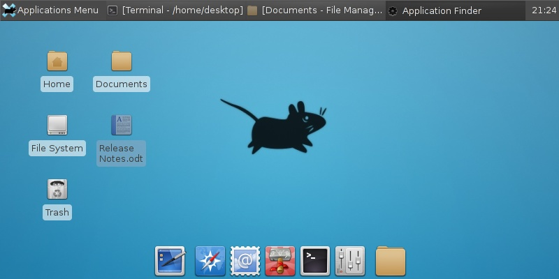
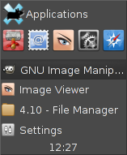
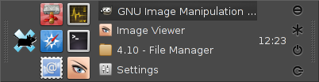
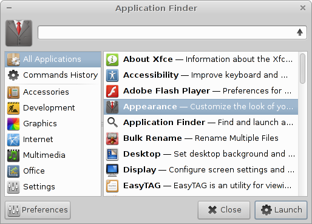
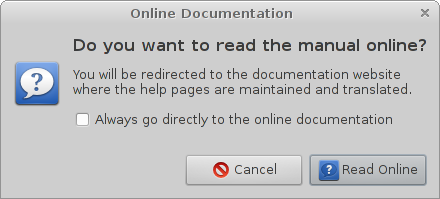
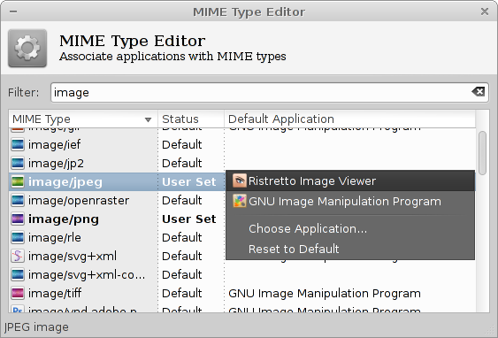
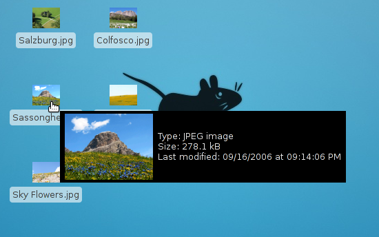
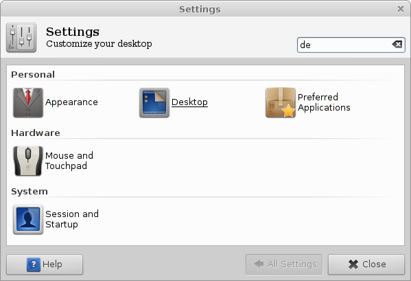

هي حصيلة 15 شهر،  عمل فيها مطورو سطح المكتب **xfce** -الموجه للحواسيب ذات الموارد المحدودة- على الإصدار **4.10،** النسخة المستقرة الجديدة لتحل مكان السابقة 4.8، مع التركيز على تلميع الواجهة وتحسين تجربة المستخدم بطرق عدة. سنلقي الضوء على بعضها:

1-**Deskbar Mode** جديد يحاذي التطبيقات المفتوحة عموديا فيما يعرض الإضافات أفقيا، صُمم لاستغلال المساحة الأفقية الواسعة في الشاشات العريضة قدر الإمكان.

2-تدعم اللوحة الآن في النمط الأفقي تعدد صفوف منصات الإطلاق والإضافات الأخرى فيما تتوسع عناصر قائمة النوافذ على كامل عرض اللوحة.

3-**applications finder** أعيدت كتابته كليا من الصفر. عن طريق الاختصار Alt+Tab يمكنك تشغيله، عرفت واجهته تحسينا وبات يجمع بين وظائف التطبيق القديم و xfrun4.

4-توجيه المستخدم إلى Wiki حين ينقر على زر المساعدة ما يجعل التوثيق حسب المطورين أكثر تحديثا.

5-سهولة تغيير التطبيقات المستخدمة في فتح مختلف الملفات عن طريق نوع جديد من محرر meme دون إضافة أو حذف الصيغ أو الأيقونات.

6-إطلاق تطبيقات وفتح ملفات بكبسة زر من سطح المكتب مع استعراض الصورة لمجرد وضع مؤشر الفأرة عليها.

7-مدير إعدادات جديد يجمع التعديلات تحت تصنيفات يتيح البحث عنها عبر الاسم أو الوصف.

يمكن الاطلاع على خواص 4.10 xfce كاملة [من هنا](http://xfce.org/about/tour). أو بقراءة [Changelog هذا الإصدار](http://xfce.org/download/changelogs/4.10).
- هل تستعمل سطح مكتب Xfce؟ ما السبب الذي يدفعك إلى ذلك؟ ما رأيك في هذه التحديثات؟
