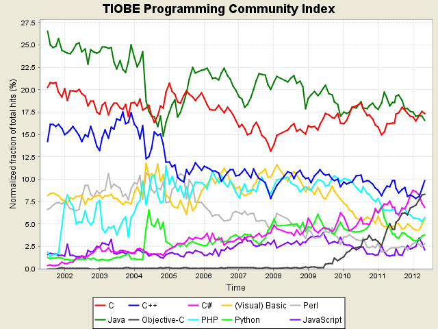
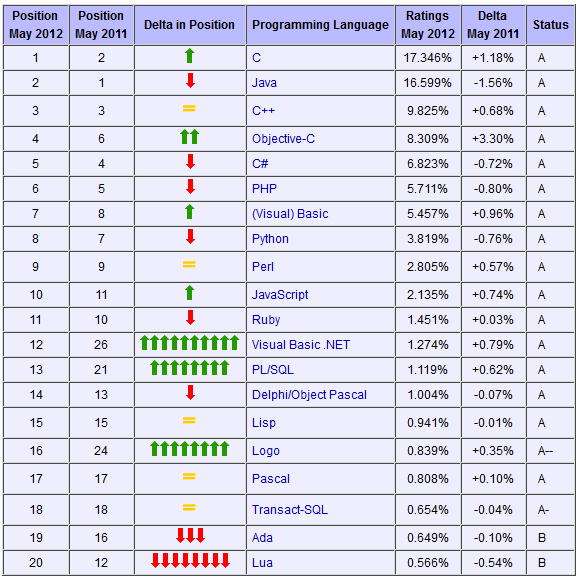

بعد أن [انتزعت](https://www.it-scoop.com/2012/04/tiobe-index-for-april-2012/) من **Java** صدارة الترتيب الشهر الماضي، حافظت **لغة ****C** البرمجية على مرتبتها الأولى للشهر الثاني على التوالي في **ترتيب ****Tiobe**** لأكثر لغات البرمجة شعبية**، في حين لم يشهد ترتيب اللغات العشر الأولى حراكا كبيرا.

حصلت لغة C البرمجية على نسبة 17.346% من اهتمام المبرمجين خلال شهر مايو الحالي، وهو ما يعتبر زيادة تقدر بنسبة 1.18% مقارنة بنفس الشهر من العام الماضي، في حين لم تحصل Java سوى على نسبة 16.599%، أي أنها تراجعت بنسبة 1.56% مقارنة بالعام الماضي.

ويشير [التقرير](http://www.tiobe.com/index.php/content/paperinfo/tpci/index.html) الذي صحب ترتيب هذا الشهر إلى الصعوبة التي تجدها لغات البرمجة الجديدة في فرض أنفسها، ويُرجع التقرير ذلك إلى صعوبة نقل أجزاء كبيرة من شفرات مكتوبة مسبقا إلى لغات أخرى، فعلى سبيل المثال لم تسجل Scala سوى نقلة نوعية واحدة فقط، حيث دخلت ترتيب Tiobe سنة 2006 واحتلت حينها المرتبة 57 قبل أن تقفز إلى المرتبة 48 عاما بعد ذلك، ليبقي الوضع رتيبا بعض الشيء بعد ذلك، حيث تحتل حاليا المرتبة 46.

ولم يختلف الحال كثيرا مع لغات جديدة أخرى، حيث تحتل لغة F# المرتبة 40  بعد أن كانت في المرتبة 38 سنة 2006، أما Groovy فاحتلت حاليا المرتبة 32 بعد أن كانت في المركز 26 سنة 2008.

قائمة Top 10 بدورها لم تشهد حركة كبيرة، فباستثناء Objective-C التي دخلت القائمة و Delphi التي خرجت منها، لم تعرف المراتب العشر الأولى تغييرات كبيرة خلال السنوات الثمانية الماضية.

لكن ما يميز ترتيب هذا الشهر هو [إثارته لحفيظة](http://www.computerworld.com/s/article/9227063/C_keeps_lead_over_Java_in_poll_PHP_developer_questions_results) Andi Gutmans أحد أهم مطوري لغة  PHP والمدير التنفيذي لشركة Zend Technologies حيث أبدى تحفظه حول الطريقة التي تحتسب فيها شعبية لغات البرمجة، وأشار إلى أن هناك ترتيبات أخرى تبين بأن لغة PHP تسيطر على 50% من الويب العالمي.

مما دفع بـPaul Jansen مدير Tiobe إلى الرد بقوله بأن أغلب الانتقادات تأتي من مجتمعات اللغات التي تشهد تراجعا، حيث تحتل PHP المرتبة 6 حاليا ([نفس مرتبة الشهر الماضي](https://www.it-scoop.com/2012/04/tiobe-index-for-april-2012/)) بعد أن كانت تحتل المرتبة 5 شهر مايو 2011. قبل أن يدعو Gutmans إلى إعطائه اقتراحاته لتحسين جودة الترتيب.

للتذكير، فإن ترتيب Tiobe لا يعكس مدى انتشار/ استعمال لغات البرمجة، وإنما يدرس مدى شعبيتها، حيث يعتمد على عدة مصادر، كنتائج محركات البحث المختلفة، الفيديوهات التي تنشر على Youtube، الكتب التي تباع على Amazon، موسوعة Wikipedia وغيرها.

فيما يلي قائمة لغات البرمجة العشرين الأكثر شعبية خلال شهر مايو 2012:

<!-- more -->

