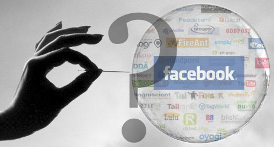

بعد أن كان من المنتظر أن يكون سعر سهم **فيس بوك** في اليوم الأول من دخوله إلى البورصة ما بين 28 و 35 دولارا، كشفت جريدة Wall Street Journal بأن هذا السعر سيكون أعلى، حيث ستتراوح قيمة السهم الواحد [ما بين 34 و38 دولارا](http://online.wsj.com/article/SB10001424052702304192704577404813861116368.html).

ما الذي يعنيه ذلك؟ ستصبح قيمة الشركة لدى دخولها إلى البورصة مقدرة ما بين 93 و104 مليار دولار، مما يعني بأنها ستتجاوز بشكل كبير القيمة التي سجلتها Google سنة 2004 والتي كانت تعتبر الأكبر في قطاع التقنية والتي وصلت حينها إلى 22 مليار دولار، بل ستتجاوز أيضا القيمة الأسطورية التي حققتها UPS سنة 2009 والتي قُدرت حينها بقيمة 60.2 مليار دولار.  ولتوضيح الصورة أكثر، فإن قيمة فيس بوك الجديدة ستتجاوز [مجموع قيمتي كل من HP وDell مجتمعتين](http://in.reuters.com/video/2012/05/15/facebook-ipo-price-hike?videoId=235026507&videoChannel=105).

قد تبدو هذه الأرقام مبهمة قليلا، دعونا نقارنها بمداخيل الشركة وبفوائدها لنعرف حجم الأمر، والذي يصل إلى حد التضخيم. حسب [جريدة Le Monde الفرنسية](http://www.lemonde.fr/economie/article/2012/05/15/facebook-reveille-les-craintes-d-une-bulle-internet_1701279_3234.html)، فإن هذه القيمة الجديدة (الجريدة أرست السعر على 104,2 مليار دولار) تمثل 28 ضعف رقم أعمالها، و100 ضعف فوائدها، وتقارن الجريدةُ الشبكةَ بشركة Microsoft والتي تصل قيمتها إلى 11 ضعفا من فوائدها.

وذكّرت الجريدة بالأحداث الدرامية التي حدث مع الشركات التي دخلت إلى البورصة قُبيل انفجار فقاعة الإنترنت الأولى، وذكرت Netscape التي قفز سعر سهمها من 28 إلى 71 دولار بعد يوم واحد من دخولها إلى البورصة، قبل أن يسقط هذا السعر إلى 15 دولار بعد عامين من ذلك.

هناك من يقلل من خطورة الأمر، ويرى بأن فيس بوك ليست شركة ناشئة، بل هي شركة اشتد عودها واستد ساعدها، وأصبح بمقدورها ضمان مستقبل مزهر لها، خاصة وأنها ليست مثل باقي الشركات الناشئة الأخرى، والتي لا تملك مداخيل، فقد تجاوز صافي أرباحها خلال 2011 المليار دولار.

لكن Peter Cauwels الباحث في قسم الإدارة وتقنيات الاقتصاد في مدرسة École polytechnique fédérale السويسرية له رأي آخر، حيث يعتبر بأن أقصى قيمة معقولة يمكن أن تصلها فيس بوك هي 50 مليار دولار، حيث أشار –في الحوار الذي خص به [جريدة Le Temps السويسرية](http://www.letemps.ch/Facet/print/Uuid/eafdc03e-9d29-11e1-8fb2-3ab1e2d74e12/Facebook_laction_%C3%A0_ne_pas_conseiller_%C3%A0_un_ami)- بأنه واعتمادا على الحسابات التي قام بها توصل إلى أن مداخيل وفوائد فيس بوك يمكن تقديرها بحوالي 25 مليار دولار، يضيف إليها 25 مليار دولار كعامل "حظ" في حال ما إذا حالف الشركةَ حظٌ، وأي قيمة سوقية فوق الخمسين مليار دولار–بحسبه- هي فقاعة إنترنت جديدة.

كما يتوقع Cauwels أن تفقد فيس بوك بريقها وتصبح في خبر كان خلال عامين على أقصى تقدير، حيث يشير إلى يرى بأن الخدمات يعفو عليها الزمن بعد مضي جيل، والجيل –حسبه- يقدر بخمس سنوات في عالم الإنترنت.

لكن ما يزيد الصورة سوداوية هي تجارب الشركات الناشئة التي دخلت إلى البورصة خلال الأشهر القليلة الماضية، فاستثناء LinkedIn والتي تعرف صحة مالية جيدة بعد عملية اكتتابها، فإن الحظ لم يحالف Groupon التي فقدت نصف القيمة التي سجلتها خلال اليوم الأول من عرض أسهمها للاكتتاب، حيث لا يتجاوز سعر سهمها حاليا 10 دولارات بعد أن كان 20 دولارا خلال أيامه الأولى. مصير مماثل عرفته Zynga التي انتقل سعر سهمها من 9.5 دولارات إلى 14 قبل أن يستقر في حدود 8 دولارات.

أضف إلى ذلك، الأخبار التي تداولت مؤخرا عن "البرود" الذي أصاب كبار المستثمرين تجاه فكرة الاستثمار في الشركة بعد عرض [نتائج الشركة المالية الفصلية](https://www.it-scoop.com/2012/04/facebook-900-million-users/)، والتي بينت تراجعا في مداخيلها عللتها الشركة حينها بـ'الاختلافات الفصلية"، قبل أن تعلن بأنها تعرف صعوبات [بسبب الاستخدام المكثف لتطبيقاتها على الهواتف الذكية](https://www.it-scoop.com/2012/05/facebook-ipo-zuckerberg-hoodie/) والتي لا تعرض الإعلانات بدل نسخة الويب الكلاسيكية.

لكن لو أردنا أن نكون إيجابيين، فهل يحق لنا أن نستثمر في شراء أسهم الشبكة؟ بداية الأمر ليس بالهين، حيث لن يتمكن المستثمرون الصغار من القيام بذلك، فمن المنتظر أن يتقاسم الأسهمَ مستثمرون وشركات استثمار كبيرة. لكن إن تمكنت بطريقة أو أخرى من القيام بذلك، فإن أغلب المحللين الاقتصاديين سينصحونك بالتخلص من الأسهم خلال 6 أشهر من طرحها (الفترة المعروفة اصطلاحا بفترة Lookup) وذلك قبل أن يصبح بمقدور المستثمرين الأوائل من الشروع في بيع أسهمهم، حيث يرافق الأمر عادة هبوطا في أسعر الأسهم وهو نفس ما حدث لكل من Zynga و Groupon آنفتي الذكر.

على ضوء كل هذه الأرقام، هل ستنفجر الفقاعة من جديد؟ أم أن فيس بوك ستثبت العكس وتعطي للسوق نفسا جديدا؟ [حسب](http://www.lemonde.fr/economie/article/2012/05/15/facebook-reveille-les-craintes-d-une-bulle-internet_1701279_3234.html) Benoît Flamant، مدير IT Asset Management فإن يجب انتظار 6 إلى 9 أشهر بعد دخول الشركة إلى البورصة لمعرفة ذلك.

هل تظن بأن الفقاعة ستنفجر؟ شاركنا برأيك
