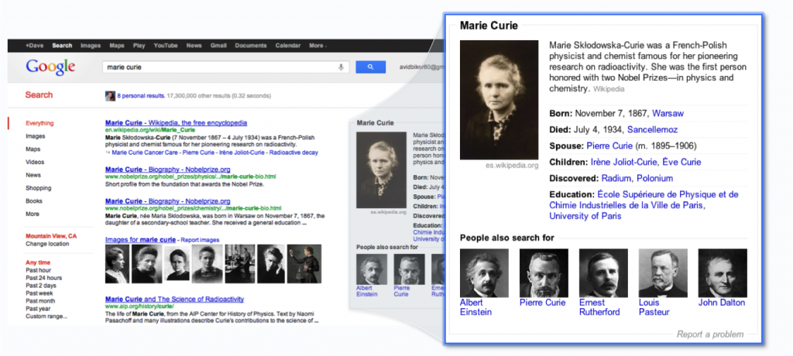
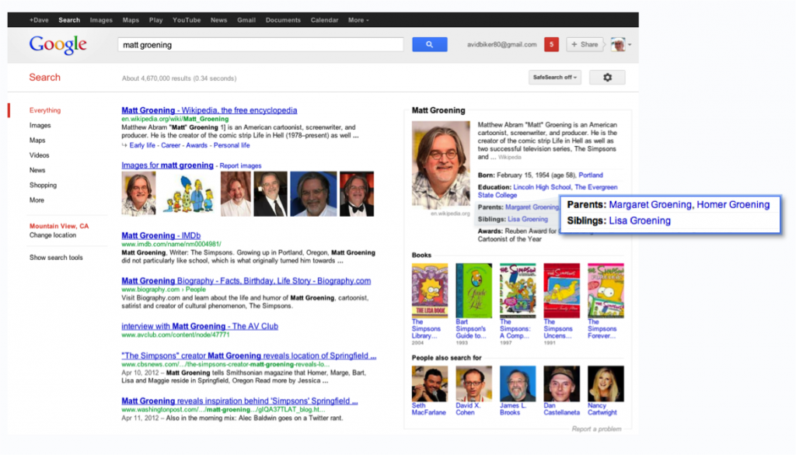

كشفت **Google** مساء اليوم عن ما يمكن وصفه بأهم تحديث لمحرك بحثها منذ انطلاقته أطلقت عليه اسم **The Knowledge Graph**، والذي يجعل من نتائج البحث أكثر دقة وأكثر غنى، بالاعتماد على **البحث الدلالي ****Semantic Search**.

[لخصت](http://googleblog.blogspot.com/2012/05/introducing-knowledge-graph-things-not.html) Google ما يقوم به The Knowledge Graph في ثلاث نقاط أساسية:

**1. الحصول على المعلومة الأدق/ الأنسب:**

لنفرض مثلا أنك دخلت إلى Google لتبحث عن The big bang theory، لكن هل تبحث عن معلومات عن نظرية الانفجار العظيم، عن المسلسل الفكاهي الذي يحمل هذا الاسم، أو ربما عن مكتبة أو مطعم استغل شهرة هذين السابقين للترويج لنشاطه. لكن مع تحديث the Knowledge Graph سيظهر لك Google قائمة جانبية تطلب منك اختيار الموضوع الذي تقصده ليظهر لك نتائج أكثر دقة (الصورة المبينة أدناه هي مثال عن البحث عن Andromeda الذي استعملته [TechCrunch](http://techcrunch.com/2012/05/16/google-just-got-a-whole-lot-smarter-launches-its-knowledge-graph/) للحديث حول الأمر).

**2.الحصول على أهم الملخصات:**

لدى البحث عن الأعلام والشخصيات، والذين عادة ما يبحث عنهم للوصول إلى بعض المعلومات الرئيسية، كتواريخ الميلاد، أو أهم الإنجازات، فإن مخلصا يظهر مباشرة على صفحة البحث يحتوي كافة تلك المعلومات.

تعتمد Google في عملية الوصول إلى هذه المعلومات على الكم الكبير من البيانات التي جمعته على مر السنوات، إضافة إلى معلومات أخرى، كبيانات موسوعة Wikipedia،بيانات World Factbook الخاصة بوكالة CIA، محتوى موقع Freebase، وغيرها، كما تشير TecCrunch بأن Google تبحث أيضا في مكتبتها Google Books، ولكم أن تتخيلوا غزارة المعلومات التي ستتوصل إليها مع كل عملية بحث.

**3.الحصول على معلومات أعمق، والوصول إلى معارف أوسع وأشمل**

<!-- more -->

سيتيح محرك البحث أيضا التعرف على مواضيع مقاربة (والتي لا تتشارك نفس الكلمات المفتاحية بالضرورة)، فلدى البحث عن تاج محل مثلا، فعلاوة على اقتراحات تخص الفنان الذي يحمل نفس الاسم (لأول مرة أسمع به)، والكازينو الأمريكي (الذي يحمل أيضا نفس الاسم) سيقترح عليك Google مشاهدة نتائج البحث حول معالم أخرى كصور الصين مثلا.

سيتيح التحديث الجديد أيضا الوصول إلى معلومات، ربما لم تتخيل أنك ستصل إليها بتلك السهولة، وتضرب Google مثلا بعملية بحث حول الرسام Matt Groening مبدع سلسة Simpsons الفكاهية، حيث يكفي النظر إلى المخلص المعروض في نتائج البحث، لتعرض بأنه استمد أسماء شخوص مسلسله من أسماء أفراد عائلته، مذهل... أليس كذلك؟

تشير Google بأن the Knowledge Graph يحتوي حاليا أكثر من 500 مليون "شيء"، إضافة إلى 3.5 مليار معلومة حول هذه الأشياء والعلاقات التي تربط بعضها ببعض، كما أنه تم تحسين هذه المعلومات اعتمادا على ما ألف الناس البحث عنه باستخدام محرك بحثها.

سيتم توفير The Knowledge Graph بداية في الولايات المتحدة، وباللغة الانجليزية فقط، قبل أن يعمم على سائر البلدان واللغات لاحقا.

الفيديو التعريفية بتحديث The Knowledge Graph:

<!-- more -->

[youtube=http://www.youtube.com/watch?v=mmQl6VGvX-c]

  هل سيغير هذا التحديث من طريق البحث على محركات البحث؟

شاركنا برأيك؟
