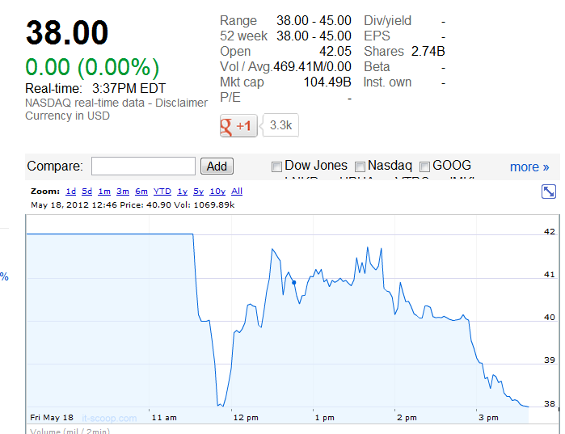

تمخض الجبل فولد فأرا، هكذا يمكن وصف اليوم الأول من دخول فيس بوك إلى البورصة، فبعد تأخر لحوالي نصف ساعة بسبب خلل تقني، بدأت فيس بوك رحلتها مع البورصة بارتفاع، حيث قدر سعر السهم حينها بـ 42.005 دولارا (حدد السعر الافتتاحي بـ 38 دولارا)، لكنه سرعان ما انخفض من جديد.

[caption id="attachment_10837" align="aligncenter" width="559" caption="رجوع سعر سهم فيس بوك إلى 38 دولارا قبل حوالي 20 دقيقة من اختتام مداولات اليوم الأول"][/caption]

ولقد تراوح [سعر سهم فيس بوك](http://www.google.com/finance?q=fb) على مر الساعات الماضية ما بين 38.03 و 41.68 $، قبل أن يستقر لبعض الوقت على سعر 38.01 $ ، لكنه لا يعطي أية مؤشرات حول إمكانية تجاوز هذا السعر بكثير واختتم اليوم الأول بسعر 38.27 $.

عادة ما يعتبر السعر الذي تختم به الشركات التي تطرح أسهمها للاكتتاب خلال يومها الأول مؤشرا على مستقبل الشركة ومدى قوتها، فعلى سبيل المثال، [تمكنت الشبكة الاجتماعية المهنية LinkedIn من مضاعفة سعر سهمها](https://www.it-scoop.com/2011/05/linkedin-ipo-3/) خلال يومها الأول، حيث أعلنت في بداية الأمر أن سعر السهم سيكون في حدود 32 إلى 35 دولارا، قبل أن تقرر رفعه إلى 45 دولارا ، لكن تهافت المستثمرين حولها رفعها إلى غاية 122.70 $ قبل أن يختتم يومها الأول بسعر 94.25$، كما أن الشبكة استطاعت أن تحافظ على تلك القيمة حتى بعد عام بعد ذلك (سجلت الشبكة دخولها إلى البورصة يوم [19 مايو من العام الماضي](https://www.it-scoop.com/2011/05/linkedin-ipo-3/))، واختتمت يوم أمس بسعر 106.17 $.

ما زاد الوضع تعقيدا هو Pivotal Research Group. التي [أطلقت](http://business.financialpost.com/2012/05/18/analyst-rates-facebook-stock-a-sell-on-first-day-of-trading/) اليوم توصيات تدعو فيها إلى بيع أسهم فيس بوك (بدل الشراء)، حيث ترى بأن سعر 38 دولار لا يلبث أن يهوى، محددة سعر 30 دولارا كالسعر الأقرب إلى المعقول:

<blockquote>

> 
> سابقا حددنا سعر سهم فيس بوك بـ 30 دولارا، وبما أن السعر الحالي للسهم هو 42 دولارا، فإننا نوصي ببيع الأسهم، ما دام سعرها الحالي جاوز بنسبة 15%  السعر الذي حددناه سابقا.
> 
> 
</blockquote>

ثم [أضافت](http://timesofindia.indiatimes.com/tech/news/internet/Facebook-gets-early-brokerage-sell-rating/articleshow/13274257.cms) على لسان محللها Brian Wieser:

<blockquote>

> 
> يظن السوق حاليا بأن الاستثمار في أسهم فيس بوك هو أقل خطورة من الاستثمار في أسهم Google، لكن الوضع ليس كذلك.
> 
> 
</blockquote>

بالرغم من هذا الوضع، فإن هذا اليوم لم يمر بردا وسلاما على الشركات التقنية التي دخلت مؤخرا إلى البورصة، ويتعلق الأمر تحديدا بالشبكة الاجتماعية المهنية Linkedin التي [اختتمت اليوم](http://www.google.com/finance?q=NYSE:LNKD) بسعر 99.02 دولارا للسهم بتراجع قدر بنسبة 5.65% مقارنة بسعر اختتام يوم أمس، إضافة إلى Zynga التي تراجع [سعر سهمها](http://www.google.com/finance?q=NASDAQ:ZNGA) بأزيد من 13% حيث يقدر حاليا بـ7.16 $.

هل تعتقد بأن سعر سهم فيس بوك سينزل إلى غاية 30 دولار مثلما أشارت إليه  Pivotal Research Group ؟

في رأيك ما تفسير هذا الدخول المحتشم لفيس بوك إلى البورصة؟

اقرأ أيضا:

[دخول فيس بوك إلى البورصة: هل نحن على مشارف انفجار فقاعة إنترنت جديدة؟](https://www.it-scoop.com/2012/05/facebook-ipo-tech-bubble/)
