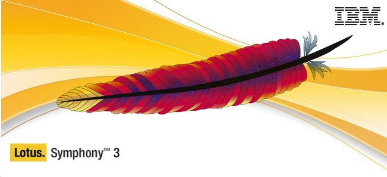

بعد أن [أبدت](https://www.it-scoop.com/2011/07/ibm-donate-lotus-symphony-source-code-apache/) رغبتها في القيام بذلك منذ حوالي 10 أشهر، [أعلنت](http://article.gmane.org/gmane.comp.apache.incubator.ooo.devel/18332) **IBM** عن تحول مهم في مسار حزمتها المكتبية **Lotus Symphony**، حيث كشف بأنها شرعت في عملية نقل مصدرها إلى منظمة **Apache** التي تتولى حاليا مهمة تطوير حزمة **OpenOffice.org** والتي تم تغيير اسمها ليصبح **Apache OpenOffice**.

من بين ما تتميز به حزمة Lotus Symphony هو واجهتها الرسومية والتي تعتبر "أجمل" بكثير من واجهة OpenOffice ومنافستها LibreOffice، مما قد يعطي للحزمة المكتبية OpenOffice.org نفسا جديدا بعد تراجع شعبيتها بعد انبثاق حزمة LibreOffice منها، خاصة وأن أغلب إصدارات لينُكس الأساسية توفرها بشكل قياسي. هذا من حيث الشكل، أما من حيث الخواص فيمكن للحزمة أن تستفيد من أعمال IBM على حزمتها الخاصة بدعم VBA الخاص بحزمة Microsoft Office، دعمهما لشتى أنواع الملفات خاصة المتعلقة بإصداري 2007 و2010 من حزمة Microsoft Office، إلى جانب العديد من التحسينات التي تجدونها كاملة [هنا](http://wiki.services.openoffice.org/wiki/Contribution).

ماذا عن زبائن IBM الذين يستخدمون حزمة Lotus Symphony؟ تؤكد IBM بأنها ستواصل تقديم الدعم لهم إلى غاية تأكدها من إمكانية عرض Apache OpenOffice بدل ذلك.

سبق وأن قامت Apache بإطلاق أول تحديث لحزمة OpenOffice منذ أن نقلت Oracle مهام تطويريها إليها، ويتعلق الأمر بالإصدار [3.4](http://www.openoffice.org/download/) الذي يدعم معيار ODF بشكل أفضل، والذي يتميز بسرعة أكبر مقارنة بالإصدار السابق.

للتذكير فإن حزمة Lotus Symphony هي نسخة مستقلة من OpenOffice توفرها IBM بشكل مجاني لكنه لم يسبق لها وأن فتحت مصدرها من قبل.

في رأيك، هل ستعود حزمة OpenOffice إلى الواجهة من جديد بفضل خواص Lotus Symphony؟
