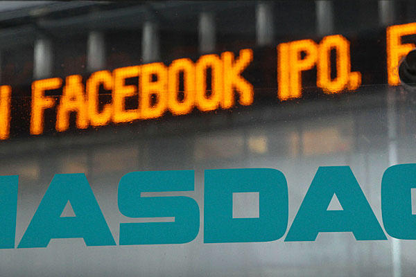

منذ أن وطأت قدم فيس بوك أرض Nasdaq [والمقالات التي تتحدث عن فشل العملية](https://www.it-scoop.com/2012/05/facebook-ipo-2/) بسبب الارتفاع الطفيف لسعر سهمها، ثم تراجعه بشكل غير منتظر تتفق كلها على أن العملية فاشلة، بل [وتؤذن ببداية نهاية فيس بوك](https://www.it-scoop.com/2012/05/facebook-ipo-tech-bubble/)، لكن بعد مرور أزيد من أسبوعين، وبالرغم من انخفاض سعر سهم فيس بوك إلى أقل من 30 دولارا، انخفضت تلك الأصوات قليلا لتسمح لأصوات محللين آخرين لهم آراء مختلفة بالوصول إلى آذان السامعين، وصدقوا ذلك أو لا تصدقوا، عملية دخول فيس بوك إلى البورصة هي نجاح محكم حسب العديد منهم.

بداية، دعونا نرجع إلى أصول القضية، والأسباب التي دفعت بالكثيرين إلى اعتقادها فاشلة، يشير [مقال](http://www.businessinsider.com/ipo-pops-2012-5) نُشر على موقعBusiness Insider إلى أن الطريقة التي عالجت بها وسائل الإعلام عملية طرح أسهم فيس بوك مردها إلى عملية "غسل الأدمغة" التي تمارسها Wall Street باستمرار، حيث أنه من المتعارف عليه بأن عملية الاكتتاب الناجحة هي تلك التي يقفز فيها سعر السهم في أول يوم إلى مستويات قياسية. لكن هل فعلا ذلك صحيح؟ وهل من فائدة الشركة التي تطرح أسهمها أن تقفز أسعار أسهمها بتلك الطريقة؟

بغض النظر عن الآلية التي أعلنت فيها عن النتائج المالية غير الجيدة لفيس بوك خلال الربع الماضي، وبالرغم ما قيل عن الطريقة التي تعامل بها بنك Morgan Stanley بشكل يفضل كبار المستثمرين على صغارهم، أو زيادتها لعدد الأسهم التي طرحتها للبيع، فإن فيس بوك هي الرابحة الأكبر من كل هذه العملية، خاصة بعد أن تم رفع سعر السهم من 30 إلى 38 دولارا وهو ما اعتبر "جنونا" في حينها وبُعيد ذلك، ثم تفطن الجميع بأنها قمة الحكمة، وذلك راجع إلى:

عملية الاكتتاب هذه سمحت لفيس بوك بجني 16 مليار دولار، 3.5 مليار دولار لوحدها كانت نتيجة تلك الزيادة، ولكم أن تتخيلوا كم عدد الشركات الناشئة التي يمكن أن تشتريها فيس بوك بهذه الأموال، أو ما هي التطويرات التي يمكن أن تقوم بها.

حسب المقال، فإن أي زيادة في سعر الأسهم تقدر ما بين 5 إلى 10% يعتبر في حد ذاته نجاحا (هل تذكرون [التوصية التي أطلقتها Pivotal Research Group](https://www.it-scoop.com/2012/05/facebook-ipo-2/) لما وصل سعر السهم إلى 42 دولار خلال اليوم الأول من تداول أسهم فيس بوك لأن السعر تجاوز 15% من قيمته الابتدائية؟). كما أن مصادر مقربة من فيس بوك أشارت إلى أن الشبكة كانت تهدف إلى تسجيل زيادة تقدر بـ10% لا غير، وهو ما تحقق لها ساعات قليلة بعد طرح أسهمها.

ما الذي يعنيه أن يحقق سعر السهم قفزة نوعية في اليوم الأول من تداوله؟ يعني ذلك بأن السعر الافتتاحي كان أقل من السعر الحقيقي للسهم (لدفع المستثمرين الأوائل لشرائه)، وأي قفزة نوعية يستفيد منها مشترو الأسهم بدل الشركة، وما السخط الذي عمت الأسواق إلى نتيجة أطماع المستثمرين الذين أرادوا مضاعفة أموالهم ما بين عشية وضحاها (هل فعلا سترغب شركة في إرضاء الانتهازيين والمواقع الإخبارية مقابل تخليها عن مليارات الدولارات ما يلبثوا أن ينسوها؟)

خلاصة القول، استطاعت فيس بوك أن تجمع أقصى ما يمكن لها من هذه العملية، من ذا الذي يكترث لقيمة الشركة الكلية إن كانت خزائنها قد امتلأت بأموال تسمح لها بأن تواجهه منافسيها بكل أريحية خلال السنوات القادمة.

على الجانب، يضيف المقال بأن المستثمرين "الحكماء" لا يهمم سعر الأسهم أسبوعا أو شهرا بعد شرائهم لها، حيث أن الأهم هو الاستثمار في الأسهم التي يمكن أن تتضاعف على المستوى البعيد، ويضرب الكاتب مثال Amazon والتي عرفت مصيرا مماثلا لدى دخولها إلى البورصة، حيث قيل عنها حينها بأنها سجلت عملية فاشلة، لكن سعر سهمها تضاعف 75 مرة بعد 15 سنة من ذلك. لكنه من غير المحتمل أن تسجل فيس بوك هذه القفزة، حيث كانت Amazon شركة ناشئة وكانت قيمتها حينها تقدر 500 مليون دولار (يعني يمكن لهذه القيمة أن تتضاعف بشكل منطقي)، لكن فيس بوك بلغت مرحلة النضج قبل أن تدخل إلى البورصة بقيمة تقدر بـ 104 مليار دولار.

بعد كل ما قيل عن فيس بوك، هل تظن بأنها أدارت عملية دخولها إلى البورصة بحكمة؟ أم أن تراجع سعر السهم المتواصل ما يلبث أن تظهر آثاره واضحة على مُحيا الشبكة؟ أيا كان رأيك فأظن أنه قد [يهمك الانضمام (الإعجاب) بصفحة المجلة التقنية على فيس بوك](http://www.facebook.com/ITscoopMagazine) :)
