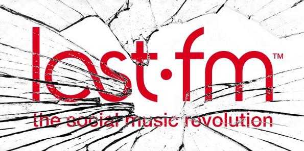

يبدو أن موسم الحر قد اشتد، فبعد الارتفاع المحسوس لدرجات الحرارة، هاهي درجة حرارة المواقع الشهيرة ترتفع تباعا فلم تمض سوى ساعات قليلة على واقعة [تسريب 6.5 مليون كلمة مرور لمستخدمي موقع التواصل الشهير LinkedIn](https://www.it-scoop.com/2012/06/linkedin-6-5-million-passwords-leaked/) حتى طفت إلى السطح حادثة مشابهة مع الموقع الشهير **Last.fm** صاحب خدمة البث الموسيقي على الإنترنت.

ولقد نشر الموقع [بيانا](http://www.last.fm/passwordsecurity) يؤكد فيه بإنهم يحققون في حادثة تسريب كلمات مرور لعدد غير معلوم من مستخدميه.

<blockquote>We're investigating a security issue with user passwords. As a precaution, we recommend you change your password: [last.fm/passwordsecuri…](http://t.co/nYLkwT4N)

— Last.fm (@lastfm) [June 7, 2012](https://twitter.com/lastfm/status/210765169003999233)</blockquote>

في الوقت الذي لم تتضح فيه حيثيات التسريب أو جهته ظهر جانب مشرق في الحادثة: موقع [Last.fm](http://Last.fm) سارع الى إصدار بيان حول الحادثة وحذر مستخدميه قبل أن يقع الفأس على الرأس وتبدأ كلمات المرور بالظهور على مواقع النت، عكس سابقه LinkedIn الذي لم يبادر حتى لتأكيد التسريب إلا بعد أن ظهرت تقارير عديدة تتكلم حول الأمر، وبدأت مواقع بنشر قوائم بكلمات المرور المعنية بالأمر.

حاليا بيان القائمين على الموقع يطلب من المستخدمين تغيير كلمات المرور الخاصة بهم فورًا كإجراء احترازي في انتظار استكمال التحقيق الذي قد يفرز عن الجهة المسؤولة عن التسريب.

تجدر الإشارة إلى أن خدمة eHarmony أيضا تعرض لحادثة مماثلة، حيث أعلنت عن الأمر على [مدونتها الرسمية](http://advice.eharmony.com/blog/2012/06/06/update-on-compromised-passwords/)، وقامت بتغيير كلمات مرور الأعضاء المعنيين بالأمر (بدل أن تطلب منهم القيام بذلك) مع إبلاغهم بالأمر بريديا.

من التالي؟ من الموقع الذي تتوقع أن تظهر كلمات مرور أعضائه على الإنترنت في الساعات القادمة؟
