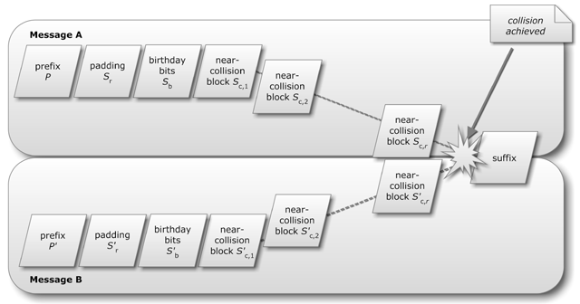

قام مختصون [بنشر](http://arstechnica.com/security/2012/06/flame-crypto-breakthrough/) تفاصيل جديدة حول فيروس **Flame** الذي تحدثنا عنه في تدوينة سابقة، وذكرت الأبحاث بأن الفيروس -الذي كانت نسبة انتشاره في إيران أكثر من أي دولة أخرى في الشرق الأوسط- أظهر نتائج رياضية متقدمة، لم يكن من الممكن الوصول إليها إلا بتعاون بعض أفضل العقول حول العالم في مجال التشفير **cryptography**، وفقاً لما اتفق عليه اثنان من أشهر الباحثين في مجال التشفير حول العالم.

ويقول الباحثان: "لقد تأكدنا من أن Flame يستخدم قيم غير معروفة للبادئات المنتقاة chosen prefix المستخدمة في هجوم التصادم Collision Attack ضد  خوارزميات التهشير hash algorithms".

وهجمات التصادم ليست بالشئ الجديد، حيث نشرت العديد من الوثائق والاختبارات العلمية عبر السنوات الماضية والتي تشير إلى أن خوارزمية MD5 لا يجب استخدامها بعد الآن في التطبيقات المستقبلية وبأنه يجب ابتكار خوارزمية تهشير أفضل قادرة على التصدي لهجمات Collision Attacks. أحدث هذه الاختبارات كان في أواخر عام 2008 حيث قامت مجموعة من الباحثين [بالإعلان](http://events.ccc.de/congress/2008/Fahrplan/events/3023.en.html) عن نجاحهم في إنشاء Certificate Authority قادر على إصدار شهادات رقمية مزوّرة، ولكن، قادرة على تجاوز جميع المقارنات الأمنية التي تقوم بها المتصفحات والتطبيقات للتحقق من سلامة ومصدر الشهادة، بحيث تبدو وكأنها صادرة عن جهة موثوقة وبالتالي لا يصدر أي تحذير أمني بخصوصها.

والمثير للاهتمام في فيروس Flame أنه لم يعتمد ذات الـ chosen-prefix الذي تم اكتشافه في 2008، بل على العكس، قام بإيجاد قيم أخرى مختلفة، مما مكنّه من توقيع الشفرات الضارة لتبدو وكأنها صادرة عن Microsoft، حيث قام الفيروس بالانتشار من خلال إيهام أنظمة Windows بأنها تستلم تحديثات أمنية هامة جديدة من Microsoft ونجح بذلك في خداع ميكانيكية Windows Update.

إن هذه النتائج، وأخرى، دفعت الباحثين حول العالم للتمسك أكثر بفكرة أن تكون "دولة أو منظمة تملك مصادر مالية كبيرة" هي الجهة خلف تصميم فيروس Flame، نظراً للتعقيد الشديد لبنية الفيروس وانكباب أفراد يعتقد بأنهم من أهم الباحثين في العالم في مجال الرياضيات في إضافة هذه المكونات الفتاكة الأخرى لمساعدة الفيروس على الانتشار.
