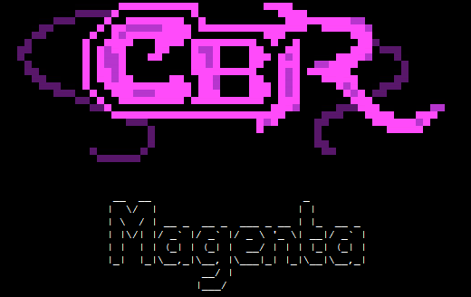

لست هنا للحديث عن الإصدار 6 من iOS الذي تحدثت عنه Apple خلال مؤتمر WWDC الذي عقدته يوم أمس، وإنما عن مشروع قد يثير حفيظة Apple، ويتعلق الأمر بمشروع **Magenta** الذي يهدف إلى توفير نسخة مفتوحة المصدر من نظام **iOS**، يمكن تشغيلها على أجهزة لم تنتجها Apple.

لكن ما الذي يهدف إلى المشروع؟ حاليا أهداف المشروع لا تزال غامضة غموض القائمة على المشروع التي تتسمى باسم Christina B.، حيث أنها لا تهدف إلى تشغيل تطبيقات متجر Appstore على جهاز آخر، وإنما تهدف إلى مجرد توفير نظام مماثل للإصدار الأول من نظام iOS يمكن الأجهزة التي تعتمد معمارية ARMv7 من استغلال Darwin/BSD بناء على قاعدة تعتمد على نواة Linux، وتنوي صاحبة المشروع استبدال المكونات المملوكة لشركة Apple بأخرى مفتوحة المصدر كاستبدال UIKit بـ Chamelleon مثلما تمت الإشارة إليه على [صفحة المشروع](http://crna.cc/magenta.html).

ليس هذا هو الخبر السيء الوحيد لشركة Apple ونظامها iOS (أو الجيد، يرتبط الأمر بالجهة التي تقف فيها لقراءة الوضع :p)، حيث نشر مطور يطلق على نفسه اسم Bubble Wrap (ما حكايتنا اليوم مع الأسماء المستعارة) مقطعي فيديو يبينان تمكنه من كتابة محاكي أطلق عليه اسم **Brine**  لتشغيل تطبيقات iOS على كل من نظام Windows وعلى جهاز PlayBook (الأخ الكبير/الصغير لهواتف BlackBerry). وحسب موقع [Open Source BB](http://opensourcebb.com/2012/06/brine-an-ios-emulator-for-playbook-not-yet-available/) الذي اتصل بأحد مطوري مشروع [Dingle Berry](https://www.it-scoop.com/2011/12/playbook-dingleberry/) (التطبيق الذي يسمح بالتحكم في أجهزة PlayBook عن بعد) فإن صاحب الفيديو سبق له وأن اتصل به بخصوص هذه المحاكي (مما يرجح من احتمال أن لا يكون الأمر مجرد فيديو).

<!-- more -->

[youtube=http://www.youtube.com/watch?v=NcQ_7ALmflE]

ما الذي سيعنيه ذلك لشركة Apple؟ وهل ستسعى إلى إيقاف مثل هذه المشاريع؟ وهل سترحب RIM (مصنعة هواتف BlackBerry) بالأمر، بعد أن يصبح جهازُها اللوحي الجهازَ الوحيد القادر على تشغيل تطبيقات مكتوبة لثلاث أنظمة تشغيل مختلفة، (يستطيع الجهاز تشغيل تطبيقاتAndroid  أيضا) ، وهل سيزيد ذلك من مبيعات الجهاز؟ كلها أسئلة تحتاج إلى المزيد من الوقت لتحصل على إجابات.
