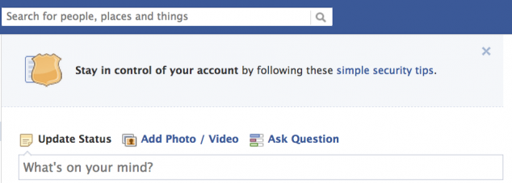

شرعت فيس بوك في إظهار رسالة في أعلى صفحتها الرئيسية تطلب من المستخدمين إمدادها بأرقام هواتفهم وذلك لإضافة المزيد من الحماية لحساباتهم ولتسهيل مهمة استرجاعها في حال تعرضها للقرصنة.

وقد تكون عمليات قرصنة ملايين كلمات المرور التي تعرض لها مؤخرا العديد من المواقع كخدمة [LinkedIn](https://www.it-scoop.com/2012/06/linkedin-6-5-million-passwords-leaked/)، eHarmony أو [Last.fm](https://www.it-scoop.com/2012/06/lastfm-password-leak/) هي التي دفعت بفيس بوك إلى اتخاذ مثل هذا الإجراء، رغم أنه لم تكن هناك أية إشارة إلى ذلك. كما أنها [تهدف](http://techcrunch.com/2012/06/14/facebook-security-tips/) إلى تجنب إرسال رسائل بريد إلكتروني لأعضائها الذين قُرصنت حساباتهم نظرا لكون هذه الرسائل عديمة الفائدة في كثيرة من الأحيان، حيث يعتبرها الكثيرون كرسائل سخام مثلما تشير إليه [هذه الدراسة](http://www.insidefacebook.com/2010/10/12/security-one-time-passwords/)، وهو ما يبقي الوضع مثلما كان عليه من دون تغيير.

لا يعتبر هذا أول خط دفاع لحسابات فيس بوك، فعلى سبيل المثال تتخذ الشبكة جملة من الإجراءات لدى تسجيل الدخول من مكان لم يألف المستخدم تسجيل الدخول منه (من بلد آخر على سبيل المثال)، وتطلب من المستخدم عادة إدخال بعض البيانات الشخصية للتأكد من هويته، أو [التعرف على بعض الأصدقاء](http://www.insidefacebook.com/2010/07/26/facebook-photos-verify/) من خلال الصور التي تُظهرها له، كما أن الشبكة تملك [خاصية طلب كلمة سر مؤقتة](http://www.insidefacebook.com/2010/10/12/security-one-time-passwords/) ترسل مباشرة إلى الهاتف تدوم لمدة 20 دقيقة فقط لتنجب أية عمليات قرصنة لدى الاتصال بالشبكة من الأماكن العامة.

رغم كل هذا، فإن بعض الأصوات تشكك في نوايا الشبكة من وراء طلبها أرقام هواتف مستخدميها، حيث يمكن لها استغلال هذه الأرقام لمعرفة المزيد حول المستخدم وحول شبكة أصدقائه في الحياة غير الرقمية.

هل ظهرت لديك هذه الرسالة؟ هل ستقدم رقم هاتفك لفيس بوك؟ أم أنك من الذين يُشككون في نوايا فيس بوك؟
