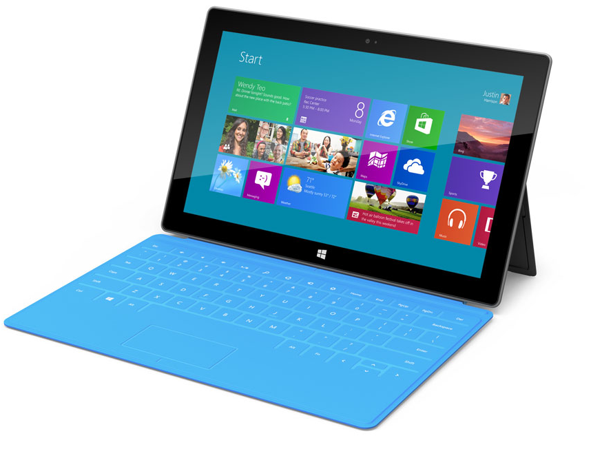
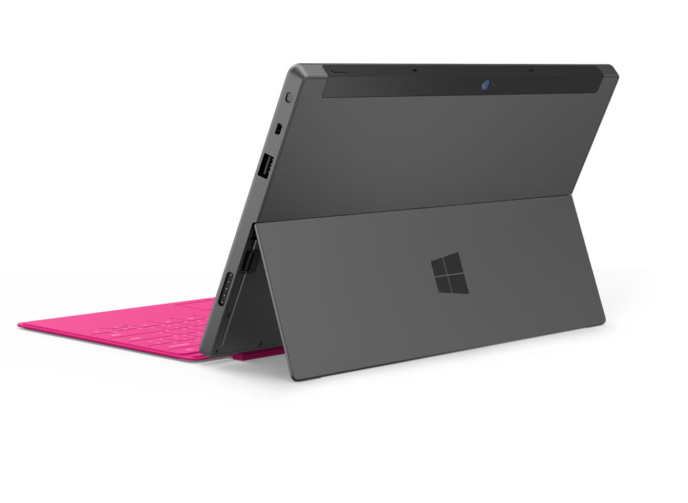
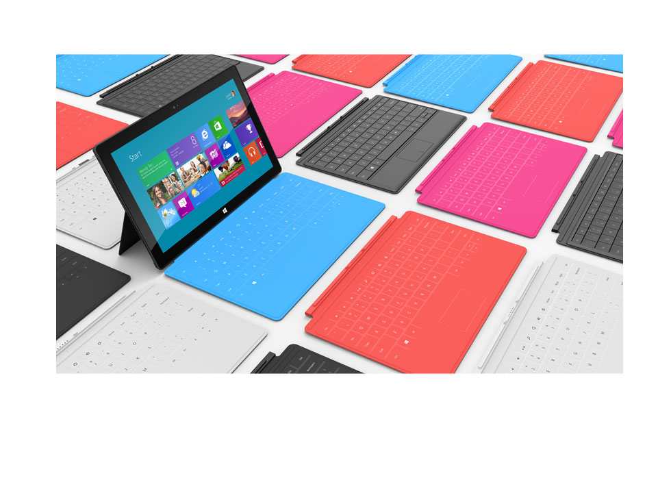

عقدت **Microsoft** مساء (ليلة) أمس مؤتمرا كشفت خلاله عن جهازها اللوحي **Surface**** **والذي يُمكن اعتباره منافسا مُباشرا وقويا لأجهزة iPad نظرا للخصائص التي يتمتع بها، وتوفره على مزايا الجهاز اللوحي وأجهزة Netbook معًا.

في بداية الأمر تم عرض جهاز Surface وتقديمه على أساس أنه جهاز لوحي "عادي" بشاشة 10.6 بوصة، وبوزن 675 جرام وبسمك لا يتجاوز 9.3 ملم ومجهز بنظام Windows 8. ثم بدأت بقية المواصفات بالظهور، بدءًا بالحامل الخلفي الذي يُتيح وضع الجهاز على طاولة في وضع القراءة والمشاهدة وهو الحامل الذي يتكامل مع تصميم الجهاز مما يجنب المستخدم عناء حَمْلِ حامِل الجهاز معه أينما ذهب.

ثم عُرض غطاء الجهاز الذي يُثبّت على الجهاز بنفس طريقة Smart Cover الخاص بأجهزة iPad، لكن المفاجئة كانت باحتواء الغطاء على لوحة مفاتيح و TouchPad وهو ما يجعل الجهاز-مثلما تُشير إليه بعض التغريدات على تويتر- جهازًا لوحيًا لكنه يمكن تنفيذ أعمال حقيقية عليه.

كشفت Microsoft عن نسختين من جهاز Surface: الأول مُجهّز بنظام Windows 8 موجه للشركات، والثاني مُجهّز بنظام Windows RT (نسخة من نظام Windows 8 خاصة بمعمارية ARM) والموجه للمستخدمين العاديين. تختلف النسختان قليلا من حيث العتاد، فعلى سبيل المثال تم تمكين نسخة Windows 8 من مآخذ USB3 ومن سعة تخزين تتراوح ما بين 64 و 128 Gb، عكس نسخة Windows RT التي تستخدم USB2 فقط وبقدرة تخزينية تتراوح ما بين 32 و64 Gb، لكن أهم نقطة اختلاف هي قدرة نسخة Windows 8 على تشغيل تطبيقات نظام Windows المتعارف عليها (يعني لن تضطر الشركات إلى إعادة كتابة تطبيقاتهم للاستفادة منها من خلال الأجهزة اللوحية) وهي نقطة في غاية القوة سترجح –من دون أي شك- الكفة لصالح Microsoft، في حين أن متجر تطبيقات Windows RT لا يزال فارغا.

لم يتم الكشف بعد لا عن دقة الشاشة ولا عن سعر الجهاز أو موعد صدوره.

الفيديو الترويجية لجهاز Windows Surface :

<!-- more -->

[youtube=http://www.youtube.com/watch?v=dpzu3HM2CIo]

[الموقع الرسمي لجهاز Microsoft Surface](http://www.microsoft.com/surface/en/us/default.aspx)

ما رأيكم في هذا الجهاز؟ هل ستلعب قدرة الجهاز على تشغيل تطبيقات Windows دورا في إقناع المستخدمين باستخدامه؟

