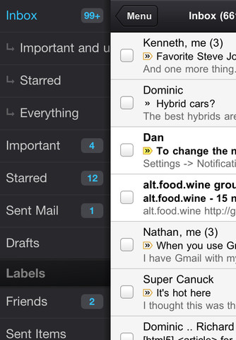
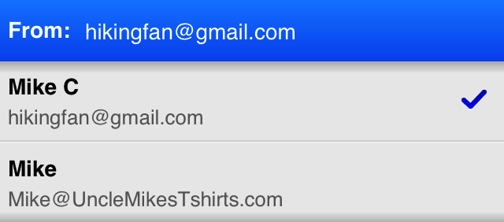

أضافت **Google** جملة من التحسينات والإضافات إلى تطبيق **Gmail** الخاص بنظام **iOS** من شأنه أن يُمكن مستخدميه من التخلص بشكل كامل من تطبيق البريد الالكتروني القياسي للنظام.

[أهم خاصية](http://gmailblog.blogspot.com/2012/06/notification-center-support-for-gmail.html) والتي تجعل تطبيق Gmail على هواتف iPhone مكافئا (إلى حد ما) لتطبيق البريد الإلكتروني القياسي هو تكامله مع مركز التنبيهات، حيث ستظهر الرسائل المستقبَلة مُباشرة ضمن باقي التنبيهات، كما أنه يمكن للتطبيق أن يرسل تنبيهات لدى استقبال رسائل جديدة، تُغني المستخدم عناء التحقق الدوري من الرسائل الجديدة.

الخاصية الثانية التي طال انتظارها تتعلق بآلية تسجيل الدخول، حيث سيتوقف التطبيق عن تسجيل خروج المستخدم بعد مرور فترة معينة، وهي خاصية تنبع من الخاصية السابقة، فلا يُعقل مثلا الاعتماد على تطبيق لاستبدال تطبيق البريد الإلكتروني الكلاسيكي ما دام أن المُستخدم "مُضطر" لإدخال كلمة المرور الخاصة به بشكل دوري.

أما الخاصية التي تجعل تطبيق Gmail يتفوق على منافسه (بشكل ما) هو إمكانية إرسال رسائل باستخدام عناوين بريد إلكتروني أخرى غير عنوان المستخدم الرئيسي (يتوجب تفعيل [هذه الخاصية](http://support.google.com/mail/bin/answer.py?hl=en&answer=22370) على نسخة الويب أولا للاستفادة منها في التطبيق)، وهي أقرب من خاصية إدارة عدة حسابات في آن واحد والتي تنوي Google إضافتها خلال التحديثات القادمة (خاصية تعدد الحسابات متوفرة على تطبيق البريد الإلكتروني القياسي).

تطبيق Gmail لنظام iOS متوفر للتحميل [من هنا](http://itunes.apple.com/app/gmail/id422689480?mt=8).

ما رأيك في هذه الخواص الجديدة؟ وهل ستستبدل تطبيق البريد الإلكتروني القياسي بهذا التطبيق؟
