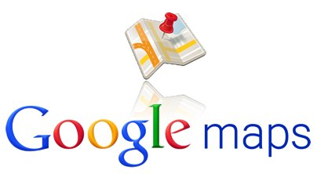

إن كنت تتابع أخبار **Google** خلال الأسابيع الماضية فلا شك بأنك لاحظت بأن خدمة خرائط **Google Maps** أثارت سخط الكثير من المطورين بعد أن قررت Google جعل واجهة الخدمة البرمجية **API** مدفوعة الأجر. واستجابة لطلبات المطورين، قامت  Google بخفضت سعر استغلال هذه الواجهة البرمجية بشكل كبير.

قبل [هذا الإعلان](http://googlegeodevelopers.blogspot.com/2012/06/lower-pricing-and-simplified-limits.html)، كان يجب على كل تطبيق يستغل خدمة Google Maps ويتجاوز حاجز 25 ألف تحميل للخرائط يوميا بدفع 4 دولارات لكل 1000 تحميل إضافي فوق هذا الحد، وهو ما دفع بالعديد من الخدمات، أمثال [Foursquare](https://www.it-scoop.com/2012/03/foursquare-openstreetmap/) و[ويكيبيديا](https://www.it-scoop.com/2012/04/wikipedia-openstreetmap/) إلى الانتقال إلى خدمات أخرى، لكن الأمر أصبح مختلفا الآن حيث أصبح السعر الآن 0.5 دولار فقط.

ليس هذا فحسب، قامت Google برفع الحد الذي كان مطبقا سابقا على الـ Styled Maps وأصبحت تخضع لنفس الحد المطبق على الخرائط العادية، كما أنها ستُعفي المنظمات غير الربحية من الدفع مقابل استغلال خرائطها.

تُشير Google بأنها لا تقوم بإيقاف التطبيقات التي تتجاوز الحد آنف الذكر بشكل آلي، حيث ستراسل أصحاب التطبيقات المعنية بالأمر لمباحثة إمكانية الانتقال إلى Google Maps API for Business كما أنها لا تطبق هذه الأسعار سوى على التطبيقات التي تتجاوز الحاجز لمدة 90 يوما متتالية (مما يعني بأن التطبيق فعلا له شعبية كبيرة ويستغل خرائط Google Maps بشكل مُكثّف)، وتذكر المطورين بأنه يمكنهم إظهار إعلانات AdSense بجانب خرائطهم للاستفادة المادية من المحتويات التي يعرضونها.

بعبارة أخرى، حتى وإن كانت نسبة المواقع المعنية بالأمر لا تتجاوز 0.35% من مجموع المواقع التي تستخدم Google Maps إلا أن Google توفر كل "شروط الراحة" التي تمكن المطورين من استغلال خرائطها بأقل التكاليف.

هل ستعود المواقع التي تخلت عن Google Maps إلى استخدامه من جديد؟ وهل ستعود ويكيبيديا إلى حضن Google بعد أن أصبحت المنظمات غير الربحية معفية من تكاليف استغلال خدمتها؟
