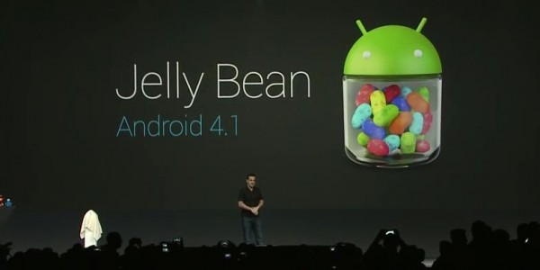

لا، لم نتحول إلى موقع متخصص في أخبار **Google**، لكن كمية ونوعية المستجدات التي كشفت عنها Google خلال افتتاحها لمؤتمر **I/O**  تدفعنا للكتابة عنها (أو عن أهمها)، وهذه المرة مع إصدار **Jelly Bean** من نظام **Android**.

قبل الحديث عن الإصدار Jelly Bean أشارت Google بأن نظام Android أصبح أكثر شعبية وانتشارا من ذي قبل، حيث تجاوز عدد الأجهزة التي تعتمد على Android حاجز 400 مليون جهاز، كما أنه يتم حاليا تفعيل مليون جهاز Android جديد بشكل يومي، أي بمعدل 12 جهاز جديد كل ثانية.

نرجع إلى Jelly Bean، بداية يحمل هذا الإصدار الرقم 4.1 وليس 5، لكن بالرغم من ذلك فإن [التحديثات التي حملها في طياته](http://developer.android.com/about/versions/jelly-bean.html) لم تكن بسيطة، بل هي تحديثات وتحسينات عميقة، وإليكم أهمها:

**Project Butter**:  بفضل هذا المشروع أصبح نظام Android أسرع من ذي قبل، حيث تعرض واجهة النظام الآن 60 صورة في الثانية، ولقد تم عقد مقارنة بين جهازين أحدهما مجهز بإصدار Jelly Bean والآخر بإصدار Ice Cream Sandwich لتبيين الفرق الكبير في السرعة ما بين النظامين.

**Voice Typing**: تم تمكين إصدار Jelly Bean من خاصية الإملاء الصوتي، والنقطة الأكثر أهمية هو عدم الحاجة إلى الاتصال بالإنترنت لاستخدامها.

**مركز التنبيهات**: تم إدخال العديد من التحسينات على مركز التنبيهات، حيث أصبح بالإمكان القيام بالكثير من الأعمال مباشرة عليه، كالاتصال بالأشخاص الذين حاولوا الاتصال بالمستخدم مباشرة من صفحة التنبيهات، قراءة رسائل البريد الالكتروني الواردة من دون الحاجة إلى فتح تطبيق البريد أو حتى الرد على تحديث على Google+ من دون الحاجة إلى الخروج من صفحة التنبيهات.

**البحث الصوتي**: خدمة مماثلة في المبدأ لخدمة Siri على هواتف iPhone، لكن الأمثلة التي عرضتها Google تظهر تفوقا كبيرا لهذه الخاصية، فعلى سبيل المثال أجاب النظام حول سؤال "من هو رئيس وزراء اليابان" بذكر اسمه بصوت واضح، إضافة إلى عرض صورته، كما قدم النظام إجابة أخرى مبهرة لما طُلب منه تقديم تعريف مصطلح روبوت، وهو ما يجعل خاصية البحث الصوتي على Jelly Bean تشبه إلى حد ما خليطا ما بين Siri وخدمة البحث Qwiki.

**Google Now**: خاصية أخرى مبهرة تساعد المستخدم (الذي يود أن يضع كل معلوماته الخاصة بين أيدي Android) بشكل كبير. فعلى سبيل المثال يمكن لتطبيق Google Now أن يذكر المستخدم بموعد رحلته، أو تنبيهه في حال تم تأخيرها، إخباره بموعد وصول القطار القادم إن كان في محطة القطارات، أو حتى تنبيهه إلى موعد خروجه من المنزل لكي يصل إلى موعده في الوقت المحدد.

**التحديث الذكي للتطبيقات**: لدى تحديث التطبيقات فإنه لن يصبح ضروريا إعادة تحميل التطبيق المحدث كاملا، حيث يمكن للنظام معرفة الفرق بين الإصدار المنصب على الجهاز والإصدار الجديد وتحميل الأقسام الضرورية فقط.

**استخدام Google Maps من دون الحاجة إلى اتصال بالإنترنت**: يمكن النظام من استغلال خرائط Google Maps من دون الحاجة إلى اتصال بالإنترنت، حيث أصبح من الممكن تحميل خرائط منطقة معينة ثم استغلال الخريطة لاحقا.

تشير Google بأن كلا من أجهزة Galaxy Nexus، Motorola Xoom و Nexus S ستحصل على تحديث 4.1 بشكل آلي Over The Air (من دون الحاجة إلى تدخل المستخدم) بداية من منتصف شهر يوليو القادم، لكنه يمكن للمطورين المهتمين بكتابة تطبيقات له الحصول على حزمة التطوير الخاص به ابتداءً من اليوم.

فيديو تعريفية بـ Google Now:

 <!-- more -->

[youtube=www.youtube.com/watch?v=pPqliPzHYyc]
