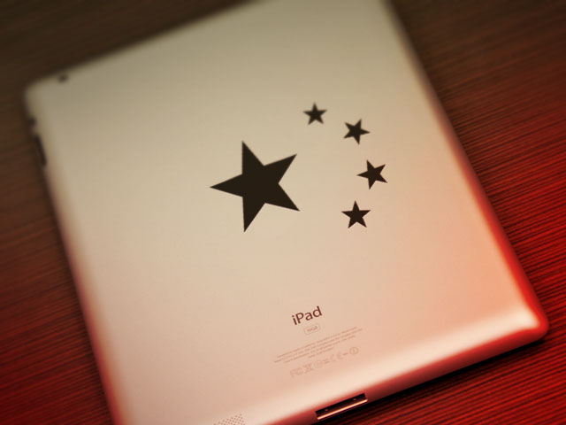

قد يبدو الأمر غريبا نوعا ما، لكن لو فكرنا في الأمر مليا لوجدنا بأن **Apple** عادة ما تُقرر اختيار الاسم الذي توده لمنتجاتها (حتى وإن كان مستخدما) ثم تحاول فرض نفسها... أو أن تدفع مقابل استغلال هذا الاسم، وهو ما حدث لها بعد أن اصطدمت بشركة **Proview** التايوانية التي تملك حق استغلال اسم **iPad** في الصين.

بداية طالبت Proview بما لا يقل عن 400 مليون دولار نظير التخلي عن اسم iPad، لكن Apple لم تقبل بالأمر بادئ الأمر، إلا أن منع تسويق أجهزتها اللوحية في الصين، وعمليات سحب الجهاز من المحلات دفعتها لتقترح 16 مليون دولار، قبل أن تقرر مد يدها إلى دفتر شيكاتها [لتدفع 60 مليون دولار](http://bigstory.ap.org/article/china-court-apple-pay-60m-settle-ipad-case#overlay-context=).

للتذكير فإنه قد سبق لـApple شراء حق استغلال اسم iPad من شركة Shenzhen Proview Technology الفرعية لشركة Proview International Holdings مُقابل 50 ألف دولار فقط، لكن الاتفاق لم يتضمن حقوق استغلال هذا الاسم في الصين، مما جعل تسويق أجهزة iPad مُهددا ليس في الصين فحسب، وإنما في باقي أنحاء العالم نظرا لتصنيع الأجهزة على أراضيها، ونظرا لإمكانية إيقاف تصدير الأجهزة في حال طالبت Proview بذلك.
