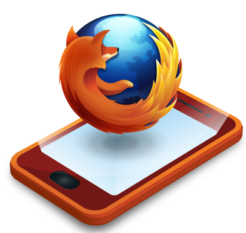

أعلنت **موزيلا** عن تغيير اسم نظامها **Boot To Gecko** المُوجه للهواتف الذكية إلى **Firefox OS** وكشفت عن العديد من الشركاء الذي سيساهمون في إطلاق الجيل الأول من الهواتف التي تستخدم هذا النظام، ونجد ضمنهم شركة "اتصالات" الإماراتية.

لم تكشف موزيلا عن الكثير فيما يخص نظامها القادم، بل كان هدف [التدوينة](https://blog.mozilla.org/blog/2012/07/02/firefox-mobile-os/) التي نشرتها هو التعريف بشركائها في مغامرتها مع أنظمة تشغيل الهواتف الذكية، فمن حيث المصنعون، اكتفت بالصينييين TCL Communication Technology وZTE، أما شركات الاتصالات فكانت عديدة، ونجد على رأسها "اتصالات" الإماراتية، Deutsche Telekom، Sprint وغيرها.

ستعتمد هواتف <del>Chrome OS</del> Firefox OSعلى مُعالج Snapdragon الخاص بـQualcomm ومن المنتظر أن يصدر أول هاتف يحمل هذا النظام في البرازيل في بداية العام القادم. كما تؤكد Mozilla من جديد على أن نظامها سيعتمد على المعايير المفتوحة وسيتم تقديم أعمالها على هذا النظام للتقييس الموحد standardization لدى منظمة W3C.

يُشير موقع [Generation NT](http://www.generation-nt.com/boot-gecko-firefox-os-smartphone-actualite-1598651.html) الفرنسي إلى أن نظام Firefox OS سيهدف بشكل أساسي إلى إنتاج هواتف ذكية بأرخص الأسعار، حيث من المتوقع أن تكون أسعار أرخص الهواتف التي تستخدمه في حدود 50 دولار فقط (يُشير الموقع بأن هذا السعر يعتبر أدنى بكثير من سعر 150 دولار لأرخص أنواع هواتف Android).

للتذكير، فإن نظام Firefox OS (نظام Boot To Gecko سابقا) [يعتمد بشكل كبير على تقنيات الويب](https://www.it-scoop.com/2012/02/boot2gecko/)، حيث يعتمد النظام على نواة Linux إلا أن باقي التطبيقات ستكون مكتوبة بتقنيات الويب الحديثة (HTML, JavaScript, CSS)، مما سيُسهل المهمة أمام المطورين الذين لن يُضطروا إلى تعلم تقنيات جديدة، أو تنصيب أدوات خاصة.
