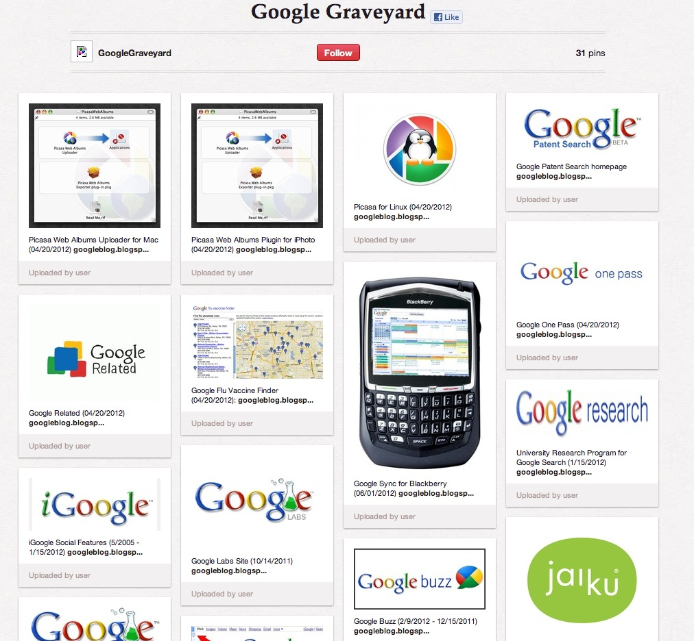

ربما سمعتم عن حملة إيقاف خدمات إضافية أعلنت عنها **Google** مؤخرا كخدمات **iGoogle**،  **Google Video** وغيرها. كان من الممكن أن يمر هذا الخبر مرور الكرام، لكن أحد الموظفين السامين لدى **Microsoft** اغتنم الفرصة إما ليسخر من Google أو ليروج لخدمة **Pinterest** أو ربما لكليهما، وذلك بإنشائه "مقبرة" على هذه الأخيرة "لدفن" جميع الخدمات التي قتلتها Google.

قام Frank X. Shaw مدير قسم corporate communications لدى Microsoft بجمع الخدمات التي قامت Google بإيقافها على مر السنوات الماضية والتي وصل عددها إلى 31 في [صفحة Pinterest واحدة](http://pinterest.com/googlegraveyard/google-graveyard/)، ناسيا أو مُتناسيا الخدمات التي أوقفتها Microsoft والتي تجاوزت هذا الرقم بكثير، حيث تُشير [هذه الصفحة](http://techrights.org/wiki/index.php/Microsoft_-_Dead_Divisions_or_Products) إلى وجود أكثر من 60 خدمة ميتة لدى Microsoft لوحدها، وهو ما قد يُعجل بظهور مقبرة تقنية أخرى – قد يُعلن عنها أحد موظفي Google- تجمع هذه الخدمات في مكان واحد.

ما هي الخدمات التي أغلقتها Google مؤخرا؟  يتعلق الأمر [بكل من](http://googleblog.blogspot.fr/2012/07/spring-cleaning-in-summer.html):

**Google Mini**:  وهي خدمة خاصة بالشركات للبحث في محتويات شبكاتها الداخلية، أعلنت Google عن إيقافها لأنه يمكن استبدالها بخدمات أخرى كـ Google Search Appliance. وسيتم إيقاف الخدمة مع نهاية الشهر الجاري (31 يوليو).

**Google Talk Chatback**: والتي كانت تسمح لأصحاب المواقع بإضافة خاصية المحادثة عبر Google Talk إلى مواقعهم، وتدعو Google مستخدمي هذه الخدمة إلى الانتقال إلى خدمة Meebo bar التي اشترتها مؤخرا.

**Google Video**: بالرغم من إيقاف رفع الفيديوهات إليها منذ مايو 2009 إلا أن هذه الخدمة بقيت "حية" لأزيد من ثلاث سنوات. ستقوم Google بنقل محتوياته إلى Youtube في العشرين من أغسطس القادم.

**iGoogle**: والتي تسمح بتخصيص صفحة بداية Google بإضافة البرامج المصغرة إليها Widgets، الخدمة سيتم إيقافها في الفاتح من نوفمبر 2013.

**Symbian Search App**: خدمة البحث عبر هواتف Symbian.
