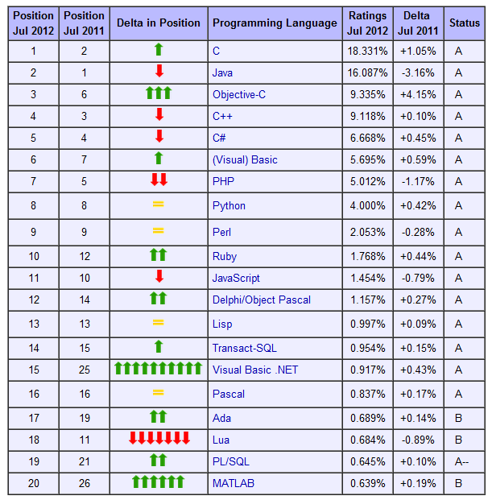

نشرت **Tiobe** ترتيبها الشهري للغات البرمجة الأكثر شعبية والتي أكدت من جديد تزايد شعبية **Objective-C** التي تجاوزت لأول مرة في تاريخ هذا الترتيب مُنافستها المُباشرة **C++** في حين تحافظ لغة **C** على صدارتها للشهر الرابع على التوالي.

و[تذكّر](http://www.tiobe.com/index.php/content/paperinfo/tpci/index.html) Tiobe بأنه تم إطلاق كلا من لغتي C++ و Objective-C سنة 1983 سعيا لإنشاء نسخة كائنية التوجه من لغة C، لكن لم تحتج C++ إلا لسنوات قليلة لتفرض نفسها على الساحة، إلا أنه وبفضل هواتف iPhone وأجهزة iPad رجعت لغة Objective-C إلى الواجهة، لكن ليس كمنافس مُباشر لغة C++، حيث أن هذه الأخيرة أصبحت مُتخصصة أكثر في الأنظمة عالية الأداء وإنما كلغة برمجة لا يُمكن الحديث عن برمجة الهواتف دون ذكرها.

وعلى ذكر الهواتف الذكية، لم يشفع انتشار Android للغة Java كثيرا، حيث أنها لم تستطع بعد استعادة صدارتها التي انتزعتها منها لغة C [منذ أربعة أشهر](https://www.it-scoop.com/2012/04/tiobe-index-for-april-2012/) (يجب أن لا ننسى بأن الهواتف الذكية ليست إلا جزء يسيرا من الحوسبة ككل)، في حين تواصل لغة PHP فقدان بريقها، حيث حلت سابعة في هذا الترتيب، متراجعة بذلك بمرتبة مُقارنة بترتيب [الشهر الماضي](https://www.it-scoop.com/2012/05/tiobe-index-for-may-2012/)، وبمرتبتين مُقارنة بترتيب نفس الشهر من العام الماضي.

للتذكير، فإن ترتيب Tiobe لا يقيس مدى انتشار لغات البرمجة، بل يهتم بشعبيتها، ويعتمد في قياس ذلك على العديد من المؤشرات، كعمليات البحث على محركات البحث، الدروس التي تُنشر على Youtube أو الكتب التي تُباع على Amzon وغيرها.

ما هو ترتيب لغة البرمجة المُفضلة لديك؟ ما هي توقعاتك لترتيب هذه اللغات خلال الأشهر القادمة؟
