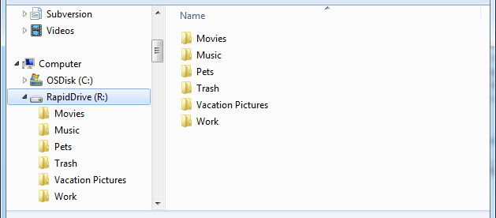

هل هو خوف من مصير مُماثل لمصير MegaUpload أم هو طمع في سوق تقوم على رأسه DropBox؟ ربما مزيج ما بين الأمرين هو ما دفع بـ **RapidShare** إلى إطلاق خدمتها للتخزين السحابي والتي أطلقت عليها اسم **RapidDrive**.

ما الذي يجعل من [RapidDrive](https://www.rapidshare.com/#!tools_rapiddrive) مُختلفا عن باقي خدمات التخزين السحابي؟ بداية الخدمة موجهة خصيصا لزبائن خدمة RapidPro والذين يستفيدون من خاصية التخزين اللامحدود والتي يُمكن لهم أن يستغلوها أيضا للتخزين السحابي، كما أنه خلافا لباقي المنافسين، فإن RapidDrive لا تقوم بمزامنة الملفات ما بين الأجهزة بشكل دوري، بل يتم تحميل الملفات قبيل استخدامها ، وهي الملفات التي تظهر في Drive (قرص) جديد وليس داخل مجلد خاص مثلما هو الحال مع باقي الخدمات.

الخدمة لا تزال حاليا في طور تجريبي Beta، والتطبيق الخاص بها متوفر فقط على نظام Windows، ومن المنتظر إطلاق النسخة النهائية من الخدمة وتطبيقها بداية من شهر سبتمبر القادم بعد أن يتم التحقق من سلامة وعمل كامل خواص الخدمة.

لا توفر MegaUpload أي حسابات مجانية/ محدودة لخدمتها، ولمن أراد أن يُجربها ما عليه سوى أن يدفع 9.90 € مقابل استغلال خدمة RapidPro لمدة شهر.

في رأيك ما سبب توجه RapidShare إلى التخزين السحابي؟ هل هو الخوف أم الطمع؟
