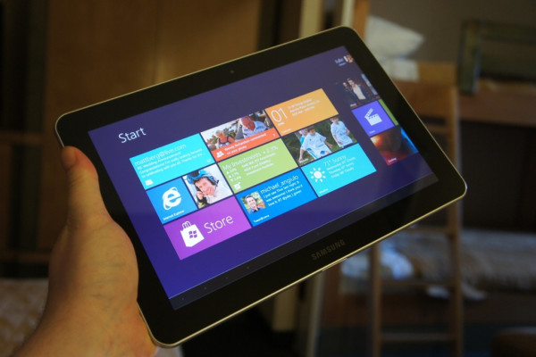

بعد أن أعطت Microsoft شارة  الانطلاق لسباق الأجهزة اللوحية المُجهزة بنظام **Windows 8**، كشفت Bloomberg بأن **Samsung** تُحضر بدورها جهازا لوحيا مُجهزا بنسخة **ARM** من نفس النظام والذي سيصدر أيضا في النصف الثاني من العام الجاري (شهر أكتوبر).

لا يُعتقد بأن يكون هدف Samsung هو مُنافسة Microsoft مصممة نظام Windows 8، حيث أنها ستعتمد على نسخة RT من النظام والمُخصصة للأجهزة التي تستخدم مُعالجات ARM، في حين أن Microsoft رمت بثقلها لإخراج نسخة من جهازها اللوحي Surface متوافقة مع معمارية x86 بأبهى صورة ممكنة، بالرغم من توفير Microsoft لنسخة من أجهزتها اللوحية تعمل بمعالجات ARM أيضا.

كما تهدف Samsung إلى تجنب ربط مصيرها بنظام واحد وشريك واحد، حيث أنها تملك نظام تشغيل خاص بها، ويتعلق الأمر ب[نظام Bada](https://www.it-scoop.com/tag/Bada/)، إضافة إلى تسويقها لعدة هواتف وأجهزة لوحية تعمل بنظام Android.

لم يتم تسريب أيا من مواصفات الجهاز بعد، [باستثناء](http://www.bloomberg.com/news/2012-07-06/samsung-said-to-plan-windows-rt-tablet-for-october-introduction.html) أنه سيأتي مُجهزا بُمعالج SnapDragon  الخاص بـ Qualcomm، كما أنه لم يتم الإعلان بشكل رسمي حول الجهاز.

تجدر الإشارة إلى أن الجهاز الذي عرضت عليه Microsoft نظام Windows 8 لأول مرة كان من تصميم Samsung مما يرجح فرضية أن الشركتين تعملان جنبا إلى جنب على هذا الجهاز اللوحي منذ مدة، كما يتوقع أن يتم الإعلان عنه بمجرد صدور نظام Windows 8 بشكل رسمي.
