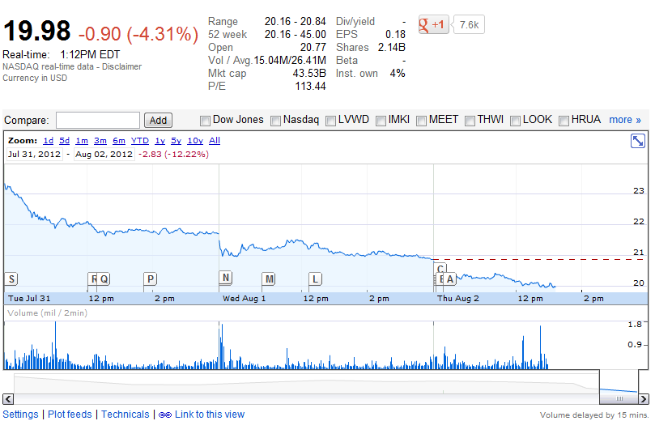

تتوالى المشاكل والأزمات التي تواجهها **فيس بوك** منذ أن وطأت أقدامها أرض Nasdaq فبعد ["فضيحة" النقرات الآلية على الإعلانات](https://www.it-scoop.com/2012/08/limited-run-facebook-ad-clicks-bots/) على الشبكة، أعلن 3 موظفون سامون استقالتهم من مناصبهم، مما أدى بسعر سهم الشبكة إلى النزول لأول مرة تحت حاجز **20 دولارا**.

يتعلق الأمر بكل من Ethan Beard الذي يشغل منصب director of platform partnerships والذي أعلن [على حسابه على فيس بوك](https://www.facebook.com/ethan/posts/10151117876790865) بأنه سيترك الشبكة بعد أن أمضى فيها أكثر من أربعة سنوات، قبل أن [تعلن](https://www.facebook.com/katiemitic/posts/10151055149008070) بعده Katie Mitic رحيلها عن الشركة والتي كانت تشغل منصب platform marketing director، ثم [لحقهما](https://www.facebook.com/jonathan.matus/posts/10100464678048261) Jonathan Matus الذي يشغل منصب mobile platform marketing manager. الملفت في الانتباه بأن كل هذه الإعلانات جاءت شبه متزامنة، حيث لم يفصل الأولى عن الأخيرة أكثر من ساعة من الوقت مثلما تبينه أوقات نشرها على الفيس بوك

ما الذي نتج عن ذلك؟ مواصلة سعر سهم فيس بوك نزوله، حيث وصل إلى مستوى قياسي جديد بنزوله تحت حاجز 20 دولار، فقد وصل سعره مساء اليوم إلى غاية 19.19 دولارا للسهم مثلا [أشارت إليه مدونة TechCrunch](http://techcrunch.com/2012/08/02/facebook-drops-below-20-worth-less-than-what-msft-offered-for-yahoo-in-2008/)  (بالرغم من أن أدنى سعر يظهر على [صفحة فيس بوك على خدمة Google Finance](http://www.google.com/finance?q=fb) هي 19.98)، وذلك بعد أن تم تداوله في أول يوم لدى دخوله إلى البورصة بسعر 45 دولارا للسهم لبعض الوقت.

[يرى](http://blogs.wsj.com/marketbeat/2012/08/02/facebook-shares-slip-under-20/?mod=yahoo_hs) المحلل Victor Anthony، بأننا نمر حاليا في الفترة الأمثل لشراء أسهم فيس بوك لمن يود الاستثمار فيها، حيث أن الشبكة تعاني مشاكل عديدة خاصة ما تعلق منها بالمداخيل واستراتيجيتها الخاصة بالهواتف، إلا أنه يتوقع أن تعود الاستثمارات في الأسهم لمن يشتريها بسعرها الحالي بالفائدة قبل نهاية 2013، حيث يتوقع أن تعود حينئذ إلى الارتفاع من جديد لتصل إلى أول سعر افتتحت به دخولها إلى البورصة والذي كان مقدرا بـ 38 دولار.

كما أنه من بين المشاكل التي تواجهها الشركة  -والتي [أشار](http://blogs.wsj.com/marketbeat/2012/08/02/facebook-shares-slip-under-20/?mod=yahoo_hs) إليها المحلل Anthony - هو قرب انتهاء فترة lock-up والتي بانتهائها سيصبح بإمكان حاملي الأسهم الأوائل (وخاصة الموظفين) بيع أسهمهم، وهو ما سيخفض سعرها نتيجة لكثرة العرض، إضافة إلى عزوف الشركات عن شراء أسهم الشبكة.

تجدر الإشارة إلى أنه رغم الزيادة التي عرفتها أعداد مستخدمي فيس بوك والتي تجاوزت 955 مليون مستخدم، إلا أن الشركة [سجلت خسائر](https://www.it-scoop.com/2012/07/facebook-posts-loss-in-first-quarterly-earnings-report/) خلال الربع الثاني من العام الجاري قُدرت بنحو 157 مليون دولار. كما أن مسلسل خروج الموظفين لديها بدأ منتصف شهر يونيو الماضي [بخروج Bret Taylor](https://www.it-scoop.com/2012/06/facebook-cto-bret-taylor-leaving/) الذي يشغل منصب chief technology officer.

السؤال الذي يطرح نفسه الآن، هل تحتاج فيس بوك إلى مدير تنفيذي جديد حتى تُطمئن المستثمرين الحاليين والقادمين للشركة؟
