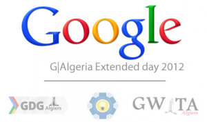

تستعد المدرسة العليا للإعلام الآلي بالجزائر العاصمة للتحضير لمبادرة هي الأولى من نوعها، تتعلق بعملاق البحث على الويب Google. هو يوم موسع واحد لحدث فريد، يجمع مطوري برمجيات، أصحاب مؤسسات، متخصصين في مجال التسويق وأصحاب مواقع، طلبةً أو أفرادًا على حد سواء، كلٌ، تجمعهم وجهة واحدة، وسبب واحد: Google وتقنياتها، ليس فقط من أنفسهم، بل وبحضور أزيد من 5 محاضرين من Google نفسها!

هذه الفعالية هي من تنظيم مجموعة Google للمطورين بالتنسيق مع سفراء المرأة للتكنولوجيا في Google والطلبة سفراء Google بالجزائر. وهذا بعد الصدى الكبير الي حظيت له أمثال هذه الفعالية في العالم العربي والغربي، حيث يأتي دور الجزائر بعد ساحل العاج، مصر، المغرب ثم الهند مؤخرا.

يتخلل اليوم برنامج حافل من المحاضرات وورشات العمل، على غرار كونه فرصة للتعارف وتبادل الخبرات بين الحضور أنفسهم. حيث تم تقسيمه إلى 3 جلسات sessions أساسية هي:

**جلسات المجتمع**، ويتم التطرق فيها إلى:

	  * اللغة العربية والتعريب في Google.
	  * برنامج جامعة Google.
	  * المرأة والتكنولوجيا في Google.
	  * التحضير لمقابلة العمل وبعض النصائح.
	  * ‫‪Google Developer Outreach‬‬

**جلسات الأعمال**، مع التركيز على المسوقين وأصحاب المواقع وأصحاب المشاريع وأداوت Google المساعدة في مجالهم.

**جلسات المطورين،** وهي عبارة عن مجموعة من ورشات العمل يتم خلالها التعرف والتدرب على‬ ‫أحدث خدمات و منتوجات Google والهدف منها هو مساعدة المطورين‬ ‫الجزائريين للاطلاع على أحدث تقنيات Google. وفيها:

	  * عرض متقدم لتقنيتي HTML5/CSS3.
	  * ورشة الأدوات التطويرية لنظام Android.
	  * منصة Google السحابية.
	  * الواجهات البرمجية API لـ Google Maps، و Google Map Maker.
	  * الباقة التطويرية SDK لـ Google Drive والـ Apps Script.

أما عن المتحدثين فسيتم الكشف عنهم في وقت لاحق عبر وسائل الإعلام و[الموقع المخصص للمبادرة](https://sites.google.com/site/galgeriaextended/home).

بالإضافة لما سبق، سيكون هناك مساحات لعرض مختلف منتجات Google والروبوت، وأجنحة خاصة بالممولين.

لمزيد من المعلومات أو للتسجيل لحضور هذه الفعالية (مقاعدة محدودة) يمكن زيارة الموقع المخصص للمبادرة [من هنا](https://sites.google.com/site/galgeriaextended/home)، كما يمكن البقاء على اطلاع عبر الوسائل الاجتماعية:

فيس بوك: [https://www.facebook.com/GDGAlgiers](https://www.facebook.com/GDGAlgiers)

[GDG Algiers](https://plus.google.com/111309779341768878739/posts) :+Google

تويتر: [@GDG_Algiers](https://twitter.com/GDG_Algiers)
