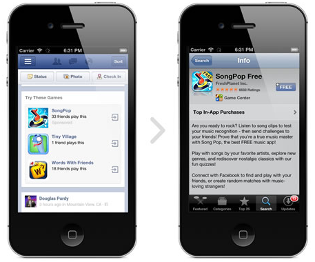

في خطوة طال انتظارها كثيرا، أعلنت **فيس بوك** عن شروعها في إظهار **الإعلانات** على **تطبيقاتها الخاصة بالهواتف الذكية** مباشرة ضمن التحديثات التي تظهر للمستخدمين، في حين ستقتصر هذه الإعلانات حاليا على تطبيقات الهواتف الذكية فقط.

كما هو معلوم فإن أكبر تحدٍ تواجهه فيس بوك حاليا هو زيادة أعداد مستخدمي تطبيقاتها على الهواتف الذكية بدل نسخة الويب من الشبكة الاجتماعية، وهو ما نجم عنه مشكل مالي يتمثل في تراجع معدل مداخيل الشبكة عن كل مستخدم لها، حيث أنه كلما زاد عدد مستخدمي تطبيقات الهواتف الذكية، كلما قل عدد المستخدمين المُعرّضين للإعلانات (الذين يستخدمون نسخة الويب)، وهو ما وضع الشبكة تحت ضغوطات المستثمرين، خاصة بعد إعلان الشبكة وصول عدد مستخدمي تطبيقاتها على الهواتف الذكية إلى [543 مليون مستخدم من أصل 955 مليون مستخدم كلي للشبكة](https://www.it-scoop.com/2012/07/facebook-posts-loss-in-first-quarterly-earnings-report/).

الإعلانات الجديدة التي ستعرض على الهواتف الذكية ستخص حاليا التطبيقات فقط، حيث سيتم اقتراح جملة من التطبيقات (والتي دفع أصحابها مقابل الإعلان عنها) التي لم ينصبها المستخدم بعد، والتي تتوافق بشكل ما مع ميولاته، حيث سيكون بإمكان المعلنين استهداف فئات عمرية معينة، بلدان معينة، أو حتى جنس المستخدم، تماما مثلما هو الحال مع الإعلانات على نسخة الويب.

[تشير](https://developers.facebook.com/blog/post/2012/08/07/introducing-new-mobile-ads-for-apps/) فيس بوك إلى أنها أرسلت ما لا يقل عن 146 مليون زيارة لكل من متجري AppStore وGoogle Play مباشرة من شبكتها خلال الشهر الماضي فقط، أي بمعدل يقترب من 4 نقرات (3.71 نقرة) لكل مستخدم على الهواتف للشبكة، وإن استطاعت فيس بوك رفع هذا الرقم فإنها ستحل جزءا كبيرا من مشكل الاستفادة المالية من مستخدمي الهواتف الذي أصبح يؤرقها مؤخرا.

السؤال الذي يطرح نفسه الآن، إن كان نظام الإعلانات الجديد سيفيد ويُعجب مطوري التطبيقات، فهل سينال إعجاب المستخدمين أيضا، خاصة وأن ثلاثة إعلانات فقط كفيلة بملء نسبة كبيرة من شاشة هواتف iPhone (مثلما يظهر على الصورة المبنية أعلاه).
