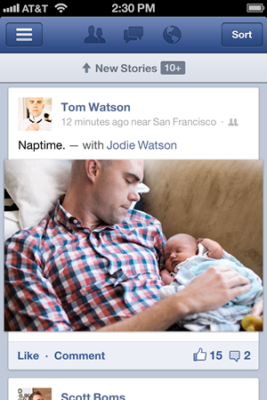

هل مللت من ثقل تطبيق **فيس بوك** على هاتف **iPhone** الخاص بك أو على جهاز **iPad**؟ هل كنت تظن بأن الأمر مقصود حتى تدفعك الشبكة إلى استخدام نسخة الويب بدل نسخة الهواتف؟ ربما الأمر لم يكن مقصودًا (بشكل مباشر) حيث عمدت فيس بوك مساء أمس إلى إطلاق تحديث جديد لتطبيقها على نظام iOS حمل الترقيم 5.0 من المفترض أن يكون أسرع مرتين من التطبيق السابق.

ما الذي تم القيام به لتسريع التطبيق؟ [التدوينة](http://newsroom.fb.com/News/A-Faster-Facebook-for-iOS-1b4.aspx) التي تعلن عن التطبيق الجديد ''للعوام" لم تقدم شرحا مفصلا حول الأمر، حيث اكتفت باستعراض ما يهم المستخدم العادي للتطبيق وركزت على سرعة التطبيق وعلى وسرعة فتح التطبيق، إضافة إلى تحسينات على الصور. لكن [تدوينة مفصلة](https://www.facebook.com/notes/facebook-engineering/under-the-hood-rebuilding-facebook-for-ios/10151036091753920) لـ  Jonathan Dann (يبدو بأنه المسؤول عن تطوير التطبيق، لكن لم أستطع من التحقق من الأمر) يرجع الأمر بشكل أساسي إلى التخلص من HTML5 في التطبيق الحالي.

لكن لماذا استعملت فيس بوك HTML5 في تطبيق على منصة iOS؟ بكل بساطة أرادت فيس بوك أن تقدم نفس تجربة المستخدم لجميع مستخدميها على جميع الهواتف وذلك بتوفير نفس "الطبقة" لهم وذلك بكتابتها بـHTML5، وهو ما جعل التطبيق السابق على نظام iOS ثقيلا حيث كان مكونا بشكل ما من ثلاث طبقات، طبقة HTML5 مبنية على إطار عمل خاص بالشبكة، الكل موضوع في إطار تطبيق IOS كلاسيكي، وهذا للتمكن من عرضه في متجر تطبيقات Apple.

شخصيا لاحظت عدة تحسينات (لم تتم الإشارة إليها بشكل مباشر في إعلان فيس بوك) ويتعلق الأمر خصوصا بالصور التي تحتوي تعليقات طويلة، حيث أنه عادة لدى الضغط على زر "قراءة المزيد" فإنه تظهر التعليقات بدل باقي النص، كما أن تم حل مشكل التنبيهات في الرسائل الخاصة، ففي السابق لدى استقبال رسالة جديدة سيتم إعلام المستخدم بذلك، لكن يتم عرض رسالة قديمة على أساس أنها جديدة (إضافة النقطة الزرقاء التي تدل على عدم قراءة الرسالة) جانبها بدل عرض الرسالة الجديدة والتي لن تعرض إلا بعض سحب القائمة إلى الأسفل لتحديثها.

هذا التحديث يدفع إلى التساؤل، فبعد أن هجروها حينا من الدهر، عاد المطورون إلى كتابة تطبيقات مركزية (تطبيقات ويب بشكل عام) بدل التطبيقات المحلية (تطبيقات سطح المكتب)، هل سيسجل التحديث الجديد لتطبيق فيس بوك عودة المطورين لكتابة تطبيقات Native بدل تطبيقات الويب المبنية على HTML5؟

وأنت عزيزي القارئ، هل لاحظت تحسنا في سرعة التطبيق على iOS؟
