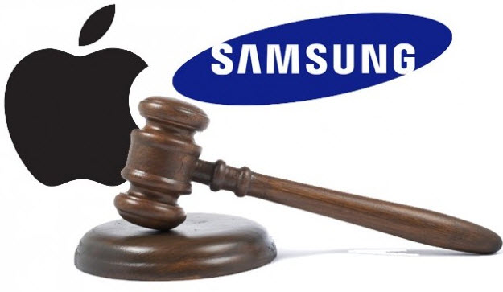

إن كنت من سكان هذه المعمورة ولم تكن خارج مجال تغطية الإنترنت خلال الأيام القليلة الماضية فإنك سمعت حول القضية التي أسالت الكثير من الحبر (الإلكتروني) والمتعلقة ب[الحكم الصادر لصالح Apple](http://ardroid.com/2012/08/25/samsung-found-guilty-in-its-case-against-apple/) والذي يُغرم Samsung بغرامة كبيرة جراء اختراقها لبراءات الاختراع الخاصة بها، حكم صدر بسرعة ملفتة للانتباه، جعلت الكثيرين يشككون في مصداقيتها، وبالمختصين إلى تسليط الضوء على الأخطاء التي فيها.

البداية تبدأ من أحد المحامين الذي يدير مدونة [Above The Law](http://abovethelaw.com/2012/08/apple-samsung-verdict/) والذي يُشير بأن الأيام الثلاثة التي قضتها هيئة المحلفين للخروج بقرارهم لم تكن أبدا كافية لدراسة الموضوع من كل جوانبه ولدراسة الملفات التي قدمتها المحكمة لهم والتي لا يقل عددها عن 109 صفحات. كما أنهم لم يطرحوا أية أسئلة خلال تلك الفترة.

أمر آخر لفت انتباه المحللين وهو التأثير الذي يُحتمل لـ Velvin Hogan رئيس هيئة المحلفين، حيث أنه وبحكم [امتلاكه لعدة براءات اختراع](http://news.cnet.com/8301-13579_3-57500358-37/exclusive-apple-samsung-juror-speaks-out/) يكون قد أثر "بخبرته" في هذا المجال على باقي أعضاء الهيئة، ويكفي أن يكون متعاطفا مع Apple أو منحازا إلى جهة معينة في القضايا المتعلقة ببراءات الاختراع حتى يحايد الصواب.

الغريب في الأمر أيضا بأن هيئة المحلفين قامت بتغريم Samsung أزيد من مليوني دولار بخصوص براءتي اختراع لم يثبت من خلال هذه المحاكمة بأنه تم اختراقهما، قبل أن يتم تصحيح الوضع بعد صدور القرار [وتخفيض قيمة الغرامة](http://www.groklaw.net/article.php?story=2012082510525390) بناء على ذلك.

أضف إلى ذلك عدم احترام الهيئة لتوصيات المحكمة، وذلك بسبب مرورها مرور الكرام على الوثائق التي سملتها إياها، فعلى سبيل المثال توصي المحكمة بأن يُنظر إلى الغرامة الواجب تحديدها كتعويض للمتضرر وليس كإجراء عقابي للمتسبب في الضرر، لكن لسان Hogan خانه حيث [صرح](http://www.mercurynews.com/business/ci_21400423/jury-foreman-apple-v-samsung-verdict-message-that-copying-risk) بأن هيئة المحلفين أرادت أن ترسل رسالة واضحة بأن خرق براءات الاختراع هو أمر سيء، مما يعني بأن الغرامة كانت عقابية ولم تكن تعويضية.

السؤال الذي يطرح نفسه الآن، هل يسمح القرار المتسرع لهيئة المحلفين الحالية بتسريع الحكم لصالح Samsung لدى استئنافها للحكم؟

