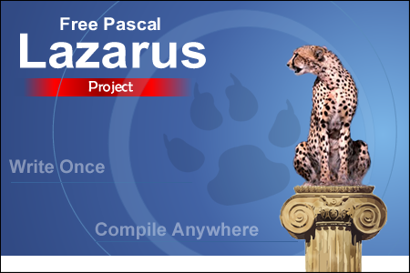

أطلق مجتمع **Free Pascal** النسخة الأولى (1.0) من بيئة التطور السريع للتطبيقات (**Lazarus** (RAD IDE. ولمن لا يعرف هذا الأخير، فهو البديل الحر المجاني للـ **Delphi** الذي يتميز عنه أيضا أنه متعدد المنصات (Windows, Linux, Mac, FreeBSD) والذي يعتمد على قوة المُجَمِّع **Free Pascal Compiler**.

يمكن عن طريق [Lazarus](http://www.lazarus.freepascal.org/) إنشاء تطبيقات سطح مكتب قائمة بذاتها Stand-alone ذات ملف تنفيذي واحد لا يحتاج أية إعتماديات أو مكتبات خارجية، وتتحلى في مظهرها بالسِمة الأصلية في النظام  Native-look، أيضا لـ Lazarus مكونات مدمجة للتعامل مع مختلف قواعد البيانات، الشبكات، إنشاء رسوم بيانية، المدخلات والمخرجات.

ولعل من الميزات الملفتة هي إمكانية استراد مشروع Delphi إلى Lazarus بدون أو بأدنى التغييرات والاستفادة من تعددية المنصات، حيث تم العمل مؤخرا على تحسين التوافقية مع Delphi.

لـ Lazarus محرر رسومي يسمح بالهيكلة والتصميم السريع للتطبيقات، ومحرر آخر كتابي لبنائها، تمحيصها، وإصدارها.

للعلم، فهذه ليست أولى الاصدارات لـ  Lazarus فقد سبقتها عدة إصدارات، لكن هذه [أولى الإصدارات الراشدة](http://www.lazarus.freepascal.org/index.php/topic,18019.html) Major-release والتي انتظرها الكثير بفارغ الصبر وما تحمله من جديد شيء غزير، ولا يمكن حصره هنا، لذا ندعوك لقراءته [من هنا](http://wiki.lazarus.freepascal.org/Lazarus_1.0_release_notes).

يمكن تحميل هذه النسخة من على موقع SourceForge [من هنا](http://sourceforge.net/projects/lazarus/).

ما رأيك بهذا المشروع ؟

هل قمت بتجربة Lazarus سابقا؟ أم هل تنوي تجربته؟ شاركنا رأيك/تجربتك!
