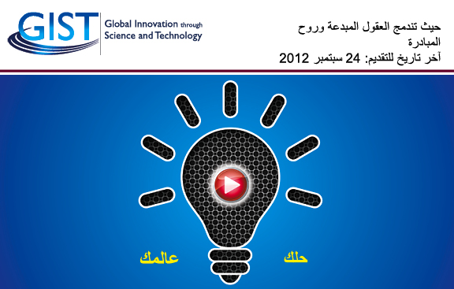

هل أنت رائد أعمال؟ هل تملك فكرة لمشروع شركة ناشئة؟ هل تبحث عن تمويل، متابعة من طرف مختصين، أو ربما تحلم في زيارة وادي السيليكون في الولايات المتحدة للاحتكاك برواد الأعمال هناك والتعلم منهم؟ **GIST** تضع كل هذا بين يديك من خلال مسابقة **Tech-I** والتي تخص كل بلدان الشرق الأوسط (إضافة إلى تركيا) إلى جانب جميع البلدان الآسيوية والإفريقية.

أول سؤال يتبادر إلى الأذهان لدى الاطلاع على إعلانات المسابقات الريادية يكون عادة حول قيمة الجائزة الأولى للمسابقة، وعادة ما يقرر رواد الأعمال المشاركة من عدمها اعتمادًا على ذلك، أعتقد أن قيمة 200 ألف دولار التي خُصصت هذا العام للفائز الأول كفيلة بإقناع أيًا كان بالمشاركة. كما أن تمضية 6 أسابيع في مسرع Accelerator في الولايات المتحدة كفيلة بإيصال فكرتك أو شركتك الناشئة إلى مراحل جد متقدمة.

باب المشاركة مفتوح لكل رواد الأعمال أيا كانت المرحلة التي وصلت إليها شركته الناشئة، من مرحلة الفكرة فقط، إلى مرحلة الشركة التي تنشط ولديها منتجات ومبيعات، شرط أن لا يتجاوز عمرها 3 سنوات. كما يُشترط في المتقدمين للمسابقة خاصة رؤساء الفرق في أن يكونوا مواطنين أو مقيمين بشكل دائم في إحدى الدول المعنية بالمسابقة.

يُقّدم للمسابقة على [موقعها الرسمي](http://gist.crdfglobal.org/) بإرسال ملخص تنفيذي Executive Summary وفيديو Pitch من دقيقتين لتقديم الفكرة أو الشركة الناشئة.

المسابقة تهتم بالشركات والأفكار التي تخص التقنية بشكل عام، الطاقة، الصحة، الزراعة  أو أي مجال مرتبط بإحدى هذه المجالات.

للمزيد حول المسابقة زوروا موقعها الرسمي، أو حمّلوا هذا الإعلان الرسمي عن المسابقة ([النسخة العربية](http://gist.crdfglobal.org/docs/gist-tech-i-2012-library/gist-tech-i-pa-arabic.pdf)، [النسخة الانجليزية](http://gist.crdfglobal.org/docs/gist-tech-i-2012-library/gist-tech-i-pa-english.pdf)، [النسخة الفرنسية](http://gist.crdfglobal.org/docs/gist-tech-i-2012-library/gist-tech-i-pa-french.pdf)).

آخر أجل لتقديم الطلبات هو 24 سبتمبر الجاري.

مبادرة GIST تمولها وزارة الخارجية الأمريكية، وتتولى  تنفيذيها مؤسسة [CRDF Global](http://www.crdfglobal.org/).
