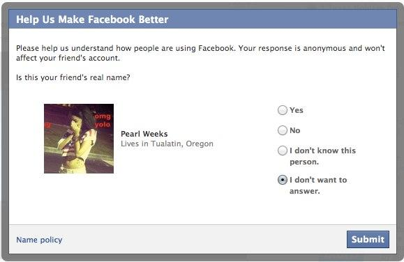

رغبة **فيس بوك** في التعرف بشكل أفضل على مستخدميها ما بين مد وجزر، فمن جهة **رضخت مؤخرا الشبكة الاجتماعية لطلبات الأوروبيين** الرامية إلى إيقاف خاصية التعرف على الأوجه في القارة العجوز، إلا أنها أطلقت جهودا أخرى (ربما ليس لها علاقة بالنقطة السابقة بشكل مُباشر) تهدف إلى الحد من الحسابات التي تستعمل **أسماء مستعارة**.

نشرت Data Protection Commissioner الإيرلندية (مكتب فيس بوك الأوروبي يقع في إيرلندا) يوم أمس [تقريرا](http://dataprotection.ie/documents/press/Facebook_Ireland_Audit_Review_Report_21_Sept_2012.pdf) تفيد فيه بأن فيس بوك قبلت إيقاف خاصية التعرف على الأوجه بشكل آلي لمستخدميها في أوروبا، حيث أن هذه الخاصية لم تعد مفعلة للمستخدمين الجدد، وسيتم حذف كل البيانات التي تم جمعها على المستخدمين الأوروبيين عبرها قبل موعد 15 أكتوبر القادم.

من جهة أخرى، وبالرغم من أن [قوانين فيس بوك المتعلقة بالأسماء](https://www.facebook.com/help/?page=258984010787183) تمنع استخدام أسماء مستعارة لدى إنشاء حساباتها فإنه –وحسب موقع[ The next web](http://thenextweb.com/facebook/2012/09/21/facebook-now-wants-snitch-friends-arent-using-real-name)- يوجد أكثر من "سبب شرعي" للقيام بذلك، كالمستخدمين من بلدان لا تُحترم فيها حرية التعبير، الحد من ظاهرة متابعة بعض الأشخاص لآخرين بشكل مزعج أو حتى الحد من تبعات متابعات أفراد الأسر المتفككة (من طلاق مثلا) لبعضهم البعض، مما يجعل من الخاصية الجديدة والمشاركة فيها أقرب ما تكون إلى الوشاية منها إلى حماية المستخدمين التي تُعلل بها فيس بوك مثل هذه الخطوات.

الخاصية تأتي على شكل نافذة تعرض صورة لأحد "الأصدقاء" الذين تود فيس بوك التأكد منهم وتسألك إن كان صاحب الحساب يستعمل اسمه الحقيقي أو لا (مع إتاحة إمكانية رفض الإجابة على السؤال).

هل "أفرطت" أوروبا في حماية مستخدميها عبر طلب إيقاف هذه الخاصية؟

هل "ستشي" بأصدقائك أصحاب الحسابات المستعارة؟
