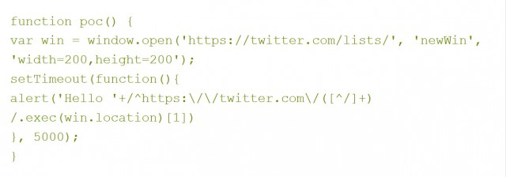

كان اليوم العاشر من الشهر العاشر،يوما شاعريا بالنسبة للمبرمجين، كيف لا وهو مليئ بالصفر والواحد، يوم فقط،.. بعد إطلاق مؤسسة **Mozilla** النسخة 16.0 من متصفحها الشهير **Firefox**، حنين إلى الصيف بدأ يدور في ذهن مدون من مدوني لغة **Javascript**، إنه يتسلى بها،... لسان حاله يقول ليت الصيف يعود يوما ﻷخبره بما فعل بي التشفير، وإذا حنّ العبد إلى الماضي أخذ يذكر الذكريات، لكن ماذا لو كانت الذكريات في تاريخ متصفح؟ سولت له نفسه أمرا، وأخذ يمكر بالثعلب <del>الماكر</del> الملتهب...

الشفرة أعلاه، هي إثبات للمفهوم Proof Of Concept الذي نشره مكتشف الثعرة في تدوينته باسم [Firefox knows what your friends did last summer](http://www.thespanner.co.uk/2012/10/10/firefox-knows-what-your-friends-did-last-summer/)، ومهمته استغلال Firefox 16.0 لسرقة معلومات شخصية، يمكّن المواقع الخبيثة من معرفة معلومات سرية عن المستخدم كتواريخ التصفح وعنواين المواقع التي زارها، بسهولة (كما ترى). وقد استخدم كمثال موقع Twitter مع regex لاستخلاص اسم المستخدم للموقع.

أما عن آلية عمل الثغرة، فهي تستغل تصرفا غريبا للنسخة الجديدة من المتصفح، إذ تحول أي قيمة غير معرفة undefined value إلى سلسلة نصّية String تلقائيا داخل أي دالة أصلية native function. الشفرة أعلاه تأخذ فقط 10 ثواني لكشف اسم المستخدم.

يذكر أن جميع المتصفحات عانت من مشاكل من هذا النوع لمدة عقد من الزمن بسبب تلاعب المهاجمين بتقنية CSS، بجعلهم عناوين URL التي زارها المستخدم مسبقا Visited links تظهر بلون مغاير، يعني حيلة صغيرة على تجربة المستخدم وممارساته، تمكنهم من جمع قائمة بأسماء المواقع التي زارها المستخدم، لكن هذه الأخيرة الخاصة بـ Firefox، تبدو أكثر جدية، كونها لا تحتاج من المهاجم تخمين العناوين التي سيزورها المستخدم أو استخدام قائمة عناوين مسبقة.

تجاوبت مؤسسة Mozilla بشكل سريع -وهذا يُحسب لها- وغيرت من[ الصفحة الرئيسية](http://www.mozilla.org) لها لتشير إلى النسخة السابقة من المتصقح 15.0.1 (أين يمكن الرجوع إليها وعمل Downgrade، هذا وقت كتابة الخبر) كما أصدرت النسخة 16.0.1 الخاصة بنظام [Android عبر Google Play](https://play.google.com/store/apps/details?id=org.mozilla.firefox).

**تحديث:** أطلقت Mozilla الإصدار 16.0.1 من متصفح Firefox والذي يحل هذا المشكل. يمكن تحميل التطبيق [من هنا](http://www.mozilla.org/en-US/firefox/new/).

ننصح المستخدمين بالرجوع إلى النسخة السابقة إلى غاية نشر التحديث الجديد 16.0.1 الخاص بالأجهزة المكتبية.

- هل بدأ الاستعجال في إصدار نسخ جديدة من المتصفح (على شاكلة متصفح Chrome) يظهر مساوئه؟
