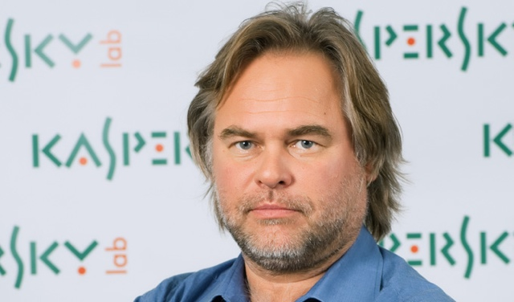

بدأ المهندسون في مخابر **Kaspersky** بالعمل على نظام تشغيل جديد مصمم خصيصاً لكي يكون آمناً منذ البداية لاستخدامه في **SCADA** و**أنظمة التحكم الصناعية ICS**، وذلك بعد أن أصبحت الهجمات التي استهدفت أنظمة SCADA و أنظمة التحكم الصناعية ICS مؤخراً مبعث قلق كبير للشركات الخاصة والجهات الحكومية. وقد حذر الخبراء الأمنيون من قبل حول مثل هذه الهجمات المحتملة، وتم إيجاد العديد من الثغرات في أنظمة SCADA وأنظمة التحكم الصناعية في السنوات الأخيرة.

هذا وقد تحدث **Eugene Kaspersky** المدير التنفيذي لشركة Kaspersky في [مقابلة](http://threatpost.com/en_us/blogs/eugene-kaspersky-unveils-plans-new-secure-scada-os-101612) أجرتها ThreatPost معه عن المشروع، وكيف سيتم اعتماده ولماذا قرر أن الوقت قد حان للبدء فيه، وفيما يلي نص المقابلة.

**Threatpost****:** لماذا قررت أن تبدأ هذا المشروع؟

**Kaspersky:** إن السيناريو الكئيب الذي ربما رأيتموه سابقاً في فيلم Live Free Or Die Hard (هو مثال ممتاز عما يحصل فيما لو تم استهداف طرق حياتنا المعاصرة بهجمات الكترونية) لا يصور لنا أحداثاً مستقبلية. في الواقع فإن الحضارة قد وصلت فينا إلى مرحلة من التطور تكون فيها الخدمات الحساسة مدارة بشكل كامل من قبل أنظمة تحكم آلية. لا، لست أحاول أن أصور سيناريو كئيب آخر كما في فيلم The Terminator، لحسن الحظ ما زلنا بعيدين عن ذلك المستوى من التطور. ولكن، فإنه من الممكن لحد بعيد أن يبدأ أشخاص أو مجموعات ذوي نوايا سيئة بتغيير نمط حياتنا من خلال الإساءة إلى هذه الخدمات عبر هجمات الكترونية منظّمة جيداً.

لقد تجنّبت ذكر كلمة "معقّدة" متقصداً لأنك لو تعمّقت النظر إلى تفاصيل حماية أنظمة التحكم الصناعية لفهمت بأنها بعيدة جداً عن معايير الأمن المطلوبة للمنشآت.

وهناك جانب آخر للقصة. بداية فإن جميع مصنّعي أنظمة التحكم الصناعية بطيئين جداً في عملية تطوير الترقيعات الأمنية. ثانياً، كل ترقيع يجب أن يمر بمراحل عديدة وطويلة من التجارب قبل أن يتم تطبيقه عملياً. ثالثاً، مصنعو أنظمة التحكم الصناعية يفضّلون عدم تطبيق الترقيعات الأمنية لتجنب مقاطعة العمل! فإن أول قاعدة في مجال أنظمة التحكم الصناعية هي "لا تلمسه. إطلاقاً" والتي تبدو منطقية من وجهة نظرهم. لكن هذا الأمر غير منطقي من وجهة النظر الأمنية. حالياً لا يوجد أي جهة أمنية تصيب هذه النقطة في الموضع الصحيح، وإنما غالباً تجدهم يقومون بتطبيق التقنيات الأمنية التقليدية الخاصة بالمنشآت عموماً في مجال أنظمة التحكم الصناعي، وهو مجال يختلف تماماً في نواح كثيرة.

**Threatpost****:** كيف تنوي حل هذه المشكلة؟

<!-- more -->

**Kaspersky:** حقاً، هل هناك طريقة لتخطي هذه المشكلة؟ حسناً، إعادة تصميم تطبيقات أنظمة التحكم الصناعية ليست حلاً فعلياً. مجدداً، عملية طويلة، مكلفة جداً ولا تضمن أنها لن تفاجئنا بأي مشاكل لاحقاً.

في الوقت نفسه فإن المشكلة يمكن حلها بطريقة أخرى. لنتخيل وجود تطبيق تحكم صناعي يحوي على مشكلة أمنية لكنه يعمل بشكل جيد ويؤدي الغرض المطلوب منه. بدلاً من العبث بالتطبيق فنحن سندعه يكمل عمله ولكن ضمن بيئة مصممة خصيصاً تضع الناحية الأمنية على قائمة الأولوليات. نعم! أنا أتكلم عن نظام تشغيل مصمم بأعلى دقة من الناحية الأمنية ومصمم خصيصاً للمنشآت الحساسة.

**Threatpost****:** ما هي أهم الميزات في النظام الجديد؟

**Kaspersky:** لا يمكنني الإفصاح عن الكثير من التفاصيل حوله. الأمر الأساسي هو أن النظام مبني على تصميم هندسي يسمح بتطوير تطبيقات لا يمكنها (بالشكل الافتراضي) أن تقوم بتنفيذ أي وظيفة غير معرّفة ويضمن وثوقية البيانات المتنقلة بين العقد المختلفة.  في هذه الحالة فإن الثغرة الموجودة في برنامج التحكم الصناعي والذي يعمل على هذا النظام لن تسبب مشكلة بعد الآن لأن العامل الخارجي أو الداخلي ذو النوايا السيئة لن يستطيع الاستفادة من الثغرة ببساطة.

**Threatpost****:** كيف يمكن لمختبرات Kaspersky أن تقوم بتطوير هذا النظام الآمن في حين أن لا أحد آخر قام بذلك من قبل؟

**Kaspersky:** من الصحيح القول بأن لا أحد آخر حاول أن يقوم بتطوير نظام آمن من قبل. قد يبدو وقع هذا غريباً على السمع نظراً للجهود التي بذلتها Microsoft, Apple ومجتمع التطبيقات مفتوحة المصدر لجعل منصاتها آمنة قدر الإمكان. مع احترامي الشديد، يجب علينا الإقرار بأنهم كانوا يقومون بتطوير حلول واسعة لمجال عديد من التطبيقات وأنماط مختلفة من المستخدمين، والأمن وقابلية الاستخدام هما دوماً عاملان متضادان! مع نظام تشغيل عمومي فإن المطور في النهاية يضطر إلى التضحية ببعض الأمان في مقابل الحصول على مرونة في الاستخدام. نحن نسعى إلى تصميم نظام تشغيل مخصص لأنظمة التحكم الصناعية بدون أي مساومة على قابلية الاستخدام. في الواقع فنحن محظوظون في هذه النقطة لأن مرونة الاستخدام لم تكن عاملاً هاماً في أنظمة التحكم الصناعية. ما يهم حقاً في هذا المجال هو الضمانات ونظامنا سيؤمن هذه الضمانات.

**Threatpost****:** لكم من الوقت بقيت الشركة تعمل على هذه الفكرة؟

**Kaspersky:** إن الاسم الرمزي لهذا المشروع فيما بيننا في Kaspersky هو 11.11 وهل تحزر؟ نعم لقد بدأنا به في نوفمبر 2011. في الواقع فإن Stuxnet كانت أول إشارة على أن عصر الهجمات الالكترونية ضد المنشآت الحساسة قد بدأ. لقد تجاوز المشروع العديد من المراحل حتى الآن باتجاه نموذج مبدئي لينصّب في بيئة صناعية مخصصة. ما زال هناك الكثير للقيام به للانتهاء - سنبقيكم على إطلاع حول تطور العملية مع الوقت.

**Threatpost****:** هل قمت بمناقشة هذا المشروع مع عملاء محتملين وما هي الميزات الأمنية التي يرغبون بها في النظام؟

**Kaspersky**: إن التصميم الخاص بالنظام عموماً وضع على اعتبار متطلبات العملاء. نحن على تواصل دائم مع عدد من العملاء الاستراتيجيين والذين يديرون عدداً من المنشآت الحساسة حول العالم.

**Threatpost****:** هل سيكون هناك قيود حول مَنْ مِنَ الشركات أو الدول التي سيسمح لها بشراء هذا المنتج حال انتهائه؟

**Kaspersky:** نحن شركة عالمية حقاً ومنفتحين للتعاون مع أي جهة صناعية، أي دولة وأي حكومة تمتثل للأنظمة العالمية بغية ضمان أمن منشآتهم الحساسة. حالما يصبح النظام جاهزاً فإننا نخطط للحصول على تراخيص رسمية في الدول التي نعمل بها للبدء بتسويق المنتج.

**Threatpost****:** هل هناك أي موعد متوقع لإنهاء المشروع؟

****Kaspersky**:** ما زال الوقت مبكراً في هذه المرحلة للتحدث عن موعد الصدور الرسمي على اعتبار وجود الكثير مما يجب إنجازه. سنبقيكم على إطلاع.

وللمزيد من المعلومات حول النظام الآمن من Kaspersky الموجه لأنظمة التحكم الصناعية الحساسة، يمكن الإطلاع على [التدوينة](http://eugene.kaspersky.com/2012/10/16/kl-developing-its-own-operating-system-we-confirm-the-rumors-and-end-the-speculation/) التي نشرها Eugene Kaspersky على مدونته الخاصة.
