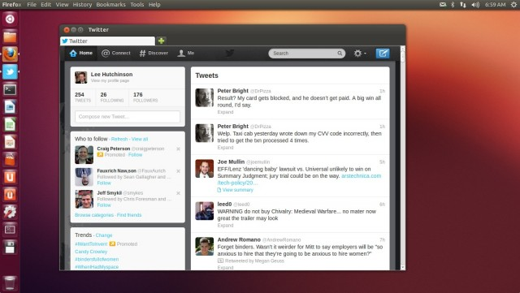
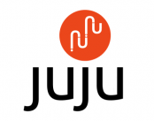

أصدرت شركة **Canonical** الراعية لتوزيعة **Ubuntu** اليومَ، النسخة **12.10** من توزيعتها الشهيرة والتي تحمل الاسم الرمزي **Quantal Quetzal**، ستة أشهر بعد [إطلاق Precise Pangolin](https://www.it-scoop.com/2012/04/ubuntu-12-04-precise-pangolin/) لكنها نتاج سنتين من الجهد المتواصل، وممهدة لخطة عمل سنتين آخرين، لترسم آفاق ما سيكون عليه **Ubuntu** عام 2014.

أما عن الاسم، فكعادة Canonical في اختيار حيوانات مهددة بالانقراض أو نادرة، جاء "كوانتال كويتزال" Quantal Quetzal ، هذا الاسم الرمزي ليشير -كما أوضح [ Mark Shuttleworth على مدونته](http://www.markshuttleworth.com/archives/1121)- إلى "الجودة".فالـ [Quantal](http://en.wikipedia.org/wiki/Resplendent_Quetzal) عائلة من الطيور التي عُثِر عليها في غرب المكسيك مع ريش قزحيّ أخضر اللون وهو صنف نادر من الطيور.

وقد تم إلقاء التركيز في هذه الإصدارة على تجربة المستخدم وما يقوم به فعلا على مستوى سطح المكتب وفي مؤسسة عمله، وتوفير الأدوات المناسبة لمساعدته في ذلك.

**جديد التوزيعة** إن كنت تبحث عن مراجعة سريعة لأهم 10 ميزات، فهذه الفيديو تفي بالغرض:

<!-- more -->

[youtube http://www.youtube.com/watch?v=KbrOrR3wctc]

**سطح المكتب:**

أول ما ستراه هو سطح مكتب Unity والتي حُسن وأضيف له العديد من الميزات، حيث ركزت هذه الإصدارة على فكرة كسر الحواجز بين التطبيقات الأصلية المحلية وتطبيقات الويب، بمعاملة كلاهما بنفس الطريقة/الأهمية، عوض اعتبار تطبيقات الويب مجرد صفحة مفتوحة على المتصفح، أصبح الآن بالإمكان تثبيت أيقونات التطبيقات المشهورة كـ Gmail، تويتر وغيرهم على لوحة التطبيقات الجانبية، استقبال التنبيهات الخاصة بها وعرضها في عداد فوق الأيقونة، التكامل مع "القائمة السريعة" أعلى يمين الشاشة وكأنها تطبيقات حقيقية.

كذلك خاصية البحث، لم تعد تفرّق بشكل كبير بين محتوىً محلي أو آخر على الويب، فعند بحثك عن ملف ما أو محتواه، فلن يقتصر البحث على مجلد الـ Home الخاص بالمستخدم بل سيتعداه إلى حسابه في Google Docs أيضا، كذلك البحث عن كتاب ما او محتوى صوتي سيبحث أيضا على Amazon (مع إمكانية تعطيل هذه الخاصية) .

Unity على غرار الشائعات، سيواصل كسطح مكتب رسمي للتوزيعة، وقد تم إلغاء تقسيمها إلى Unity 2D و Unity 3D وتوحيد الشفرة في نسخة واحدة فقط هي ببساطة Unity.

**نسخة Ubuntu Server:**

الثقل الذي تحدثنا عنه في العنوان، كان يقد هذه النسخة، حيث ركزت Canonical في النظر إلى الكيفية التي أصبحت تُبنى بها مواقع الويب وتطبيقاته، ودفع Ubuntu لاشباع هذه الاحتياجات، نسخة 12.10 أًضيف لها اثنان من أكبر خدمات الخوادم، [OpenStack](http://www.ubuntu.com/cloud/private-cloud/openstack) و Juju. في حين يقدم الأول خدمات الـ Cloud Computing يوفّر [Juju](https://juju.ubuntu.com/) طبقة مسهلة لتنصيب تطبيقات الويب المسكنة محليا، فعوض تنصيب Nginx أو Apache، ثم تنصيب MySQL بعدها السعي وراء ضيط الإعدادت وغيره فقط لتنصيب Wordpress، مع Juju (لماذا أحس وكأنه إعلان تلفزيوني؟ :p) تم أتمتة كل هذا على شاكلة apt-get للخدمات/منصات بل ودفع كل هذا إلى خدمة Amazon EC2 مثلا بكل سهولة. كذلك به خدمة Monitoring مدمجة، تعلمك أي من مكونات تطبيقك يعمل ببطء.

**في الخفاء:**

كعادة أي توزيعة جديدة، تأتي Ubuntu 12.10 بآخر إصدارات البرامج المثبتة بها:

	  * نواة Linux 3.5 التي تحمل بدورها العديد من الميزات.
	  * Python 3.2.3 بشكل افتراضي (مع إمكانية تنصيب النسخة السابقة).
	  * مجمّع gcc 4.7.2.
	  * وأخيرا LibreOffire 3.6.

الجدير بالذكر أيضا، هو توحيد أقراص التنصيب، فلم يعد هنا قرص تنصيب مخفف من نوع CD وآخر DVD مُثقل،<del> بل وتم إلغاء أيضا تفريق نسخ معماريات 32 بت و64 بت، ... انسى كل هذا،</del> كل ما عليك تحميله هو صورة ISO واحدة بسعة 800 Mb <del>لكلا المعماريتين</del> (عندما تم نشر روابط التوزيعة لا يزال هناك فصل حسب المعماريات).

أيضا أصبح هناك خيار تشفير كامل القرص الصلب -وليس فقط مجلد Home- عند تنصيب النظام (سابقا كان بالامكان ذلك، لكن **بعد** تثبيت النظام)

**التحميل:**

	  * لتحميل التوزيعة من [هنا](http://www.ubuntu.com/download/desktop).

بهذه المناسبة أطلقت Canonical شعارا بعنوان: "Avoid the pain of Windows 8" أو: تجنب صداع Windows 8 :)

- ما رأيك بالميزات الجديدة التي يحملها Ubuntu 12.10؟ وهل أنت شغوف لتنصيبه أم أنك تفضل الاستقرار على النسخ ذوات الدعم طويل الأمد LTS ؟
