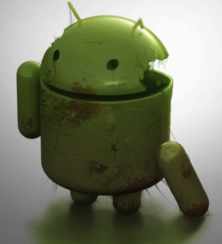

معظم التقارير التي تتحدث عن **البرمجيات الخبيثة** التي تستهدف أنظمة الهواتف الذكية تكون حول أجهزة **Android** التي كثيرا ما تدون حولها مواقع الحماية كأسهل وأكثر المنصات استهدافا من قبل الفيروسات والمخترقين على حد سواء، والتي يسعى من خلالها هؤلاء إلى استغلال ثغرات هذا النظام وكسب ما يمكن كسبه من أموال عبر المستخدمين الغافلين والمصابة أجهزتهم بغير علمهم، وهو ما حصل مع هذا **المخترق الفرنسي** الذي استطاع -وعلى مدار عامين- من كسب **500 ألف يورو** من خلال برمجية خبيثة أصابت عددا غير معلوم من المستخدمين، من حسن الحظ أن الجاني سقط في شر فعاله و[ألقي عليه القبض](http://www.androidauthority.com/french-hacker-collects-500000-euros-malware-app-targets-android-mostly-124228/) بحر هذا الأسبوع.

صديقنا الماكر ذو العشرين ربيعا والقاطن بمدينة Amiens شمال فرنسا والذي لم يتلقى أي تكوين برمجي من قبل والموصوف من قبل النيابة العامة على أنه حاد الذكاء أقر -حين استجوبته نفس الهيئة- بأنه استعمل تطبيقا للاحتيال على ضحاياه، يشبه في شكله أحد التطبيقات المدفوعة، لكنه يوفره بشكل مجاني، وبينما الضحية المسكين يستعمل التطبيق الخبيث يقوم هذا الأخير بإرسال رسائل قصيرة دون علم صاحب الهاتف المصاب، كما يقوم بالتسجيل عبره في مواقع الألعاب والقمار والمضاربات وبالطبع باستخدام أموال الضحية.

همسة: لنواجه الأمر، هذه عاقبة الطمع أليس كذلك ؟

في حين لم يشر [التقرير](http://www.bbc.co.uk/news/world-europe-19994944) الى أي منصة تم استعمال هذا التطبيق الخبيث بكثرة لكن كالعادة تذهب أصابع الاتهام -والتهكم أحيانا- إلى Google ونظامها Android، لكن دوما مثل هذه التقارير ترفع مستوى الحديث عن مدى أمان أنظمة الهواتف الذكية التي لم يعد يخلوا منها جيب إنسان، فالقاصي والداني أصبح يتسوق عبر هاتفه وجهازه اللوحي ولو لشراء التطبيقات فقط، وهذا يعني تعريض بياناته المصرفية للخطر، فهنا يثار التساؤل التالي: أي منصة أكثر أمانا؟ وأي منصة يجب علي أن أستعمل؟

الجدير بالذكر أن الأخبار الواردة عن نسخة Android الجديدة (4.2) تقول أنها ستحمل خواص أمنية أكثر من أي وقت مضى، منها خاصية تمنع التطبيقات التي تعمل في الخلفية والتي تحاول عمل أي شيء خفية عن صاحب الهاتف، أو على الأقل تنبه المستخدم إلى هذه البرمجيات، لكن وكالعادة ليست كل الأجهزة ستتمكن من التحديث لهذه النسخة، مما يعني أن عددا كبيرا للغاية -علما أن مليون جهاز Android يفعل كل يوم- سيكون معرضا لعدة أخطار.

فهل منصة Android منصة آمنة كفاية لاستعمالها أم يجدر بي تغيير جهازي بواحد يعمل على منصة أخرى ؟
