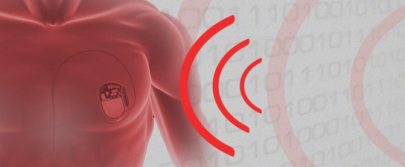

قام الباحث **Barnaby Jack** بالكشف عن** ثغرات أمنية** في أحد** أجهزة تنظيم ضربات القلب Pacemaker** بعد قيامه بإعادة برمجة Reverse engineering جهاز الإرسال الخاص به، الأمر الذي يجعله قادراً على السماح للمهاجمين بإيقاف المنظم عن العمل، إرسال صدمات كهربائية قاتلة و/أو إعادة برمجة الـ firmware الخاص به، عن بعد على مسافة 30 قدم.

و[قال](http://www.scmagazine.com.au/News/319508,hacked-terminals-capable-of-causing-pacemaker-mass-murder.aspx) Jack في مؤتمر BreakPoint الأمني، أن تأثير الهجمات اللاسلكية عن بعد غير مبالغ فيه، ومثل هذه الهجمات تعادل "الاغتيالات المجهولة" وتحت أسوأ الظروف، "الإبادة الجماعية".

وفي عرض فيديو -رفض Jack طرحه للعلن لأنه قد يؤدي للكشف عن اسم المصنّع لهذه الأجهزة- قام بإرسال شحنات بلغت شدتها 830 فولت إلى منظم لضربات القلب، باستخدام حاسب محمول.

ويذكر Jack بأن منظم ضربات القلب احتوى على "وظيفة سرّية" يمكن استخدامها لتفعيل جميع منظمات ضربات القلب والمنظمات المزروعة داخل الجسم، في حدود 30 قدم.

كل جهاز سيقوم بإعادة رقم النموذج والرقم التسلسلي الخاص به.

ويعقب Jack: "مع هذه المعلومات، يكون لدينا ما يكفي للمصادقة مع أي جهاز في تلك الحدود"

وخلال الهندسة العكسية لهذه المرسلات -والتي تتصل مع أجهزة تنظيم ضربات القلب- لم يجد أي جهد مبذول لتمويه التعليمات البرمجية والغرض منها بل حتى قام بإيجاد أسماء مستخدمين وكلمات مرور بدت وكأنها خاصة بخادم التطوير الخاص بالشركة المصنعة.

ويضيف، بأن تلك المعلومات يمكن الاستفادة منها لتحميل الأجهزة بـ firmware خبيثة تنتشر بين أجهزة تنظيم ضربات القلب لاسلكياً مع إمكانية تنفيذ "إبادة جماعية" لأصحابها.

<blockquote>

> 
> إن أسوأ سيناريو يمكنني التفكير فيه، والممكن بنسبه 100% مع هذه الأجهزة، هو تحميل تحديث لـ firmware خبيث إلى إحدى المبرمجات، والتي ستقوم بدورها بإصابة جهاز آخر لتنظيم ضربات قلب أو جهاز مزروع لتنظيم ضربات القلب والتي بدورها ستقوم بإصابة أخرى في حدود الـ 30 قدم.
> 
> 
</blockquote>

ننصح قراءنا بتجنب الإجهاد والضغط النفسي الذي قد يتسبب بأزمات قلبية تتطلب تركيب أحد هذه الأجهزة، تفادياً لخطر الاغتيال عن بعد! :)

وقانا الله وإياكم شرها وأدام علينا وعليكم الصحة والعافية إن شاء الله.
