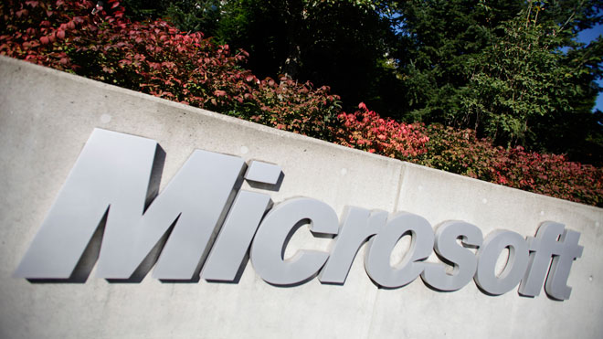

قامت شركة الأمن المتخصصة **Kaspersky** بنشر تقرير حول **تطور المخاطر الأمنية** مؤخراً. وبشكل مفاجئ فقد كان هناك بعض النواحي الملحوظة في التقرير وخصوصاً، أن منتجات عملاق صانعي البرمجيات **Microsoft** لم تعد تحتل مركزاً في **أول 10 منتجات وجد فيها ثغرات أمنية**. يعود هذا السبب إلى أن آلية التحديث التلقائي في نظام Windows تم تحسينها وتطويرها بشكل صحيح في الإصدارات الأخيرة من نظام Windows.

وفيما يلي أسوأ 10 ثغرات أمنية للربع الثالث من عام 2012، وفقاً [لتقرير Kaspersky](http://www.securelist.com/en/analysis/204792250/IT_Threat_Evolution_Q3_2012):

	  * عدة ثغرات في منتجات Oracle Java: حجب الخدمة (وقد يتمكن المهاجم من الحصول على shell على النظام المصاب يسمح له بتنفيذ أوامر بصلاحيات مستخدم محلي) وثغرات XSS (تسمح بالوصول إلى بيانات حساسة في جلسات العمل على مستوى client-side). **حرجة بشكل كبير**.
	  * 3 ثغرات في منتجات Oracle Java: تسمح بالحصول على shell على النظام المصاب وتنفيذ أوامر بصلاحيات مستخدم محلي. **حرجة جداً**.
	  * عدة ثغرات في مشغل الوسائط Adobe Flash Player: تسمح بالحصول على shell وتنفيذ أوامر بصلاحيات مستخدم محلي. تسمح بالوصول إلى بيانات حساسة. **حرجة بشكل كبير**.
	  * عدة ثغرات في مشغل الوسائط Adobe Flash Player: تسمح بالحصول على shell وتنفيذ أوامر بصلاحيات مستخم محلي. تسمح بتجاوز بعض الإجراءات الأمنية في النظام. **حرجة بشكل كبير**.
	  * عدة ثغرات في Adobe Reader/Acrobat: تسمح بالحصول على shell وتنفيذ أوامر بصلاحيات مستخدم محلي. **حرجة جداً**.
	  * عدة ثغرات في Apple QuickTime: تسمح بالحصول على shell وتنفيذ أوامر بصلاحيات مستخدم محلي. **حرجة بشكل كبير**.
	  * عدة ثغرات في تطبيق Apple iTunes: تسمح بالحصول على shell وتنفيذ أوامر بصلاحيات مستخدم محلي. **حرجة بشكل كبير**.
	  * ثغرات في تطبيق Winamp عند معالجة ملفات AVI/IT: تسمح بالحصول على shell وتنفيذ أوامر بصلاحيات مستخدم محلي. **حرجة بشكل كبير**.
	  * عدة ثغرات في مشغل الوسائط Adobe Shockwave Player: تسمح بالحصول على shell وتنفيذ أوامر بصلاحيات مستخدم محلي. **حرجة بشكل كبير**.
	  * عدة ثغرات في مشغل الوسائط Adobe Flash Player: تسمح بالحصول على shell وتنفيذ أوامر بصلاحيات مستخدم محلي. تسمح بتجاوز بعض الإجراءات الأمنية في النظام. تسمح بالوصول إلى بيانات حساسة. **حرجة جداً**

هذا وقد تم التصنيف وفقاً لعدد الأجهزة والمستخدمين المعرضين للإصابة بهذه الثغرات.

وبالعودة إلى ملاحظتنا في بداية الخبر، فقد كانت تطبيقات Microsoft من عدة سنوات خلت تحتل أماكن مختلفة على قائمة Kaspersky للثغرات الأمنية، لكن مع بداية Windows Vista، قامت الشركة بشكل جدي بإجراء تحسينات مختلفة على نظامها. وبالطبع فإن Windows 7 أتى ليكمل ما تم البدء به في Vista، ونظام Windows 8 ينقله خطوة أخرى إلى الأمام.

أخيراً، نعرض لكم فيما يلي بعض [الإحصائيات](http://thenextweb.com/microsoft/2012/11/02/microsofts-security-team-is-killing-it-not-one-product-on-kasperskys-top-10-vulnerabilities-list/) المتعلقة بالثغرات السابقة:

	  * 28% من الهواتف الذكية المستهدفة تعمل بنظام Android الإصدار 2.3.6 والذي تم طرحه في سبتمبر 2011.
	  * 56% من التهديدات الأمنية المرقعة في الربع الثالث من عام 2012 تعتمد على ثغرات Java.
	  * ما مجمله 91.9 مليون رابط تشعبي يقوم بنشر برمجيات خبيثة، بزيادة بنسبة 3% عن الربع الثاني لعام 2012.

هل سنشاهد Microsoft تعود لسباق أنظمة التشغيل الآمنة مجدداً أم أن Java ستكون الملامة في كل شئ الآن فتغطي على خجل باقي الشركات؟
