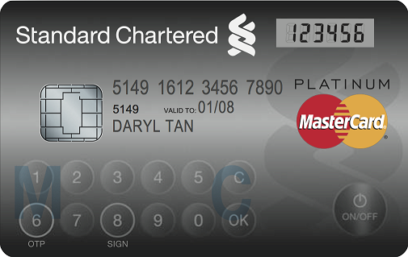

في خطوة لتعزيز حماية زبائنها لدى استخدام بطاقاتها للدفع الإلكتروني، كشفت **MasterCard** عن **بطاقتها الإلكترونية** الجديدة والتي تحتوي على** شاشة صغيرة ولوحة مفاتيح** تُمكن من توليد كلمات سر مؤقتة لدى كل عملية شراء.

البطاقة الجديدة –والتي سبق لـ Visa أن كشفت عن[ مثيلة لها من قبل](http://readwrite.com/2011/11/02/new-visa-credit-card-comes-wit)- تحتوي على لوحة أرقام وشاشة LCD صغيرة تهدف إلى توليد أرقام سرية مؤقتة لدى القيام ببعض عمليات الشراء التي تتطلب توليد كلمة سر إضافية في بعض الحالات مما يُلغي مرحلة طلب مثل كلمات المرور هذه من البنوك مباشرة (حسبما يُشير إليه أكثر من مصدر)، حيث تهدف علمية التحقق من هوية حامل البطاقة عبر مرحلتين من محاربة سرقة بيانات البطاقة أو استعمالها من غير إذن صاحبها.

[تُشير](http://newsroom.mastercard.com/press-releases/mastercard-introduces-next-generation-display-card-technology-a-first-for-singapore/) الشركة بأن البطاقة ستكون قادرة على توفير خواص إضافية، مثل معرفة رصيد البطاقة أو نقاط المكافئة التي يحصل عليها المستخدمون لدى شراء منتجات مُعينة عبر استخدام هذه البطاقة.

سيكون بإمكان حاملي هذه البطاقة الجديدة استخدامها تماما مثلما ألفوا استخدام البطاقات العادية من قبل، وسيتم توفيرها في مرحلة أولية لزبائن Standard Chartered Online Banking.

في رأيك هل سيكون لمثل هذه البطاقات انعكاسات على حلول الدفع الإلكتروني عبر الهواتف التي تهدف بدورها إلى تسهيل مهمة الدفع وتوفير حماية أكبر للمستخدمين؟
