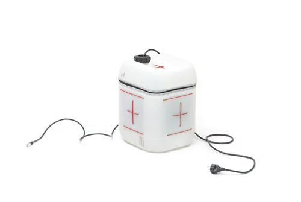

هل لديك وعاء أو ما يعرف بـ [Jerry can](http://en.wikipedia.org/wiki/Jerrycan) في المنزل، وحاسوب قديم  أو قطع حاسوب رخيصة الثمن تباع في بلدتك ؟ إذا لديك كل شيء لتركيب **حاسوب خاص بك** بأبخس الأثمان! نعم،Jerry Can Do it! طبعا بعد موافقة الأم :D

**JerrySchool** هو اسم الحدث/الورشات التي ستنطلق في جامعة هواري بومدين والمدرسة العليا للإعلام الآلي بالجزائر العاصمة، بالتوازي، أين يجتمع الطلبة -أو أي مهتم- في مجموعات لعمل [Jerry](http://youandjerrycan.kegtux.org/wiki/doku.php?id=start) أي خوادم متنقلة أو حواسيب بأوعية (جمع وعاء) على طريقة DIY اختصار لـ Do It Yourself أي افعلها بنفسك! عن طريق إحضار قطع إلكترونية قديمة أو رخصية الثمن وفي متناول الجميع أو حواسيب مغبرّة قديمة وإعادة إنعاشها في شكل جميل.

ما بين يومين أو ثلاثة، يتم العمل على تشكيل الهيكل الأساسي للحاسوب “Shape a Body”، ثم خلال اليوم الرابع والخامس يتم شحذه وبعثه للحياة من جديد “Give it a Soul” عن طريق تنصيب برمجيات حرّة عليه كحزمة [Piratebox](http://www.youtube.com/watch?feature=player_embedded&v=XeIiFKnKPjE) على سبيل المثال لمشاركة الملفات بشكل حر عبر شبكة Wifi، أو يمكن تحويله إلى خادم ويب، خادم رسائل sms أو علبه لتوزيعة Linux... وغيرهم الكثير.

**ما الغرض؟**

لا شك أن الفوائد عديدة، ومن أهمها، تأكيد أنه نملك كل شيء لصناعة محلية خالصة، تقليل التكلفة (خاصة في حالة الشركات الناشئة) أو استخدام حواسيب Jerry لعمل نسخ احتياطي Backup لبياناتنا، تسكين موقع ويب محليا، وأخيرا لمجرد اكتساب الخبرة والتعلم!

**متى؟**

	  * يوم الخميس 13 من ديسمبر [عرض تقديمي](https://www.facebook.com/events/383080058447674/) من طرف الفريق المنظم بقاعة المحاضرات للمدرسة العليا للإعلام الآلي، على الساعة 11 صباحا.
	  *  من 21 إلى 26 ديسمبر، انطلاق الورشات بالمدرسة العليا للإعلام الآلي، كل يوم من الساعة 9 صباحا لغاية الساعة 4 مساءا.
	  * من 30 ديسمبر إلى 6 جانفي، انطلاق الورشات بجامعة هواري بومدين، كل يوم من الساعة 9 صباحا لغاية الساعة 4 مساءا.

[صفحة الحدث](https://www.facebook.com/events/332618110178358) على الفيس بوك.

[بعض من صور](https://fbcdn-sphotos-b-a.akamaihd.net/hphotos-ak-ash4/430965_10151187664858843_1471661427_n.jpg) حواسيب Jerry [تم صنعها](http://www.flickr.com/photos/jerrydiy/sets/72157629501222130/).
