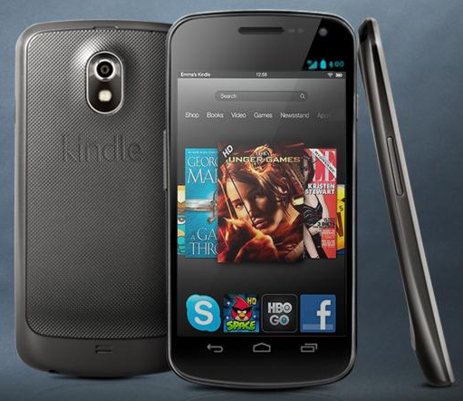

بعد أن ظهرت شائعات حول رغبة **Amazon** في دخول معترك **الهواتف الذكية**، وبعد أن فعلت فعلتها في سوق الأجهزة اللوحية، تعود الإشاعة للظهور من جديد بعد تأكيد موقع إخباري تايواني عن شروع Foxconn في تصنيع هاتف Amazon الذكي.

حسب موقع [Taiwan Economic News](http://news.cens.com/cens/html/en/news/news_inner_42351.html) فإن Amazon قد طلبت حوالي 5 ملايين قطعة من هاتفها الذكي، وهو رقم يبدو صغيرا جدا مقارنة بالأعداد التي تبيعها شركات أخرى مثل Apple، لكن يبدو بأن هذه الخطوة ما هي إلا جس لنبض سوق الهواتف الذكية، كما أنه من المحتمل أن يقتصر تسويق هاتف Amazon الذكي على أمريكا فقط في مرحلة أولية.

يُشير الموقع بأنه من المحتمل أن يُسوق هذا الهاتف ما بين الربعين الثاني والثالث من العام القادم بسعر يُحتمل أن يكون تنافسيا جدا (مثلما اعتادت عليه Amazon) يتراوح ما بين 100 و200 دولار أمريكي فقط.

تجدر الإشارة إلى أن Amazon تعتمد سياسة بيع أجهزتها مقابل أسعار منخفضة جدا، حيث تعتبر الجهاز [كخدمة](https://www.it-scoop.com/2011/09/amazon-kindle-fire/) تُتيح للمستخدمين شراء عدة منتجات خاصة بالشركة، وليس كسلعة في حد ذاتها، كما أنها تعتمد نظام تشغيل مبنيا على نظام Android يُعتبر مغلوقا إلى حد ما، حيث تسعى Amazon إلى جعل متاجرها الإلكترونية هي الوجهة الوحيدة لمستخدمي أجهزتها اللوحية. وما قد يزيد من بقاء المستخدمين "مسجونين" بشكل أعقد في بيئة Amazon هي توفيرها لعدة خدمات يوفرها منافسوها (يعني لا حاجة للمستخدم للبحث لدى المنافسين)، فقد سبق لها أن [اشترت شركة UpNext  الناشئة متخصصة في الخرائط ثلاثية الأبعاد](https://www.it-scoop.com/2012/07/amazon-upnext/)، كما أن هناك بعض المحللين الذين يعتقدون بأن [شراء Zynga المتخصصة في الألعاب هي إحدى الخطوات المنطقية القادمة للشركة](https://www.it-scoop.com/2012/10/zynga-yahoo-amazon/)، هذا دون الحديث عن باقي الخدمات التي توفرها للمستخدمين من تبضع على الإنترنت، وخدمات الفيديو لدى الطلب وغيرها.

في رأيك، هل هي مجرد إشاعة، أم أن دخول سوق الهواتف الذكية أصبح ضرورة بعد أن ضمنت Amazon مكانة لها في سوق الأجهزة اللوحية؟
