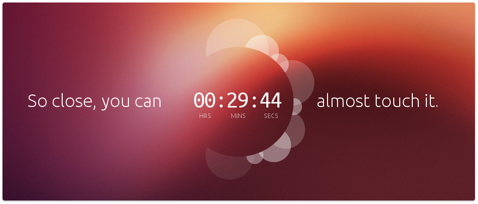

بعد عدٍ تنازلي بدأ تقريبا مع حلول اليوم الأول من **العام الجديد 2013**، تم عرضه على الصفحة الرئيسية لموقع **Ubuntu** والذي أسال الكثير من الحبر على الويب، وأثار العديد من التساؤلات والتوّقعات. كشفت **Canonical** الرّاعي الرّسمي لتوزيعة **Ubuntu** من نظام **Gnu/Linux**، أخيرًا، عن **Ubuntu Phone OS**، فماذا يكون هذا المنتج الجديد؟

 **Ubuntu Phone OS**[ هو ما كشفت عنه](http://www.theverge.com/2013/1/2/3827922/ubuntu-phone-os-announcement) Canonical على لسان مؤسسها Mark Shuttleworth، وهو - على غرار **Ubuntu for Android**- نظام Ubuntu معد من الصفر للهواتف الذكية، ميزته أنه متاح للتحميل مجانا ويمكن تركيبه على عدد من الأجهزة المتواجدة حاليا خاصة التي تعمل بنظام Android، ومتطلبات تشغيله متواضعة حيث يكفيه 1Gb من الذكرة مع معالج بدائي من نوع A9 لكي يشتغل وبصفة رشيقة.

[من ميزات النظام](http://www.omgubuntu.co.uk/2013/01/ubuntu-phone-os-unveiled-by-canonical) أيضا أنه لا يعتمد على آلة Java الافتراضية JVM، كما هو معمول به في نظام Android، واعدا أن يستغل طاقة العتاد القصوى لتشغيل تطبيقات أصيلة Native app، مع توافقية كبيرة للأجهزة التي تعمل بنظام Android تسمح للمزودين وصنّاع الهواتف الذكية باعتماده بأدنى مشقة.

هدف Mark Shuttleworth حسب نظرته السوقية هو استهداف الهواتف الذكية ذات العتاد المتواضع والسعر الزهيد، وهذا -حسب نظرته- سبيل فعّال للنفاذ إلى السوق بسرعة، كما أن لـ Canonical قاعدة مستخدمين معتبرة ومستعدة مسبقا، ممن يستعمل نظامها Ubuntu، كما أن هذا الأخير يحظى بعدد جيد من المطورين.

تنوي Canonical إطلاق هذا النظام مع نهاية العام الجاري، في حين سيتم المواصلة في برنامج Ubuntu for Android كخطوة أولى للعام الجاري، ولم تكشف بعد رسميا عن عقد مزودين أو صناع هواتف، لكنها تملك هواتف حقيقة منه لغرض العرض في لندن.

أما عن منصة التطوير SDK لهذا النظام الجديد، فستكون متوفرة لجهاز Galaxy Nexus في غضون الأسابيع القادمة، وهو الجهاز الوحيد المدعوم رسميا، حاليًا. تطبيقات هذا النظام ستكون عابرة للشاشات، ثنائية الواجهة، تتكيف حسب مكان تواجدها، كتطبيق هاتف أو كتطبيق سطح مكتب، مع وجود شاشة ترحيب عوض شاشة قفل، ومع توفير مساحة أكثر من أي نظام آخر للتطبيقات، بل وحتى من دون استعمال الأزرار وفقط عبر _HUD_ يُتحكم فيه بالصوت.

فيديو ترويجية:

[youtube https://www.youtube.com/watch?v=LoXpLUr5WB4]

- ما رأيك بهذه الخطوة؟ وهل سيكون لـ Canonical نصيب معتبر في سوق الهواتف الذكية؟
