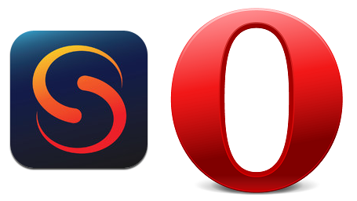

أعلنت **Opera** صباح اليوم عن شرائها للشركة المطورة للمتصفح الذي ينافسها **Skyfire** مقابل 155 مليون دولار، وعلى غير العادة لن يتم إيقاف المتصفح، بل سيستمر تطويره إلى جانب باقي منتجات الشركة.

بعد الخطوة التي خطتها Opera منذ أيام والمتعلقة ب[تخليها عن محرك العرض الخاص بها Presto والتحول إلى محرك WebKit](https://www.it-scoop.com/2013/02/opera-moves-to-webkit/) تواصل الشركة بقيامها بخطوة أخرى تبدو أكثر منطقية ستسمح لها بمواجهة باقي المنافسين بشكل أفضل، فمن جهة يملك متصفح Skyfire ما يزيد عن 20 مليون مستخدم، كما أن المتصفح يملك من الخصائص ما يجعله مميزا، فعوض التحالف مع أحد المتخاصمين في مسألة دعم Flash من عدمه، يوفر Skyfire لمستخدميه إمكانية مشاهدة فيديوهات Flash على الأجهزة التي لا تدعمه، حيث يقوم المتصفح بتحويل الفيديوهات إلى نمط متوافق مع الأجهزة التي لا تدعم Flash على خواديمها. كما أن المتصفح يحسن تجربة المستخدم لدى مشاهدة الفيديوهات عبر التقنية التي طورتها والتي تُطلق عليها اسم **Rocket Optimizer** وذلك بعرضها بدقة تتناسب مع تدفق الإنترنت لديه، حيث تُشير Opera بأن خاصية Rocket Optimizer تقوم بمعرفة ما إن كان المستخدم يواجه مشاكل مع تحميل الفيديو، وتعديل جودتها خلال بضعة أجزاء من الألف من الثانية فقط.

الخطوة تبدو أكثر منطقية خاصة إذا علمنا بأن Opera تقوم عبر Opera Turbo  بضغط صفحات الويب على خواديمها قبل أن ترسلها إلى مستخدمي متصفحها في حال ما إذا كان تدفق الإنترنت لديهم ضعيفا، ويتم ضغط الصفحات بنسبة 80% قبل إرسالها إلى المتصفح، مما يزيد من سرعة التصفح ويقلل من تكاليفه.

يُشير [البيان الصحفي](http://www.opera.com/press/releases/2013/02/15/) الذي يُعلن عن هذه الصفقة إلى أن Skyfire تقوم حاليا ببيع تراخيص لاستخدام تقنيتيها Rocket Optimizer و Skyfire Horizon لثلاثة من كبريات شركات الاتصال الأمريكية، كما أنها في مراحل متقدمة لترخيصها لعشرة شركات أخرى خارج الولايات المتحدة.

من المنتظر أن يتم إنهاء الصفقة بشكل نهائي في منتصف شهر مارس القادم، ستحصل Skyfire بموجبها على 50 مليون دولار نقدا، وسيتم دفع باقي قيمة الصفقة اعتمادا على أداء الشركة خلال السنوات الثلاث القادمة، كما سيصبح Jeffrey Glueck المدير التنفيذي الحالي لـ Skyfire نائبا للمدير التنفيذي لـ Opera.

السؤال الذي يطرح نفسه الآن، ما الذي تُحضر له Opera؟ وهل سيكون متصفح Dolphin القادم على رأس قائمة مشتريات Opera خلال الأشهر القادمة؟
