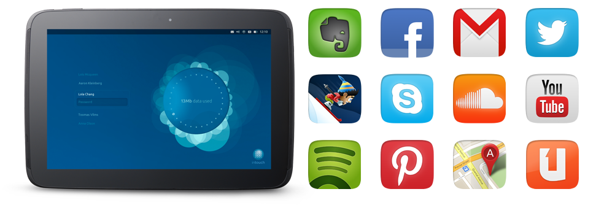

بعد عد تنازلي كنا قد أشرنا إليه أمس على حساباتنا في الشبكات الاجتماعية، والذي أثار الفضول والتفاسير خاصة بتزامنه مع حدث **HTC**، ومماثل لعد **Ubuntu for phones** التنازلي، انقضى منذ قليل بالكشف عن -ما كان متوقعا- نظام **Ubuntu** خاص **بالحواسيب اللوحية**، لكن بمظهر وجودة مفاجئتين.

[**Ubuntu for tablet**](http://www.ubuntu.com/devices/tablet) هو نظام يتمتع بنفس بنية **Ubuntu for Phones**، أي دمج تقنية Ubuntu Touch الموجهة خصيصا لأجهزة اللمس.

يعتمد تصفح النظام على حواف الجهاز الأربعة وحتى الوسطى، بتمرير الإصبع من الحافة إلى الداخل، أو من على قائمة منبثقة أو زر، ليعطي شعورا مميزا بالانسيابية. ويلغي الحاجة إلى الأزرار الصناعية بتصميم جذاب. الفيديو التالية توضح الأمر:

[youtube http://www.youtube.com/watch?feature=player_embedded&v=5_4fXQcxFRs]

من بين خصائص النظام:

	  * **دعم لتعدد المستخدمين:** حيث يمكن إنشاء أكثر من حساب مع تشفير كامل للحسابات.

	  * **دعم لتعدد المهام:** حيث يمكن تشغيل أكثر من تطبيق في نفس الوقت وعرض تطبيقين جنبا إلى جنب بطريقة مشابهة لما أتى به Windows 8، كما هو موضح في الصورة التالية:

	  * **يدعم النظام جميع قياسات الشاشة ما بين:** 6 إلى 20 بوصة، وهو موجه للاستخدام المنزلي أو في مجال الأعمال على حد سواء.

**من بين الميزات الأخرى:**

	  * تحكم في المهام عبر الصوت

	  * دعم تطبيقات الويب وتطبيقات والتطبيقات الأصيلة.

	  * إمكانية تشغيل -بعض- تطبيقات Windows! كما تم الإشارة إليه في الفيديو أسفله، حيث ظهرت صورة لـ MS Excel (!).

	  * التحول لوضع الحاسوب المكتبي عند اكتشاف النظام أنه تم إيصاله بفأرة ولوحة مفاتيح.

الفيديو التالية لمؤسس شركة Canonical تشرح جميع جوانب النظام وتكامله مع نسخة الهواتف ونسخة سطح المكتب:

[youtube https://www.youtube.com/watch?v=h384z7Ph0gU&hd=1]

الجدير بالذكر أن هذه النسخة، ونسخة الهواتف، ستتوفر الخميس القادم للتحميل المجاني لحواسيب Nexus 7 اللوحية. وقد ذكر Shuttelworth في لقاء صحفي [مع موقع OMGUbuntu](https://twitter.com/omgubuntu/status/303912907832426496) أن هناك من الشركات المصنعة التي أبدت استعدادها المسبق لتخصيص رقاقاتها لهذا النظام. لكن لم يتم الإفصاح بعد عن أية قائمة موزعين. أيضا ذكر أن بعض التطبيقات [يتم نقلها](https://twitter.com/omgubuntu/status/303914758766198784) إلى نسخة سطح المكتب أيضا لتوحيد تجربة المستخدم.

في الختام، وبالنسبة للمطورين، فإن حزمة التطوير لنظام الحواسيب اللوحية هي نفسها حزمة Ubuntu for phones والتي تعتمد على منصة Qt وتقنية QML. مع [تسهيل المهمة](https://twitter.com/omgubuntu/status/303915299181309953) لمطوري Android لتنقل تطبيقاتهم لمنصة Ubuntu.

- كيف ترى هذا النظام الجديد؟ وهل سيفرض نفسه بين المنافسين ؟ شاركنا رأيك ورؤيتك!
