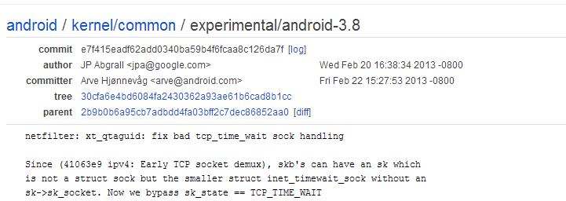

حسب ما تم ملاحظته على خوادم تطوير نظام **Android**، فإن **Google** قامت مؤخرا باقتراح "اختباري" للاعتماد على النواة رقم **3.8** (آخر إصدارة مستقرة) من نظام **Linux**، لما تحويه هذه الأخيرة من ميزات في مجال الهواتف ومعماريات **ARM**.

يعتمد إصدارا Android 4.1 و Android 4.2 على نواتي 3.3 و 3.4 من Linux، على الترتيب، فلو تمت هذه القفزة في رقم الإصدارات حقا في الأشهر القليلة القادمة، [فإن هذا](https://android.googlesource.com/kernel/common/+/experimental/android-3.8) سيكون كسبًا لنظام Android وللمصنعين له بشكل عام. لكن لمَ؟

بمتابعة تطورات نواة Linux  الأخيرة، وبالأخص النسخ 3.7 و 3.8 فسنرى أن التركيز في تطويرهما صب على معماريات ARM وARM64 خاصة ونظام الملفات ([F2FS](http://en.wikipedia.org/wiki/F2FS) (_Flash-Friendly File-System_ الذي تم زرعه في النواة من قبل Samsung والموجه خصيصا لإدارة أفضل لمختلف هيئات رقاقات الذاكرة الخارجية، وتحسينات في إدارة الذاكرة، كذلك تم [توحيد الشفرة المصدرية لمختلف معماريات ARM](https://www.it-scoop.com/2012/10/linux-kernel-3-7-support-multiple-arm/)، حيث لن يشكل تصنيع رقاقة ARM جديدة عبئا بعد الآن للمصنعين لإضافة تعريفها لنواة Linux وبالتالي سيزيد من تبني Android.

أيضا من الأمور التي ستجلبها النواة الجديدة، دعم أفضل لمنصة Tegra التابعة لـ Nvidia، و منصة Exynos التابعة لـ Samsung. باعتبار هذه الأخيرة حليفا لـ Google وما قدمته مؤخرًا لنواة Linux، فإن الاعتماد المبكر لهذه النواة في نظام Android يبدو أمرًا واردًا جدًا.

تشير بعض التكهنات أن هذا الاقتراح، يصُبُ في صالح الإصدارة القادمة من نظام Android 5.0 والتي ستحمل اسم [Key Lime Pie.](http://en.wikipedia.org/wiki/Key_lime_pie)

	  * ترى هل تشفع ميزات Android وتطوره لتصرفات Google الغريبة فيه، [كتنصيب البرامج عن بعد ومن دون إذن](https://www.it-scoop.com/2013/02/android-google-settings/)؟
	  * هل التخلي عن الـ Java هي اللمسة الأخيرة الناقصة لرفع أداء هذا النظام؟
	  * ما محل Ubuntu phone من الإعراب؟ كونه يعتمد على Linux أيضا، هل سيُجاري هو الآخر هذه التطورات ويعتمدها؟

