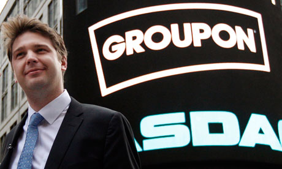

أن تكون المؤسس والرئيس التنفيذي لشركة تقنية فهذا لا يمنحك مناعة ضد الطرد، هذا ما ذكرت به **Groupon** العاملين على الساحة التقنية، فبعد سلسلة من النتائج السلبية التي استمرت على مدار عدة فصول، قرر مجلس إدارة Groupon طرد مؤسسها ورئيسها التنفيذي **Andrew Mason** وذلك بعد أن سجلت الشبكة خسائر جديدة.

بالرغم من فقدانه رئاسة الشركة التي أسسها، لم يفقد Andrew Mason حس الفكاهة لديه، حيث راسل موظفيه برسالة (يمكنك أن تطلع عليها كاملة [هنا](http://news.cnet.com/8301-1001_3-57571934-92/former-groupon-ceo-leaks-outgoing-memo-i-was-fired-today/)) مطلعها:

<blockquote>

> 
> بعد أربع سنوات ونصف رائعة كمدير تنفيذي لـ Groupon قررت بأنه حان الوقت لأمضي المزيد من الوقت مع عائلتي... أمزح فقط،  لقد تم طردي اليوم، إن كنت تتساءل عن سبب ذلك فهذا يعني بأنك لا تدري ما يدور حولك.
> 
> 
</blockquote>

[سجلت](http://files.shareholder.com/downloads/AMDA-E2NTR/2345238693x0x639149/9fe8bda7-ab63-41a9-89c7-a15ea221526a/5.1_4Q12_Earnings_Slides_-_FINAL.pdf) Groupon خلال الربع الرابع للعام الماضي خسائر وصلت قدرت بـ 81.1 مليار دولار مقابل خسائر قدرت بـ 65.4 مليون دولار خلال نفس الفترة من العام الذي قبله، ونزل سعر سهمها إلى أدنى مستوياته حيث تم تداول السهم بسعر 2.6$ وهو سعر بعيد كل البعد عن السعر الافتتاحي له المقدر بـ20$ للسهم الواحد.

أشار مجلس إدارة Groupon بأن رئيسه ونائبه سيتولان منصب الرئيس التنفيذي بالنيابة إلى حين إيجاد رئيس تنفيذي جديد، وهي المهمة التي تم إسنادها إلى مكتب دراسات خارجي.
