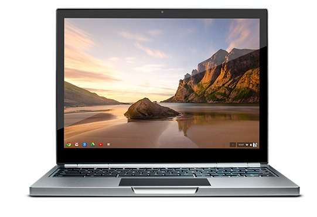
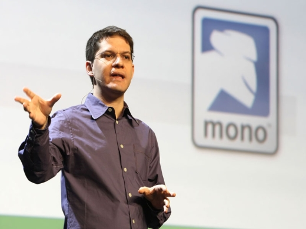

ما الذي يحدث لـ "قادة لينكس"؟ هذا السؤال الذي دار في ذهني لما رأيته من أمور تعجبت لها من شخصين يُعتبران أبرز أعلام Linux والغريب في الأمر أن الأمرين وقعا تقريبا في آن واحد، وأقصد هنا مغازلة **Linus Torvalds**** **مؤسس لينكس لجهاز **Chromebook Pixel** الذي كشفت عنه Google مؤخرا وبنظام التشغيل الخاص به **ChromeOS** إضافة إلى إعلان **Miguel de Icaza** عن **تخليه عن نظام لينكس** كنظام تشغيل مكتبي و**الانتقال إلى نظام ****Mac**.

لنبدأ بـ Torvalds والذي أعلنت عن الأمر على ... منصة Google+ (يعني Google من جديد) حيث لم يكتفي بنشر "تدوينة" [واحدة فقط](https://plus.google.com/+LinusTorvalds/posts/dk1aiW4JjHd)، ليبدي إعجابه بجهاز ونظام Google، بل أتبعها بعد ذلك ب[تدوينة أخرى](https://plus.google.com/+LinusTorvalds/posts/1kGLuKDjSFd) ليلة أمس، حيث أبدى في كلتيهما إعجابه الشديد بشاشة الجهاز وبدقتها العالية، كما أعلن عن إمكانية أن يصبح جهاز Chromebook Pixel حاسبه المحمول الرئيسي، رغم أنه يُفضل الحواسيب المحمولة التي يقل وزنها عن كيلوجرام واحد، إلا أن الجرامات الخمسمائة الإضافية (1.5 كج هو وزن جهاز Chromebook Pixel) لم تلعب دورا كبيرا في إقناعه في التخلي عن الجهاز مقارنة بدقة الشاشة التي أذهلت مطور نواة Linux.

الغريب في كل هذه الحكاية هو مواصلة Torvalds استخدام نظام ChromeOS على جهازه رغم أن [تنصيب توزيعة](https://sites.google.com/site/chromeoswikisite/home/what-s-new-in-dev-and-beta/developer-mode) Linux كاملة أمر ممكن على الجهاز، لكن يبدو أن المطور يرغب في تجربة النظام لمدة أطول، حيث يبدو بأنه يُمكن تنفيذ كافة المهام التي لا تدخل ضمن نطاق البرمجة باستخدام نظام ChromeOS بفعالية عالية. رغم ذلك أشار Torvalds إلى تفكيره في تنصيب توزيعة كاملة عليه قريبا.

في التدوينة الثانية، قال Torvalds:

<blockquote>

> 
> I think ChromeOS isn't necessarily a bad idea
> 
> 
</blockquote>

وهو تصريح يُمكن اعتباره "تزكية" مباشرة من رجل عُرف بتصريحاته النارية اتجاه كل ما يُثير حفيظته، والتي [طالت](https://www.it-scoop.com/2011/08/linus-torvalds-drops-gnome-3-xfce/) حتى سطح مكتب Gnome 3 قبل أن يُغير رأيه فيه (يبدو بأن الرجب أصبح يُغير آراءه كثيرا مؤخرا :P).

سطح مكتب Gnome يدفعنا إلى الحديث عن مؤسسه Miguel de Icaza والذي [كشف](http://tirania.org/blog/archive/2013/Mar-05.html) بدوره أيضا عن تخليه عن نظام Linux على الأجهزة المكتبية وانتقاله إلى أجهزة وأنظمة Mac، حيث كتب تدوينة تُعتبر جد قاسية على النظام قال فيها (تكلم عن إجازته التي قضاها باستخدام جهاز Mac  فقط):

<blockquote>

> 
> يتم إسبات النظام وإعادة تشغيله من دون أية مشاكل، اتصال Wi-fi اشتغل بسهولة، لم يتوقف الصوت بتاتا، أمضيت 3 أسابيع من دون الحاجة إلى إعادة تجميع النواة من جديد لحل هذا المشكل أو ذاك، ومن دون أي معاناة مع تعريفات الفيديو أو الانخفاظات الغريبية والعشوائية في جهاز ThinkPad خاصتي.
> 
> 
</blockquote>

قبل أن يضيف بأن تعدد التوزيعات وعدم التوافقية الموجودة فيما بينها، وحتى عدم التوافقية التي نجدها بين مختلف إصدارات نفس التوزيعة دفعته إلى التخلي عن Linux كنظام للحواسيب الشخصية. كما أنه ينصح المستخدمين الجدد باقتناء أجهزة Mac، ولا يُفكر في سواها إن أراد تقديم حاسب شخصي كهدية.

رغم أن مؤسسة لينكس ترى بأن الأجهزة المكتبية لم تعد بتلك الأهمية التي كانت عليها من قبل كما أن تقر بأن أنظمة لينكس لهذه الأجهزة لم تلق النجاح الذي كان تنشده، إلا أنها ترى بأن Microsoft ليست العدو اللدود لها مثلما ساد الاعتقاد، حيث سبق وأن [صرح](http://www.networkworld.com/news/2011/040511-linux-vs-microsoft.html) Jim Zemlin المدير التنفيذي لمؤسسة لينكس بأن Apple هي الصديق الحميم والعدو اللدود في آن واجد لمن يعملون في مجال المصادر المفتوحة.

ما الذي يحدث لقادة Linux؟ هل فقدوا عقولهم؟ أين ذهبت كل التصريحات الرنانة السابقة حول النظام؟ أم أن الأمر كان مجرد نزوة لم تدم طويلا؟ وهل فقد النظام معركته على الحواسيب الشخصية بشكل كامل؟
