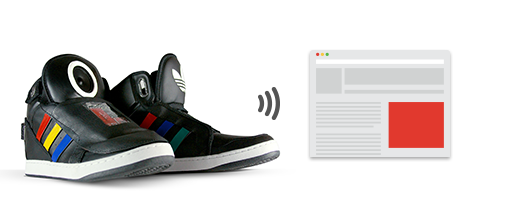

بعد نظاراتها الذكية [Google Glass](https://www.it-scoop.com/2012/04/google-news-10/) التي كثر الحديث عنها حتى قبل الشروع في تسويقها، كشفت **Google** عن نموذج prototype لمنتج "قديم" يستخدم التقنية بشكل جديد، أطلقت عليه اسم **The Talking Shoe** والمُتمثل –مثلما هو واضح من الاسم- في حذاء يُمكنه الحديث والتفاعل مع لابسه.

حذاء The Talking Shoe مزود بكل من جهاز لقياس السرعة accelerometer، أداة لتحديد الاتجاهات gyroscope، أداة Bluetooth للتمكن من البقاء على اتصال مباشر بهاتف ذكي إضافة إلى أدوات لاستشعار الضغط، وهو ما يُمكنه من الحديث مع لابسه بشكل دائم، والتفاعل معه حسب الحالة التي يكون فيها (الجلوس، المشي أو الركض مثلا)، إضافة إلى إمكانية أن يقوم الحذاء بنشر تحديثات بشكل مباشر على الشبكات الاجتماعية.

قد يبدو بأن أفضل استعمال لمثل هذه التقنية سيكون في مجال التدريب الرياضي، فيكفي أن تتم برمجة تطبيق خاص بذلك ليقوم الحذاء بتشجيع لابسه لمواصلة الركض، أو لتنبيهه لأخطاء يقوم بها خلال تدريباته. وربما ستدفع بعض شركات تصنيع الأحذية بعض الرياضيين المتعاقدين معها إلى استخدام أحذية ذكية لمتابعة أدائهم، أو لنشر تحديثات لجذب مزيد من المتتبعين لهم.

لا تقفز فرحا ولا تستغرق في أحلامك حول ما يُمكنك القيام به بهذه إن امتلكت واحدة من هذه الأحذية الذكية، فمنتج Google الجديد ما هو إلا نموذج سيبقى كنموذج فقط ولن يتم تسويقه، حيث أن هذا النموذج يدخل ضمن حملتها التي أطلقتها مؤخرا [Art Copy&Code](http://www.artcopycode.com/) والتي تهدف إلى إعادة "اختراع الترويج الإعلاني" من جديد. لكن هذا الأمر قد يدفع الشركات المتخصصة في الأحذية الرياضية إلى التفكير في إطلاق "أحذية ذكية".

بالرغم من ذلك، هناك من يرى بأن دخول Google بنفسها سوق الأحذية الذكية يبقى واردا، فعلى سبيل المثال مشروع Google Glass كان بدوره "مجرد نموذج" ما لبث أن أصبح منتجا ينتظر الآلاف صدوره لاقتنائه. بعبارة أخرى، قد يكون هدف Google هو جس نبض السوق قبل الكشف عن نواياها الحقيقية.

فيديو تعريفية بمشروع The Talking Shoe:

<!-- more -->

[youtube=http://www.youtube.com/watch?v=VcaSwxbRkcE]

هل سنسمع قريبا عن حصول Google (أو غيرها) على براءة اختراع لمفهوم "حذاء ذكي" أو "حذاء ناطق"؟

هل ستقدم شركات الأحذية الرياضية على إدخال التقنية إلى منتجاتها؟
