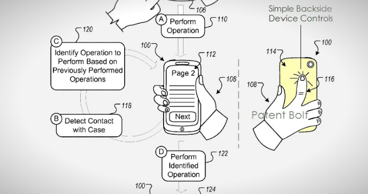

لم تعد الشاشات التي أصبحت تكبر يوما بعد يوم كافية في نظر **Google**، فبعد التخلص من جميع الأزرار الملموسة لتوفير مساحة إضافية للشاشة، تعتزم Google أن تجعل من هواتف Android **أجهزة قابلة للعمل عن طريق اللمس حتى على أظهرها**، وهو ما بينه طلب تسجيل براءة اختراع جديدة تقدمت به مؤخرا.

[طلب تسجيل براءة الاختراع](http://www.patentbolt.com/2013/03/google-in-race-with-apple-to-bring-backside-controls-to-devices.html) يُبين إمكانية لمس ظهر الجهاز للتحكم فيه للقيام ببعض المهام، فعلى سبيل المثال سيكون بإمكان المستخدم الانتقال إلى المقطع الموسيقى التالي، قلب صفحة الكتابة الذي يقرأه، أو عمل Scroll لصفحة  الويب الحالية. كما أنه من شأنها أن تجعل من هواتف Android التي تستعمله منصات ألعاب متكاملة، فيكفي إمساك الجهاز بالوضع الأفقي وتمكينه من عدة أزرار غير مرئية على ظهره لينافس منصات الألعاب المحمولة الحالية.

تبدو فكرة الاختراع هذا، "بديهية" نوعا ما، وهو ما يدفع إلى التساؤل عن السبب الذي أخٌّرها إلى غاية هذا العام، لكن يبدو بأن Google ليست الوحيدة التي فكرت في الأمر، بل [سبقتها](http://www.patentlyapple.com/patently-apple/2010/01/apple-the-tablet-prophecies.html) Apple إليها، والتي تقدم سنة 2006 بطلب تسجيل براءة اختراع باسمها حول تمكين أجهزتها اللوحية من خاصية مماثلة. غير أنه من عادة Apple تسجيل براءات اختراع لا تقوم باستغلالها، حيث مرت على تسجيل براءة اختراع Apple ما لا يقل عن 6 سنوات.

الغريب في الأمر هو طلب Google تسجيل براءة اختراع مماثل لاختراع Apple، الأمر ليس واضحا بشكل جيد، لكن حسب بعض [المواقع المتخصصة](http://arstechnica.com/gadgets/2013/03/google-files-a-patent-for-backside-controls-on-future-android-devices/) التي تحدثت حول الأمر، يبدو بأن اختراع Apple يخص التحكم في جهاز لوحي باستخدام كلتي اليدين، وهما أمران (كون الجهاز حاسبا لوحيا، واستخدام اليدين معا بدل يد واحدة) يبدو بأنه من شأنهما أن يجعلا "الاختراعين" مختلفتين.

هناك عدة مشاكل قد تواجه استغلال مثل هذا "الاختراع"، أولها ضرورة التفريق ما بين "الضغطات" التي قام بها المستخدم عن قصد، وتلك التي قام بها عن غير قصد (بسبب طريقة وضع الهاتف في الجيب مثلا)، وهو أمر يبدو بأن Google قد فكرت فيه، حيث أنها تتأكد من أن المستخدم يحمل فعلا الهاتف في يده، لكن المشكل الذي يبدو أكثر تعقيدا هو إضافة أغلب المستخدمين لغطاء خارجي لهواتفهم، لحمايتها من "العوامل الخارجية"، وهو ما سيدفع إلى أحد الأمرين: تخلي المستخدمين عنها، أو فتح الباب أما "براءة اختراع جديدة" تخص غطاء خارجيا لا يؤثر على آلية اللمس على الظهر، أو يضيف آلية اللمس إلى الأجهزة التي لا تملكها.

هل تتوقع ظهورا هواتف Android تعمل باللمس حتى على ظهورها؟

هل سنرى قريبا صراعا جديدا في المحاكم ما بين Apple وGoogle حول حقوق استغلال اللمس على أظهر الهواتف؟
