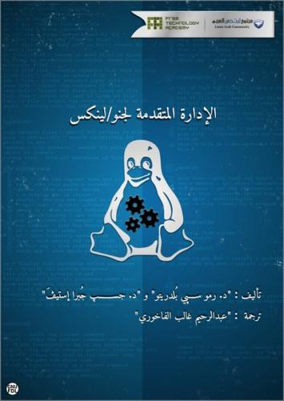

في إطار مبادراته لترجمة الكتب التقنية المهمة في مجال المصدر المفتوح، أعلن **مجتمع Linux العربي** اليومَ عن انتهاء ترجمة **كتاب الإدارة المتقدمة لـ Gnu/Linux** مع توفر رابط تحميل -أولي- له.

الترجمة جهد وبذل، فأما الأولى فقد كانت من طرف العضو المشرف "[عبد الرحيم غالب الفاخوري](http://www.linuxac.org/forum/members/20958-%D8%B9%D8%A8%D8%AF%D8%A7%D9%84%D8%B1%D8%AD%D9%8A%D9%85-%D8%A7%D9%84%D9%81%D8%A7%D8%AE%D9%88%D8%B1%D9%8A)"، وأما الثانية فقد كانت منه أيضا ومن [طرف](http://www.linuxac.org/forum/threads/59158-%D8%AA%D8%B1%D8%AC%D9%85%D8%A9-%D9%83%D8%AA%D8%A7%D8%A8-GNU-Linux-Advanced-Administration) أعضاء مجتمع Linux العربي الذين بذلوا المال والوقت والمراجعة لإخراج الكتاب بأفضل ما يمكن.

يأتي الكتاب في 600 صفحة أو تزيد، وله أهمية بالغة، إذ يعتبر مرجعا في مجاله، فهو شامل في أجزاءه، مُلمٌ في محتوياته، شيّق لأي مهتم بالإدارة المتقدمة لأنظمة Gnu/Linux، هذا الأخير الذي له نصيب الأسد من الخوادم على الويب خاصة مع عصر الحوسبة السحابية، وبزوغ أهمية الأمن والأمان والاستقرار.

مما تطرق له الكتاب، مقدمة في نظام Linux بشكل عام ونواته، أدوات المدير، الإدارة المحلية، إدارة كل من الشبكات، الخوادم، البيانات، الأمن، كيفية التخاطب أو التعايش مع الأنظمة غير Linux.

الجدير بالذكر أن الكتاب أُخرج بالتعاون مع أكاديمية التقنية الحرة وهي كما ذكر الكتاب:

<blockquote>إن أكادمية التقنية الحرة FTA ، هي مبادرة مشتركة من عدد من المؤسسات التعليمية في دول عديدة، وهي تحاول المساهمة في مجتمع يسمح لكل مستخدميه بالدراسة، والمشاركة، والبناء على المعرفة الموجودة دون قيود.</blockquote>

الكتاب تحت رخصة [Gnu FDL](http://www.gnu.org/copyleft/fdl.html)، وهي رخصة يسارية Copyleft، تسمح لك بنسخ، توزيع تعديل المستند وفق شروطها.

لتحميل الكتاب يُرجى [زيارة موضوع إطلاقه](http://www.linuxac.org/forum/threads/63280-%D9%83%D8%AA%D8%A7%D8%A8-%D8%A7%D9%84%D8%A5%D8%AF%D8%A7%D8%B1%D8%A9-%D8%A7%D9%84%D9%85%D8%AA%D9%82%D8%AF%D9%85%D8%A9-%D9%84%D8%AC%D9%86%D9%88-%D9%84%D9%8A%D9%86%D9%83%D8%B3)، حيث تم ذكر أنه قد يتم تحديث الرابط فيه، في حال تعديل الأخطاء الإملائية.
