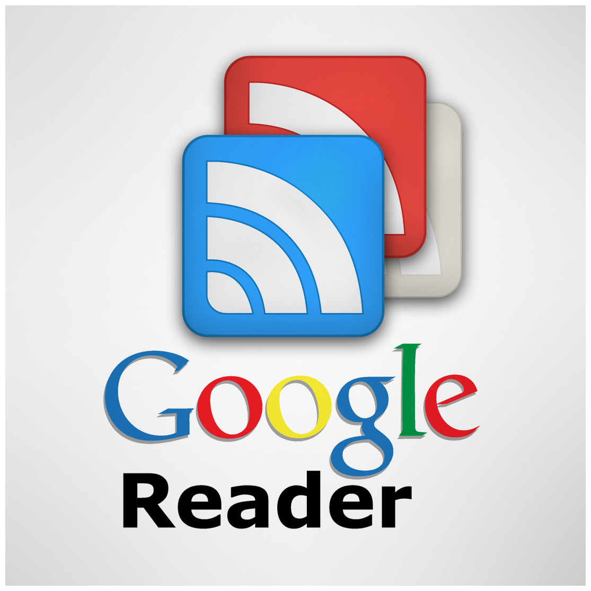

كتبت هذا كرد على مقال [هل أصابت Google في مسألة إيقافها لخدمة Reader؟ وهل سيؤثر ذلك على مستقبل تطبيقاتها المستقبلية مثيلات Keep؟](https://www.it-scoop.com/2013/03/google-reader/) ثم رأينا -أنا وصاحب المقال- أن نفرده في مقالة لظهور أوسع.

سأنطلق من دعوى لنكن واقعيين كما في المقال أعلاه..

صحيح أن Google لا تجني أرباحا من الخدمة لكن يبقى هذا “خطأها” وتوقيف الخدمة زاد الطين بلة لأنه قد توفر عليها المال، لكن لن توفر عليها ثقة المستخدمين التي فقدت أو ستفقد والتي قد لا تحصل عليها مجددا ولو بالمال. فالمستخدم عامة لئيم بطبعه، وإذا أكرمت اللئيم تمرد فما لو قطعت كرمك. سيكفر بجميع فضائلك وشعاراتك.

المصيبة ليست في الـ Google Reader ولا في الـ Rss عموما، فبعض من -المحللين- يعتبره تقنية فات زمنها أو [بريقها](http://techcrunch.com/2009/05/05/rest-in-peace-rss/)، المشكل الحقيقي تصرفات الشركة على مستوى البروتوكولات وخاصة بروتوكول [CalDAV](http://en.wikipedia.org/wiki/CalDAV).

أن تغلق خدمة ليس بالأمر الجلل كما ترسمه ردود المستخدمين، لأن البدائل موجودة. لكن أن تغلق بروتوكولا أنت من كبار مزوديه فهذا من الـ [evil](http://en.wikipedia.org/wiki/Don%27t_be_evil) بعينه، لأنه قد يسبب سقوط خدمات أخرى وبور تجارة أو حتى إغلاق شركات وخسارتها.

**ماهو CalDAV؟**

هو بروتوكول ذي معيار مفتوح open standard لخدمات التقويم التي تعتمد على الويب. مستعمل في تطبيق Apple iCal ومشروع التقويم لـ Mozilla وغيرهم الكثير، وGoogle الآن تريد دفع المستخدمين لاستعمل Calendar API عوض البروتوكول نفسه، البعض يفسر أن للأمر علاقة بمنافسة Microsoft، لكن الأمر الأكيد هو “الاحتكار”.

[ليس هذا فقط](http://googleblog.blogspot.ca/2012/12/winter-cleaning.html)، فقد سبق وأن [أغلقت](http://www.pcmag.com/article2/0,2817,2413283,00.asp) بروتوكول Exchange ActiveSync أو EAS لمزامنة البريد، جهات الاتصال، والتقويم، لمستخدميها “المجانيين” مما دفع Microsoft لبناء حلها خاص لدعم هذا البروتوكول وكذا [CarDAV](http://en.wikipedia.org/wiki/CardDAV) لمستخدميها الذين يعتمدون على خدمات Google على الأقل لغاية 31 يوليو 2013. وأصبحت مايكروسوفت هي الأخرى تقول أن هذا هو الوقت الأنسب للتحول إلى Outlook.com. أي أصبح الكل يقول: “أنا فولي طيّاب”.

لنعد الآن إلى “فلنكن واقعيين” وأضيف إليها “فلنكن منطقيين” أيضا:

هذه التصرفات ليس على علاقة بالمال *فقط* بل أضف إليها تضييق النطاق على المنافس، أي احتكار غير مباشر، وخطوة أخرى لسعي الشركة إلى تكوين Ecosystem يغلق الـ Open Way. يعني من Protocol-based إلى API-based أين يمكنها أن تفعل في الخفاء ما تشاء.

طبعا المستخدم المغفل يجد نفسه متعلق بشركة فلانية ولا مناص من التخلص من خدماتها لأنها جزء من حياته، أم الشركة فالخدمة التي ليست “جزءا من حياتها” فلا تتردد للتخلص منها، ولا مجال للمشاعر.

ذاك مغفل والقانون لا يحميه، لكن ماذا عن “الواعي” والمبرمجين ؟ كيف حالهم إذا تم إغلاق البروتوكولات ؟ فإن كان للخدمة بديل ومدة صلاحية، فإن غلق البروتوكولات والمعايير فعلا “قطع للطريق” وهذا ما على القارئ والمستخدم “التقني” بخاصة أن ينتبه له ويحرص عليه ويختار من هذا المنطلق خدماته التي سيعتمد عليه في حياته اليومية.
