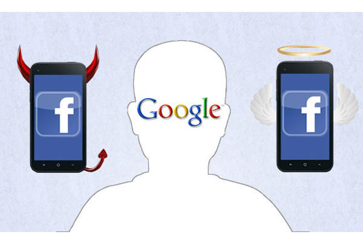
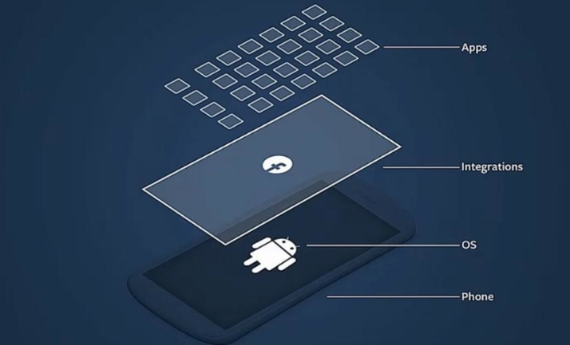

كما عَلِم جميع متابعي أخبار التقنية، أعلنت **فيس بوك** عن إطلاق **launcher** خاص بها على هاتف خاص به هو **HTC First** وسيُتبعه بنشر التطبيق (Facebook Home) لعدد من أجهزة Android من Samsung وLG وHTC؛ وبنظرة سطحية يمكن لأي متابع أن يُدرك الهدف من وراء هذا، فقد أدركت Facebook أن عليها التوجه إلى Android للاستفادة من كونه أكثر انفتاحًا من iOS وهو البيئة التي كان يستهدفها فيس بوك بشكل أساسي خلال الفترة السابقة، هذه النقلة نحو Android تتيح له في المستقبل ضمان قاعدة مستخدمين أوسع وكذلك كسب المزيد من وقت هؤلاء المستخدمين بأن يكون فيس بوك دومًا في جيوبهم، وأكثر من ذلك، أن يكون هو الشاشة الرئيسية لهواتفهم الذكية.

سبق وأن طرحنا [نظرة على مستقبل Android](https://www.it-scoop.com/2013/03/android-future/)، وخلُصنا إلى أنه قد لا يكون مطمئنًا لـGoogle لعدة أسباب، من بينها اتجاه الشركات للابتعاد أكثر عن أصل Android واستخدام واجهات مخصصة بشكل واسع وتعمّد تغييب اسم Android في منتجاتها، وهو أيضًا ما تجد Google فيه حلًّا لمشكلتها، إذ تلجأ إلى اعتماد أسماء تجارية مثل Nexus وجعل منتجاتها مرتبطة باسمها بدل اسم Android؛ وهكذا نجد أن Android يعاني من تمزّق حقيقيّ بحيث يحاول كل طرف جذبه إلى ناحيته؛ ثم يجيء Facebook Home ليدفع باسم Android إلى الوراء أكثر ويحتل عُقر "داره"، اﻷمر الذي يزيد الطّين بلة؛ فما تأثيره على Android وما تأثيره على فيس بوك كشركة؟

نحن نعلم أن فكرة Facebook Home الأساسية ليست شيئًا جديدًا، فلطالما استخدمت الشركات launchers خاصّة بها، ومن الصعب للغاية أن تجد هاتف من غير سلسلة Nexus يحمل نسخة غير مخصصة من Android، لكن يرى بعض الكتّاب التقنيّين أن استخدام Facebook على هاتف يعمل بنظام Android خالص غير مخصص سوى من ناحية الشاشة الرئيسية، على عكس التعديلات الواسعة التي تُدخلها Samsung وHTC مثلاً على أجهزتها، هو بحدّ ذاته انتصار لـGoogle، فهاتف HTC First لا يحمل واجهة Sense المعروفة والتي تستخدمها HTC على أجهزتها، وكذلك فإنه لا يحوي أي برامج من تلك التي تلحقها الشركات بأجهزتها والتي تكون في الغالب غير مفيدة، [وبإمكانك بسهولة تعطيل Facebook Home والعودة إلى الواجهة المعتادة لـAndroid كما على أجهزة Nexus](http://www.theverge.com/2013/4/9/4206176/htc-first-review-facebook-phone). لكن لا يبدو الأمر على حقيقته كذلك، فرغم تطوير Google لـAndroid وتضمينه إمكانية تغيير برنامج launcher الأصلي بشكل طبيعي، فإنها لن ترحّب عمليًّا بوجود Facebook Home على منصّتها الخاصّة ([وإن كانت رحّبت به رسميًّا](http://techcrunch.com/2013/04/04/google-says-facebook-home-demonstrates-androids-openness-framing-apple-as-restrictive))، خصوصًا عندما تتخبّط في تقديم طبقتها الاجتماعيّة الخاصّة Google+ بشكل مماثل؛ وإن لم يحمل Facebook Home خطرًا مباشرًا على Google، فإنّه على الأقل انتصار لمنافسها اللدود فيس بوك، وهذا بحد ذاته خطِر! يبدو الأمر مُهينًا جدًّا لأنّه Android بحدّ ذاته، [ولو استطاع فيس بوك بناء Home على منصة iOS بطريقة ما، لكان الأمر مختلفًا](http://www.marco.org/2013/04/09/mathis-facebook-home).

نقطة أخرى يذكرها بعض من يرى في Facebook Home منفعة لـGoogle: [إن أرباح Google من Android لا تتعلّق بتطبيق launcher الذي يُستخدم على الجهاز بقدر ما يتعلق باستخدام منتجاتها كالبحث وسوق Play وChrome](http://ignorethecode.net/blog/2013/04/09/facebook_home)، والدليل سماحها للشركات بتعديل الواجهات بشكل واسع مقابل حرصها على ألا تحمل أجهزة Android محرّك بحث افتراضيًّا آخر، أو سوق تطبيقات آخر أو أي بديلٍ عن منتجاتها كما شهدنا في Kinde Fire حيث تم اشتقاق (fork) النظام بأكمله وتم استبدال معظم خدماته بخدمات مقابلة من Amazon.
وردًّا على ذلك، يكفي تصوّر أنّ Facebook أصبح يحتلّ الواجهة الرئيسية وقائمة التطبيقات وحتى شاشة القفل، فما المانع أن يقدّم فيس بوك أيضًا بديلاً عن بحث Google في المستقبل؟ وربّما سوق تطبيقات Facebook بديلاً عن سوق Play؟ ألا يكفي أن يضمن أوّلاً قاعدة المستخدمين ثم يتوسّع في "احتلال" أجهزتهم؟ دعك من أنه ولا شك سيُكسب فيس بوك كمية كبيرة من المعلومات التي كان يُفترض أن تحصل عليها Google لتوجيهها في الإعلانات!
إذًا يمكن اعتبار Facebook Home [أوّل امتحان حقيقي](http://www.appleoutsider.com/2013/04/08/open-season/) لادّعاء Google بانفتاح Android ولا يمكن لـGoogle إلا أن تلوم نفسها على هذا التهديد الطارئ! ففيس بوك يلعب بشروط Android نفسها، ولا يحاول بناء نظام مشتقّ؛ وهذا يقودنا للنقطة الثانية المتعلقة بتأثير Home على فيس بوك كشركة ومدى نجاحه المتوقّع.

## هل يُتوقع النجاح لـFacebook Home؟

<!-- more -->

يحتجّ الكثير من الكتاب التقنيين على التجربة التي يقدمها Facebook Home، ويشيرون إلى كونه شديد التطفل والإزعاج، فهل حقًا نرغب في أن نجعل كل ما يفعله أصدقاؤنا على الأجهزة التي نحملها لأداء مهماتنا اليومية؟ بالنسبة للمستخدم العادي، غير التقني، لا يبدو الأمر مزعجًا كثيرًا إذا علمنا أن [هذا المستخدم لديه وسطيًا 100 صديق](https://www.facebook.com/notes/facebook-data-team/anatomy-of-facebook/10150388519243859) (بعكس الكتاب التقنيين والصحفيين الذين ربّما يمتلكون بضعة آلاف) وأن هؤلاء المئة ليسوا جميعًا نشيطين على فيس بوك، لذلك فإن هذا النمط من المستخدمين (الذين ربما يشكلون غالبية مستخدمي فيس بوك) يحتاجون فقط لشيء من التعوّد ليصبح نمط "الهاتف الذكي الاجتماعي" مألوفًا، وكذلك فإن المهام اليومية التي يقومون بها تختلف في تنوّعها عن تلك التي يفترضها التّقنييون ورجال الأعمال، وإن كنت أمقت الافتراض الساذج بأن هم المستخدمين "العاديين" الأول والأخير هو ما يفعل أصدقائهم وعائلتهم فقط وأين يذهبون، بل أعتقد أنها الصورة التي تريد الشبكات الاجتماعية تكريسها في أذهاننا!
نقطة أخرى يراهن عليها فيس بوك هي تبني "سياسة وسطيّة" كما [يكتب موقع Wired](http://www.wired.com/gadgetlab/2013/04/facebooks-phone-is-a-triumph-of-mediocrity):

 	  * أولاً: إشاعات هاتف فيس بوك لم تكن دقيقة، فلا هو هاتف واحد ولا هو هاتف يعمل بنظام تشغيل جديد ولا حتى فرع (fork) عن نظام آخر، وإنما هو ببساطة مجموعة من برامج تعمل على نظام موجود مسبقًا؛
 	  * وثانيًا: فإن أول هواتف فيس بوك، HTC First، ليس جهازًا عالي المواصفات، بل هو أقرب للفئة المتوسّطة؛
 	  * وثالثًا: يستهدف فيس بوك بهذا المنتج أولئك الذين لا يهتمون كثيرًا بتجربة غنية وكاملة على الإنترنت، ولكنهم يحبون فيس بوك؛ الذين يستعملون التطبيقات، ولكن ليس كثيرًا منها؛ ويتواصلون مع أهلهم وأصدقائهم، ويريدون أن يكون ذلك سهلاً؛ يعتبر كثير من الناس أن فيس بوك هو الإنترنت، وFacebook Home سيكون هو الإنترنت على هاتف بالنسبة لهم.
 	  * ورابعًا: فيس بوك بحد ذاته هو انتصار للوسطية؛ فهو ليس أفضل بيئة للتواصل، ربما يتفوق في هذا تويتر أو WordPress، وهو ليس أفضل تطبيق لمشاركة الصور؛ فهذا Instagram أو Flickr وربما Snapchat، وهو بالتأكيد ليس أفضل منصة للتطّبيقات أو دفتر عناوين أو خدمة مراسلة. ومن السهل أن تُغضبك سياسات الخصوصية في فيس بك أو الإعلانات أو لإجراء تعديلات باستمرار [...]، ولكن فيس بوك بالفعل جيّد في إتاحة التواصل بين الناس، ومقبول المستوى في ما سوى ذلك.

أخيرًا سيؤثر موقف Google ذاتها على نجاح Facebook Home باعتباره مطور النظام المستضيف له، فكما ذكرنا صممت Google نظام Android بحيث يقبل استبدال launcher بآخر، وفي الموقف الرسميّ ترحّب Google بمنتج فيس بوك الجديد هذا، الذي [ ما كان له أن يوجد لولا تسامح Google](https://twitter.com/asymco/status/319895251454140417)؛ ولكن كم ستصبر على وجود Facebook Home في متجرها قبل أن تجد عذرًا ما لإزالته، وقبل أن تبدأ بالحرب الصامتة والمُعلنة على برامج من هذا النمط وقبل أن تزيد تركيزها على التصميم الأصلي لنظامها؟ سوق Play هو المساحة التي يمكن لـGoogle أن تحارب فيها الشركات المنافسة التي تستغل مرونة Android، ولن تدع Google هذه الفرصة تفوتها، في المقابل قد يسلك فيس بوك طريقة أخرى بالتعاقد مع شركات أخرى لإضافة Facebook Home على أجهزتها بشكل افتراضي كحل لهذه المشكلة.

في النهاية لا بد أن نشهد بالذكاء لفيس بوك باتباعه سياسةً تعتمد على شق طريقه وسط بيئات منافسة بأقل قدر من إثارة العداء، واستغلاله كل ما يمكن لضمان وجوده في المستقبل في حين بفشل هؤلاء المنافسون في وضع قدمهم في عالم الشبكات الاجتماعية على بيئاتهم التي طوّروها بأنفسهم؛ وعلى الطرف الآخر يمكننا أن نلاحظ كيف ستشكّل الشّبكات الاجتماعيّة حياتنا في المستقبل بأن تكون هي وجهتنا الأولى (والأخيرة ربّما) عندما نستخدم هواتفنا، فما بدأه فيس بوك لتوّه ليس إلا صراعًا بين الشبكات الاجتماعية على هواتفنا الذكية!
